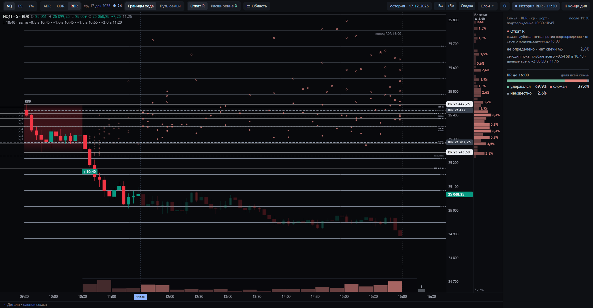
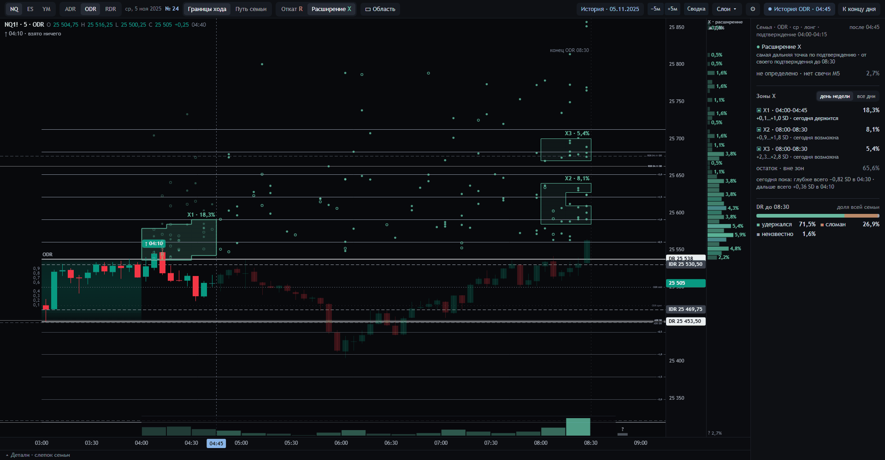

# DR Lab — второй экран трейдера DR/IDR

DR Lab показывает для текущей сессии NQ, ES или YM **где и когда цена чаще всего бывала в похожих сессиях 2006–2025**:
уровни DR/IDR как в индикаторе автора метода (TheMas7er, M7DR) и «созвездия» мест из истории. Это локальный инструмент
одного трейдера (оператора); этот репозиторий — его смысл, дизайн, исследования и код, и общее место работы для агентов.

*English: a local second screen for a DR/IDR futures trader: today's session with the author's DR/IDR levels and, from
20 years of similar sessions, where and when price most often went. The semantic layer is in Russian; start at
[`meaning/README.md`](meaning/README.md) (no code needed) or [`AGENTS.md`](AGENTS.md) (to work on the code).*

## С чего начать

| Кто вы | Куда идти |
|---|---|
| **Смысловой агент** — хотите понять и обсуждать смысл, не открывая код | [`meaning/README.md`](meaning/README.md) |
| **Агент-исполнитель** — будете менять код, данные, экран | [`AGENTS.md`](AGENTS.md) |
| Хотите увидеть все варианты дизайна 1–22 | [`design/README.md`](design/README.md); живые макеты — `design/all-designs/ИСТОРИЯ.html` (скачать и открыть в браузере) |

## Где мы (01.10.2026)

- **Дизайн 24 «Границы хода»** — отдельная версия рядом с рабочим экраном (поручение оператора 01.10). Каркас дизайна
  22, а статистика — по семантической спецификации DR-LAB-SEM-1.0
  ([`meaning/lens/2026-10-01-spec-v1/`](meaning/lens/2026-10-01-spec-v1/README.md)). Точка — окончательный откат R или
  расширение X одной сессии семьи от её подтверждения до конца сессии. Рядом гистограммы цены и времени того же
  события, исход DR и «Путь семьи» по пятиминуткам. У каждого числа есть паспорт. Любой день 2006–2025 открывается как
  сегодняшний. Подробности: [`design/sozvezdiya-24/README.md`](design/sozvezdiya-24/README.md).

- **Карта зон в дизайне 24** (01.10, вечер): вместо одного «главного кластера» — несколько ценово-временных зон
  окончательного отката R и расширения X, у каждой доля семьи и статус на сегодня: держится, возможна или уже
  невозможна по сегодняшнему пути. Смысл, проверка на 2018–2025 и пороги приёмки на новых сессиях —
  [`meaning/12-karta-zon.md`](meaning/12-karta-zon.md).

## До этого (29.09.2026)

- **Рабочий экран** — дизайн 22 «смысл числа» на рыночных данных (с 29.09, решение оператора; до этого — 21).
  У каждого числа видно событие, горизонт и насколько история сопоставлена с сегодняшней ценой (● ◐ ○); без
  сопоставления вместо процентов прочерки: [`meaning/04-dizajn-22.md`](meaning/04-dizajn-22.md). Открытые вопросы по
  деталям — [`meaning/05-otkrytye-voprosy.md`](meaning/05-otkrytye-voprosy.md).
- **Смысловой аудит 29.09.** Частоты метода («DR держится около 80 %», цвет коробки, модели дня) — в основном геометрия
  диапазона. Экран в основном откалиброван, кроме моментов без сопоставления цены. Часть чисел легко прочитать не как то
  событие, которое посчитано: [`meaning/03-dokazatelstva.md`](meaning/03-dokazatelstva.md). Исследования —
  [`studies/audit_2026_09_29/`](studies/audit_2026_09_29/).
- **Совместная работа.** GitHub — посредник между смысловым агентом и агентом-исполнителем, решает оператор:
  [`meaning/06-protokol.md`](meaning/06-protokol.md).

## Жёсткие правила

Рыночные данные (лента, свечи по дням, результаты по отдельным датам) сюда никогда не попадают — репозиторий публичный,
здесь только агрегаты и синтетические макеты. 2026 год в базе истории скрыт. Без Volume. Сервер только локальный. Ордеров
нет. Полный список — в [`AGENTS.md`](AGENTS.md).
