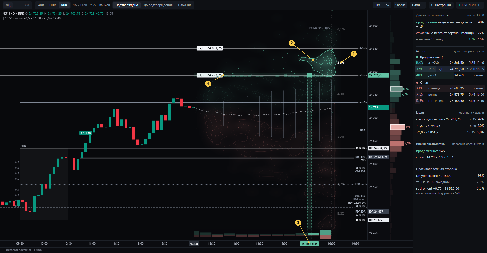
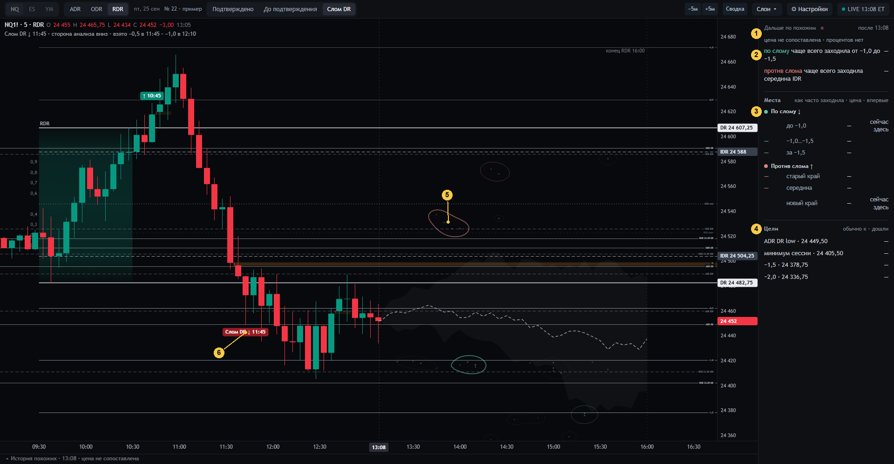
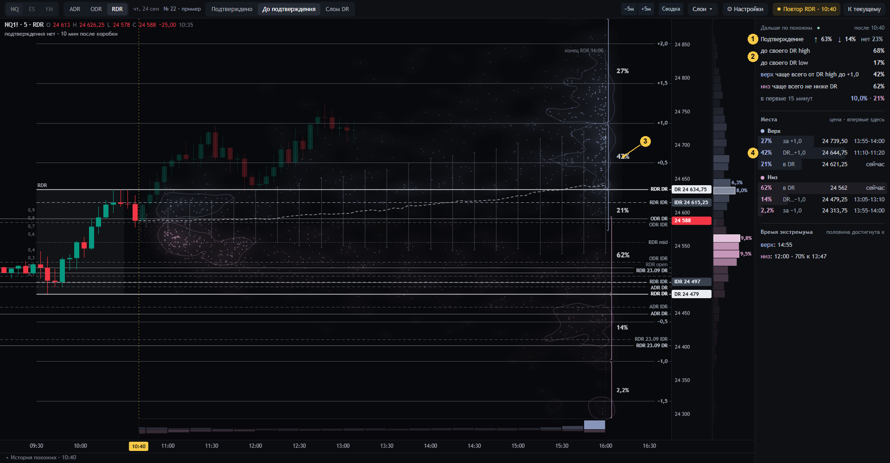

# 04 · Дизайн 22 «смысл числа» — рабочий экран с 29.09.2026

> **01.10.2026.** Дизайн 22 остаётся рабочим экраном. Рядом построен дизайн 24 с новой семантикой процентов
> (спецификация DR-LAB-SEM-1.0): [10-dizajn-24.md](10-dizajn-24.md).

**Статус: [решение оператора] — рабочий экран DR Lab на рыночных данных с 29.09.2026** (до этого — дизайн 21).
Картинки ниже — тот же код на синтетических днях (рыночные данные не публикуются). Дизайн 22 — это 21, в котором
каждое число приведено в соответствие с тем, что оно считает (аудит 29.09, [03-dokazatelstva.md](03-dokazatelstva.md);
линзы, [lens/](lens/)), и затем поправлен оператором вживую 29.09 (журнал решений — [01-zachem.md](01-zachem.md)).

**Главное (решение оператора 29.09):** звёзды, созвездия и проценты мест показывают, **куда и когда цена похожих
сессий приходила после текущей свечи**. Процент места — как часто цена туда заходила. Прежний смысл «окончательный
экстремум дня» агенты 28.09 без запроса оператора подставили вместо его вопроса (сам объект есть в методе автора — Time & Price максимального отката, `docs/STRATEGY.md` §6.3, — но отвечает на другой вопрос); он собирал все кластеры у 15:50–16:00 и на экране отменён навсегда.

Открыть макет: скачать `design/sozvezdiya-22/built/index.html` (один файл) и открыть в браузере. Состояния по адресу —
`#conf` (подтверждено), `#wait` (до подтверждения), `#brk` (после слома DR). `&hl=N` — как будто наведена N-я строка
панели. В истории всех дизайнов он стоит под номером 22: `design/all-designs/ИСТОРИЯ.html`.

## Обзор: подтверждено, DR цел

| № | Что видно | Какое это событие | Против 21 |
|---|---|---|---|
| 1 | Тонкие тихие скобки справа от конца сессии с процентами | **Как часто цена похожих заходила в эту ценовую полосу** после текущей свечи. Только места впереди цены; доли одной стороны не складываются в 100 % (сессия может зайти в несколько мест), поэтому ближнее место почти всегда с самой большой долей. Самая большая доля стороны — крупным белым | **Изменено**: в 21 — окончательный экстремум, процент на ядре |
| 2 | Яркое созвездие | Самое вероятное место стороны: где и когда цена **впервые заходила** чаще всего (ядро плотности) | **Изменено**: в 21 все созвездия одинаковые и из экстремумов. Яркость — в «Настройках» |
| 3 | Яркое созвездие другой стороны (откат) | То же для отката | — |
| 4 | Тусклое созвездие | Другое место той же стороны с меньшей долей | — |
| 5 | Залитый веер и пунктир | 20–80 % закрытий похожих в каждую минуту и их середина; это разброс в каждую минуту, а не коридор пути (целиком внутри проходит около 12 % путей) | Как в 21 (срезы макета 22 оператор отменил) |
| 6 | Столбцы справа от шкалы цены | Первые приходы по полосам цены 0,1 IDR | **Изменено**: в 21 экстремумы |
| 7 | Полоса снизу | Первые приходы по 15 минутам | **Изменено**: в 21 экстремумы, всегда копились у 16:00 |
| 8 | Заливка коробки | Цвет коробки: зелёная (закрытие выше открытия), красная (ниже), серая (формируется или равны); градиент — гуще над телами (IDR) | **Новое** (оператор) |
| 9 | Оранжевая полоса | Открытый VI (volume imbalance, ICT): тела двух соседних свечей M5 не перекрываются, тени перекрываются | **Изменено**: в 21 «VIB», правило проверяло только закрытие и открытие |
| 10 | Знак в заголовке панели ● ◐ ○ | Как сегодняшняя цена сопоставлена с историей: ±0,25 IDR · ±0,5 · не сопоставлена (тогда процентов нет) | **Новое** |
| 11 | Места: доля · название · цена · впервые | Доля — как часто заходила; цена — самое плотное место первых приходов; «впервые» — самое частое 15-минутное окно первого прихода; «сейчас здесь» — цена уже в этом месте | **Изменено** |
| 12 | Цели | Уровень · «обычно к» (самое частое окно первого касания) · «дошли» (цена хотя бы раз дошла) | Прочерк, если цена не сопоставлена |
| 13 | Противоположная сторона | «DR удержится» (ни одного закрытия M5 за своим DR) · «тенью за DR заходили» (так задевается стоп прямо за DR) · retirement −0,75 и «после касания DR держался» | **Изменено**: убран «пусто», добавлена тень |

Убраны 29.09: «в первые 15 минут» и «Время экстремума» (оба описывали окончательный экстремум).

У каждого числа при наведении одна тихая строка: **событие · после какого момента до какого · как сопоставлена цена**.
На самом экране поясняющего текста нет, как требует оператор.

## Наведение на место

| № | Что происходит |
|---|---|
| 1 | Наведена строка места «30 % · +1,5…+2,0» |
| 2 | Границы места — яркие линии с ценами |
| 3 | Окно «впервые» уходит на ось времени (здесь 15:30–16:00; на синтетических днях так вышло) |
| 4 | Созвездие места подсвечено, остальные приглушены |

## После слома DR: история не сопоставлена

После слома похожих сессий мало, и цену с ними часто сопоставить нельзя. На ленте так бывает в 47–70 % моментов после
слома, а в первый час после подтверждения похожих меньше 40 почти всегда. Макет нарочно показывает этот случай.

| № | Что видно | Почему |
|---|---|---|
| 1 | «○ цена не сопоставлена · процентов нет» | Без сопоставления цены доли на новых днях не лучше постоянной оценки, цели заметно хуже |
| 2 | «По слому ↓» | Сторона по направлению слома; «продолжение» относилось к прежнему подтверждению |
| 3 | «Против слома ↑»; места «новый край / середина / старый край» IDR | Не «откат» и не «retirement setup»: эти слова принадлежат сценарию подтверждения (ремарка оператора 28.09, ждёт подтверждения) |
| 4 | Прочерки в местах, целях и времени | Прочерк — «подходящей истории нет», а не 0 % |
| 5 | Созвездия только контуром, без свечения и процентов; плотность по цене и полоса времени скрыты | Форма показывает, куда приходили те немногие сессии, но не выдаёт это за оценку |
| 6 | Пилюля «Слом DR ↓ 11:45» | Факт слома остаётся на своей свече, как в 21 |

## До подтверждения

| № | Что видно | Событие |
|---|---|---|
| 1 | Подтверждение ↑ / ↓ / нет | Первое подтверждение позже — закрытие M5 за **своим** DR похожей сессии; «нет» — не было до конца сессии |
| 2 | «До своего DR high / low» | Цена похожей сессии дошла до **собственного** DR high / low. Теперь это число всегда не меньше ↑ / ↓. В 21 брался сегодняшний уровень в чужой шкале, и в 9–11 % моментов выходило «↑ 45 %», но «до DR high 40 %» |
| 3 | Скобки мест «Верх» и «Низ» | Как часто цена похожих заходила выше DR high (до +1,0 и за +1,0) и ниже DR low; место, где цена стоит сейчас («в DR»), без процента |
| 4 | Места с «впервые» | Как в состоянии «подтверждено» |
| 5 | Яркое созвездие | Где и когда цена похожих чаще всего впервые выходила вверх из DR |

## Что изменилось против 21 и на чём это основано

| Изменение | Основание | Статус |
|---|---|---|
| Звёзды, созвездия, проценты мест = куда и когда цена приходила; процент = как часто заходила | Вопрос оператора; экстремум дня копился у 16:00 по построению ([03 §6](03-dokazatelstva.md#6-как-легко-прочитать-не-то-событие)) | [решение оператора] 29.09 |
| Процент места на тихой скобке; самое вероятное созвездие стороны ярче | Число относится ко всей полосе, ядро держит около трети ([03 §6](03-dokazatelstva.md#6-как-легко-прочитать-не-то-событие)) | [решение оператора] 29.09 |
| Веер — залитая полоса | Срезы раздражали | [решение оператора] 29.09 |
| Убраны «в первые 15 минут» и «Время экстремума» | Описывали экстремум дня | [решение оператора] 29.09 |
| Заливка коробки цветом, градиент; мельче подписи линий; VI по ICT; колесо мыши держит правый край на конце сессии | Замечания оператора вживую | [решение оператора] 29.09 |
| Знак сопоставления ● ◐ ○; при ○ нет процентов | Без сопоставления: DR удержится BSS ≈ 0, места < 0, цели −48…−50 % ([03 §5](03-dokazatelstva.md#5-рабочий-экран-21-на-истории)) | в рабочем экране; отдельного решения нет (О1) |
| «До своего DR high / low» | Противоречие с ↑ / ↓ исчезает (11 % → 0 %), навык не хуже | в рабочем экране |
| «Тенью за DR» рядом с «DR удержится» | Удержание DR и выживание стопа — разные события | в рабочем экране; отдельного решения нет (О6) |
| Убран «пусто» | На новых днях свойство не держится | в рабочем экране; отдельного решения нет (О8) |
| Названия после слома | Ремарка оператора 28.09 (только в памяти агента) | в рабочем экране; ждёт подтверждения (О7) |
| У каждого числа подсказка «событие · горизонт · сопоставление» | Три вопроса к числу ([01](01-zachem.md#три-вопроса-к-любому-числу)) | в рабочем экране |

«В рабочем экране» без решения по пункту значит: оператор включил дизайн 22 целиком, но этот пункт отдельно не
обсуждал. Вопросы — [05-otkrytye-voprosy.md](05-otkrytye-voprosy.md).

**Что осталось как в 21** ([решение оператора]): весь день на одном графике; навигация как в TradingView; три места на
сторону; звёзды; веер и его медиана; цели, retirement; только проценты, никаких чисел сессий; каждая строка панели —
ссылка на график; повтор по клику на свечу с честным префиксом; «⚙ Настройки»; уровни DR/IDR/STD и прошлых сессий.

## Как это устроено

Сервер (`lab/scene21.py`, `/api/cohort`) отдаёт для каждой похожей сессии её путь после момента, собственный DR
(`uH`, `uL` до подтверждения) и признак «тенью за DR». Экран собирается из `design/sozvezdiya-22/src`. Определения
чисел — `docs/SEMANTICS.md`, раздел «Рабочий экран: дизайн 22».
