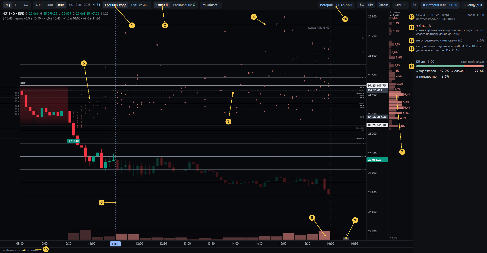
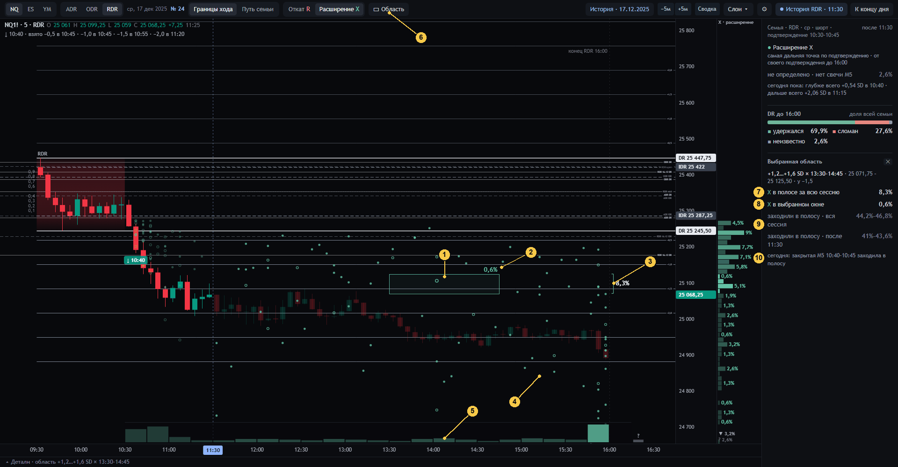
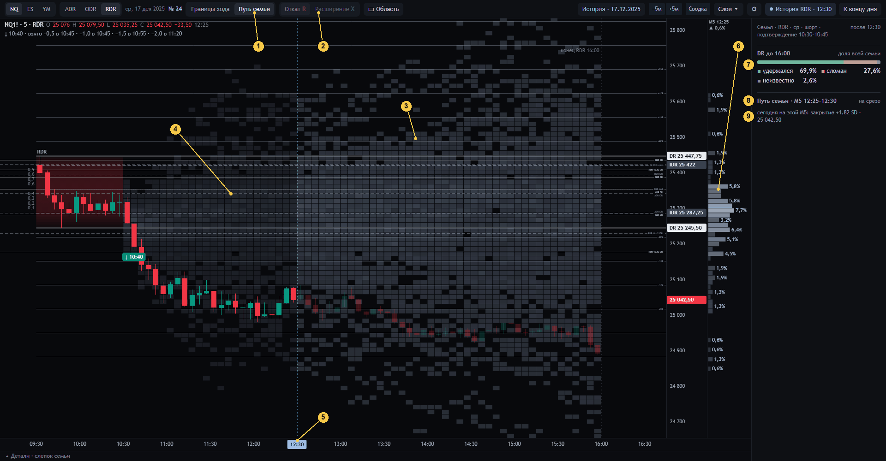
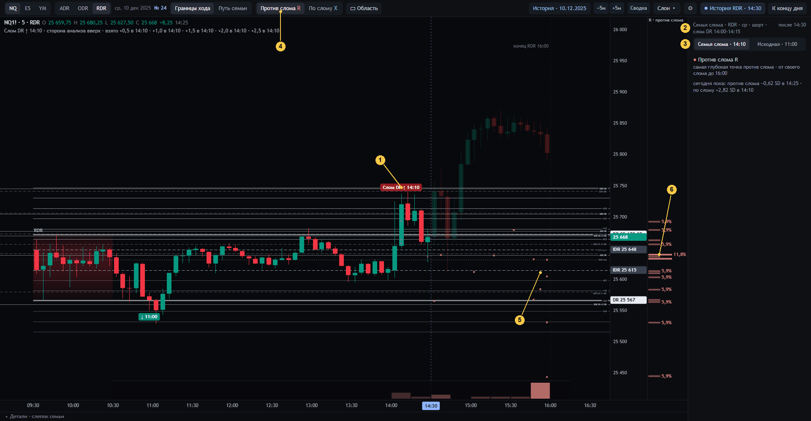
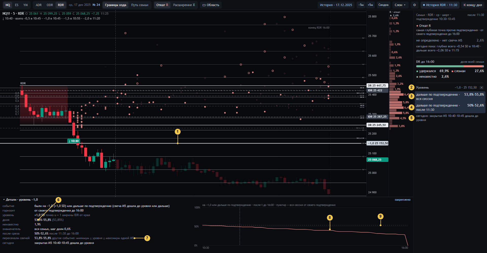
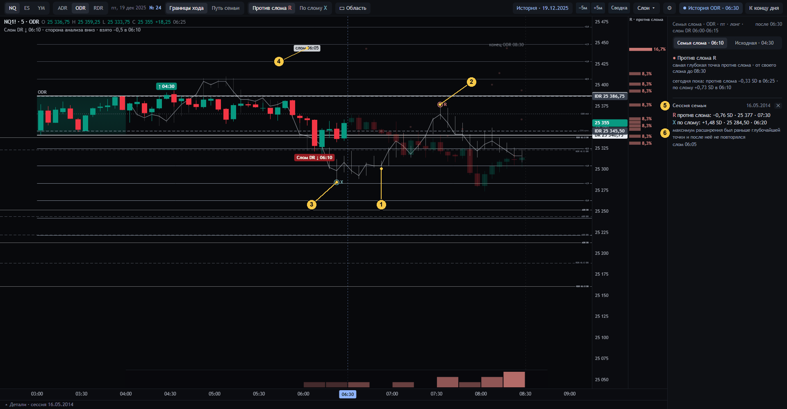
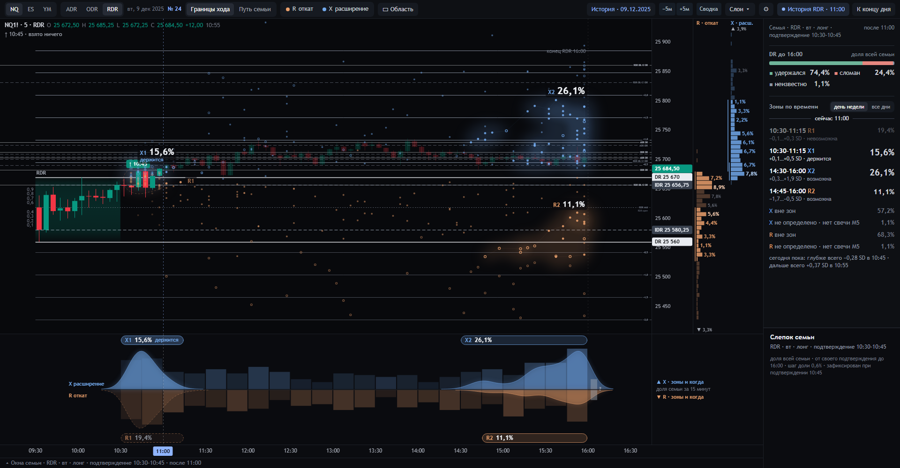
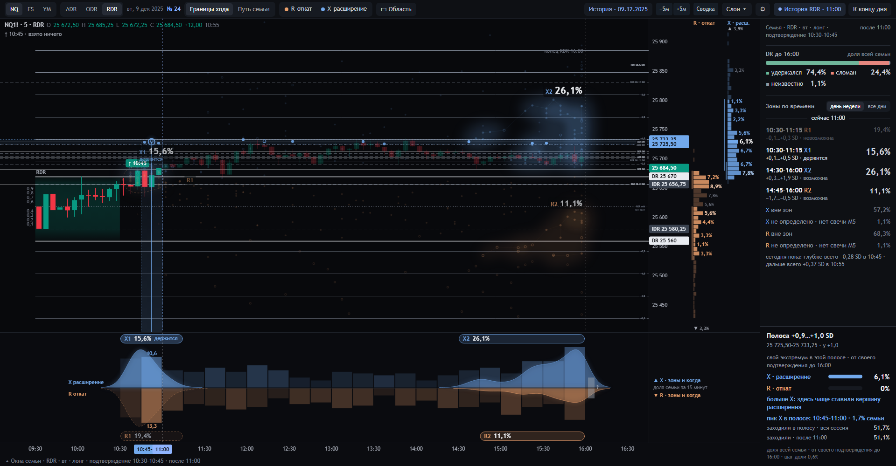
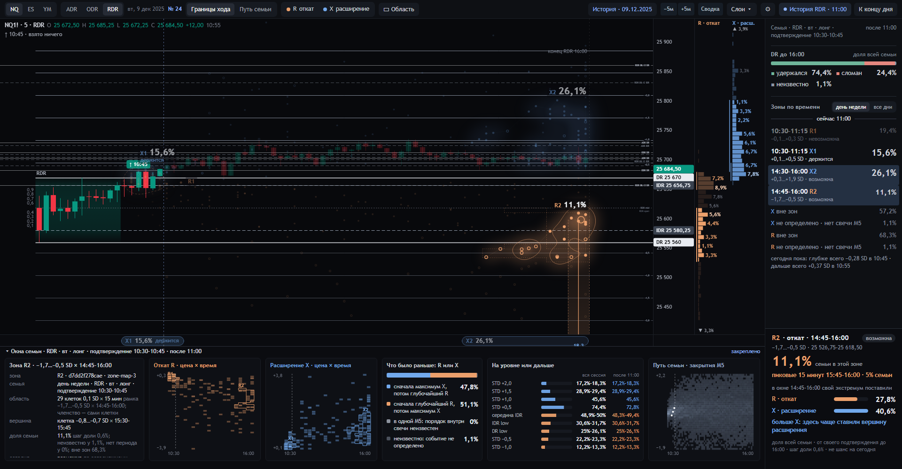
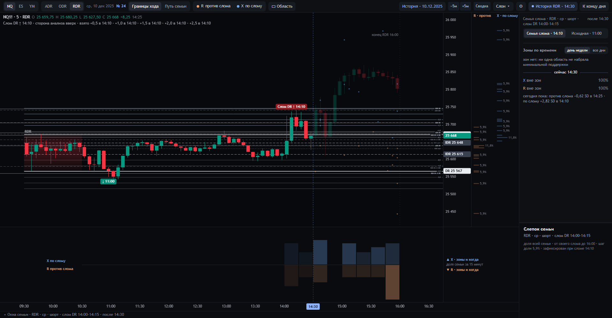

# 10 · Дизайн 24 «Границы хода»: рубеж смысла процентов (01.10.2026)

**Статус.** Отдельный прототип по прямому поручению оператора от 01.10.2026. Код и документы — в ветке `design-24` и
её пулл-реквесте на GitHub; правки по решениям оператора продолжаются в нём же. Рабочий экран — по-прежнему дизайн 22
(`http://127.0.0.1:8767/`), его файлы не менялись. Дизайн 24 — `http://127.0.0.1:8767/24/`, ярлык «DR Lab 24».

Источник смысла — семантическая спецификация аудитора **DR-LAB-SEM-1.0** ([lens/2026-10-01-spec-v1/](lens/2026-10-01-spec-v1/README.md)).
Здесь — что она решает, как она реализована и чем отличается от 22. Код: `lab/scene24.py`, `design/sozvezdiya-24/`
([README с картой кода](../design/sozvezdiya-24/README.md)). Определения коротко — [`../docs/SEMANTICS.md`](../docs/SEMANTICS.md),
раздел «Дизайн 24».

**Дизайн 23** — первая проба той же спецификации, сделанная другим агентом. 01.10 в 01:34 она ушла в `main` от имени
оператора: страница `/sem-v1/` без каркаса 22, запрос `/api/family-v1` (`lab/scene21.py::family_sem_v1`), описание —
`design/sozvezdiya-23/README.md`. Дизайн 24 — продуктовая версия по поручению оператора: интерфейс 22 целиком,
собственный слой данных `lab/scene24.py` (счёт в тиках, паспорта, семья слома, исторические дни, проверки). Дизайн 23
не изменён и работает рядом.

Главная ось 24 — **откуда берётся каждый процент, где он фиксируется, почему фиксируется и как считается**. Если
следующая правка заденет что-то из раздела 2, это смена фундамента: её надо выносить оператору и записывать в
[07](07-cepochka-reshenij.md).

## 1. Что было не так с процентами в 22

Дизайн 22 честно подписывал каждое число, но сами числа были разными объектами под одной картинкой
([09](09-chisla-ekrana.md), [razbor-2026-09-30](razbor-2026-09-30/README.md), [линза 14](lens/2026-09-30-linza-14.md)):

- **Проценты мест не делили сотню.** Доля места — «как часто цена семьи заходила в полосу». Одна сессия заходит в
  несколько мест, поэтому доли одной стороны складывались больше чем в 100 %. Ближнее место почти всегда было самым
  большим просто потому, что оно ближе.
- **Числа пересчитывались на каждой закрытой M5.** Горизонт «после среза до конца сессии» сжимался со временем, а
  места впереди цены менялись вместе с ней. Одно и то же место в 11:50 и в 15:25 означало разные вопросы.
- **Под видом одной «вероятности» на экране жили четыре объекта:** первые касания мест, плотность первых касаний
  (созвездия и контур 38 %), исход DR и путь закрытий (веер). Куратор назвал это смешением (линза 14).
- **Оператор читал крупные проценты как слепок дня из корзины,** который делит 100 % и зафиксирован при
  подтверждении. Например: «из 25 у 16 % DR сломался — лонг не держать». Такого объекта на экране не было: делил сотню
  только «DR удержался».

Отсюда запрос оператора: главная картина должна быть **слепком семьи, зафиксированным при подтверждении**, с понятной
сотней процентов, а не набором пересчитываемых долей.

## 2. Что решено в 24: откуда берётся процент

Десять правил. Вместе они и есть рубеж; у каждого есть причина.

| № | Правило | Почему так |
|---|---|---|
| П1 | **Одна семья, один N, фиксация при подтверждении.** F = инструмент × сессия × день недели × направление × 15-минутное окно подтверждения (по подписи свечи на TradingView, от конца коробки). Берутся сессии 2006–2025 строго раньше показанного дня. Состав фиксируется в момент сегодняшнего подтверждения (закрытие подтверждающей M5) и до конца дня не меняется. У слепка есть паспорт: `family_id` — состав, `snapshot_id` — версия измерений | Сравнение во времени должно относиться к одному историческому набору. Сдвиг среза не переписывает исходную карту (спец. §3.2, §9.2, §13.1) |
| П2 | **Одна сессия — одно событие — одна точка.** R — самая глубокая точка против подтверждения, X — самая дальняя по подтверждению. У каждой сессии своё начало (её собственное подтверждение, сама свеча не входит) и свой конец (конец её блока; свеча, закрывшаяся в конце, входит). Время события — открытие первой M5, где была достигнута цена. Повторы хранятся, но голосов не добавляют | Это публичные объекты метода (максимальный откат и максимальное расширение). У каждой сессии ровно одно значение, поэтому каждая гистограмма делит сотню (§5.1) |
| П3 | **Каждый процент = счётчик / N, и у каждой сущности своя сотня.** Распределение R, распределение X, исход DR (4 категории), каждая колонка «Пути семьи». R и X не складываются друг с другом, колонки — между собой | Сотня существует только внутри одного объекта. Сложение разных объектов и было ошибкой 22 (§6) |
| П4 | **Бинарные вопросы — отдельные события с названным горизонтом.** «На уровне или дальше», «заходили в полосу», «пересекали свечой» — доля N, у которой событие было. Считаются за весь горизонт каждой сессии и отдельно за общие часы после среза. Не делят сотню и вложены друг в друга: дальний уровень не может набрать больше ближнего | Это вопрос «было ли», а не «где закончилось». Хвост X на всём горизонте численно равен «на уровне или дальше» — это проверяется (§5.4) |
| П5 | **Неизвестное — не ноль и не выбрасывается.** Сессия без нужной M5 на горизонте остаётся в N. Её событие «?» никогда не рисуется ни по какой цене. Для бинарного вопроса показывается диапазон [да/N; (да+неизвестно)/N] | Иначе неизвестное превращается в успех, в провал или в сжатие N (§6, §13.3) |
| П6 | **Срез двигает только сегодняшнее.** Новая закрытая M5 меняет сегодняшние факты и вопросы «после ЧЧ:ММ». Исходные R, X, их распределения и исход семьи остаются прежними. Прошедшие по часам точки приглушаются, но не исчезают | Исходный ориентир не переписывается задним числом (§9.2) |
| П7 | **Кластеров автоматически нет, область выбирает оператор.** Полоса цены, полоса × окно или окно времени, по сетке 0,1 SD × 15 минут. Скобка справа несёт долю всей полосы, рамка — долю своего окна; окно не может быть больше полосы. Свечение — только рисунок без чисел | Сгущение в выборке ещё не устойчивый кластер. На N = 25 все клетки по одной сессии (§7, §12) |
| П8 | **Счёт в целых тиках.** u = d·(цена − край)/ширина IDR; ячейка цены — floor(10·v/w); уровень u = a/b проверяется как v·b ≥ a·w. Округлённая цена не участвует в проверке | Граница −0,75 одинакова для всех сторон и не зависит от округления (§3.1, §14.1-6) |
| П9 | **После слома — отдельная семья слома.** Тот же ключ, но вместо окна подтверждения — окно слома. Ориентация переворачивается: 0 — противоположный край IDR, «По слому / Против слома». У семьи слома свой N; доли «DR сломан» внутри неё нет. Исходный слепок доступен переключателем и восстанавливается с прежними N и числами | Незаметная подмена исходной семьи запрещена (§9.3) |
| П10 | **Атом — существующая M5-свеча** (слово оператора 01.10). Ночь и день считаются одинаково. Дырка — только целиком отсутствующая M5 на горизонте события, если без неё событие не определяется | Ничего не отбрасывается из-за неполных минут внутри свечи; сертификация минутной ленты не строится |

### Каждое число экрана 24

| Число | Как считается | Знаменатель | Горизонт | Что делит 100 % | Где на экране | Как нельзя читать |
|---|---|---|---|---|---|---|
| Доля полосы 0,1 SD у шкалы цены | #{R (или X) в полосе [k/10; (k+1)/10)} / N | N | своё подтверждение → конец блока | все полосы + «?» | гистограмма справа от шкалы | «сила уровня», «сколько раз заходили» |
| Доля 15 минут внизу | #{время события в [f+15b; f+15b+15)} / N | N | то же | все 15-минутки + «?» | полоса времени снизу | «когда будет разворот сегодня» |
| Скобка выбранной полосы | сумма долей ячеек полосы | N | то же | нет, это одна область | скобка справа от конца блока | доля «ядра» или окна |
| Рамка полоса × окно | #{события в полосе и в окне} / N | N | то же | нет | рамка на графике | доля всей полосы |
| DR: удержался / сломан / неизвестно / нет периода | категории исхода | N | своё подтверждение → конец блока | все четыре | панель, полоса | вероятность выигрыша или удержания от сегодняшней цены |
| На уровне или дальше | #{хотя бы одна M5 дошла до уровня} / N; при неизвестных — диапазон | N | весь свой горизонт; отдельно после среза | нет, вложенные | наведение на уровень, панель, детали | «цель», «будет» |
| Заходили в полосу | #{M5 с low < верх и high ≥ низ} / N | N | весь свой горизонт; после среза | нет | панель области, детали | доля событий R/X в полосе |
| Пересекали уровень свечой | #{M5 с low ≤ L ≤ high} / N | N | весь свой горизонт | нет | детали уровня | «на уровне или дальше» (гэп за уровень — «дальше» без пересечения) |
| Клетка «Пути семьи» | #{закрытие сессии на этой M5 в полосе} / N | N | одна M5 | вся колонка + «нет свечи» | плёнка, колонка справа | путь одной сессии или вероятность перехода от сегодняшней цены |
| Поле диапазонов V | #{свеча M5 сессии задевала полосу} / N | N | одна M5 | нет | детали клетки | закрытие |
| «?» | #{событие неизвестно или нет периода} / N | N | — | часть сотни своего объекта | у гистограмм, в панели | ноль или «не было» |

Шаг доли — 100/N: при N = 25 это 4 процентных пункта, при N = 156 — 0,64. Проценты считаются до округления и
показываются с одним знаком; ноль после запятой не пишется. Счётчики (N, «да», «неизвестно») хранятся в паспорте
каждого числа, на экране — только проценты и шаг доли в подсказке заголовка семьи (правило оператора: «проценты, не
счётчики»).

## 3. Как читать экран

Снимки этого раздела — первый вид 24 (до 01.10, ночь). Смысл чисел тот же; нынешний вид «Окна времени» с
одновременными R и X — [раздел 3а](#3а-вид-окна-времени-0110-вечер-решение-оператора).

Снимки — история NQ. В обзорах 17.12.2025, RDR, среда, шорт, подтверждение 10:40, семья из 156 сессий; потом семья
слома 10.12.2025 и ODR 19.12.2025. Это снимки инструмента (правило 1: снимки экрана можно), сами данные в репозиторий
не попадают.

### Обзор: «Границы хода», откат R, срез 11:30

| № | Что видно | Какое это событие и от чего процент | Против 22 |
|---|---|---|---|
| 1 | «Границы хода · Путь семьи» | Два режима одной семьи: события R/X или закрытия по M5 | **Новое** |
| 2 | «Откат R · Расширение X» | Один переключатель меняет точки и обе гистограммы сразу | **Новое** |
| 3 | Точка | Одна сессия семьи: её окончательный R за её собственный горизонт, на своей цене (в ширинах её IDR, перенесённых на сегодняшний IDR) и по реальным часам | **Заменено**: в 22 звезда — первое касание места |
| 4 | Кольцо | То же событие сессии, которая сломала свой DR. Форма, а не исключение: такие сессии остаются в N | **Новое** |
| 5 | Приглушённые точки слева от среза | События, которые исторически были раньше сегодняшнего среза. Остаются в распределении и не означают, что сегодняшний откат уже сделан | **Новое** |
| 6 | Пунктир среза | Сегодняшняя последняя закрытая M5. Двигает только сегодняшние факты и вопросы «после ЧЧ:ММ» | Как в 22 |
| 7 | Гистограмма у шкалы цены | P_R: доля семьи, у которой окончательный R в этой полосе 0,1 SD. «▲ / ▼» — доля за краем кадра, «?» — неизвестное | **Заменено**: в 22 — первые касания мест |
| 8 | Гистограмма времени | T_R: та же таблица по 15 минутам от конца коробки. Пик у 16:00 — свойство окончательного экстремума, его не прячут | **Заменено** |
| 9 | «?» после конца блока | Неизвестная масса R отдельной клеткой, не по времени | **Новое** |
| 10 | Заголовок семьи | Ключ семьи и срез. В подсказке — момент фиксации, шаг доли, `snapshot_id` | **Изменено**: «Семья · …» с 30.09, теперь с паспортом |
| 11 | «Откат R» | Название события и горизонт | **Новое** |
| 12 | «не определено · нет свечи M5» | Неизвестная масса R в процентах N | **Новое** |
| 13 | «сегодня пока» | Факты сегодняшних закрытых M5 после подтверждения: самая глубокая и самая дальняя точка с временем. Это не проценты и не окончательные значения | **Новое** |
| 14 | DR до 16:00 | Исход семьи: четыре категории, вместе 100 % N | **Изменено**: в 22 «DR удержится» + «тенью за DR» |
| 15 | «Детали» | Одна раскрываемая область вместо шести окон: полный паспорт выбранного числа и один график к нему | **Заменено** |
| 16 | «История» | Любой день 2006–2025 открывается как сегодня; его семья — только из более ранних дней | **Новое** |

Убраны (спец. §10.4): три места на сторону и их скобки, созвездия с контуром 38 %, «впервые», цели, «после касания DR
держался», шесть окон истории внизу.

### Выбранная область: расширение X, полоса × окно

| № | Что видно | Смысл |
|---|---|---|
| 1 | Рамка полосы +1,2…+1,6 SD × 13:30–14:45 | Выбрана оператором: кликом по гистограммам, рамкой «▭ Область» или с Shift. Сама по себе не утверждает, что здесь кластер |
| 2 | 0,6 % у рамки | Доля семьи, у которой окончательный X лежит **в этой полосе и в этом окне** |
| 3 | Скобка 8,3 % | Доля семьи, у которой X лежит **во всей полосе** за весь горизонт. Всегда не меньше доли окна |
| 4 | Точки X | Расширение — по подтверждению (для шорта вниз). В области точки ярче |
| 5 | Окно на полосе времени | Те же 15-минутки, что у рамки |
| 6 | «▭ Область» | Инструмент рамки; Esc снимает выбор |
| 7 | «X в полосе за всю сессию» | = скобка (3) |
| 8 | «X в выбранном окне» | = рамка (2) |
| 9 | «заходили в полосу» | Другое событие: хотя бы одна M5 задела полосу. Вся сессия и после среза; при неизвестных — диапазон |
| 10 | «сегодня» | Заходила ли сегодняшняя цена в полосу после подтверждения и когда; положение в момент подтверждения — отдельно |

### «Путь семьи»

| № | Что видно | Смысл |
|---|---|---|
| 1 | «Путь семьи» | Режим закрытий M5 |
| 2 | Погашенный переключатель R/X | Гистограммы событий в этом режиме скрыты, чтобы их проценты не читались как проценты плёнки |
| 3 | Клетки | C(K, j): доля семьи, закрывшаяся в полосе K на общей M5 j. Одна линейная шкала цвета для всех колонок, без нормировки на максимум колонки |
| 4 | Приглушённые колонки | Часы до сегодняшнего среза. История в них не меняется |
| 5 | Срез | Отделяет прошедшее от оставшегося |
| 6 | Колонка справа от шкалы | Распределение закрытий **на одной M5**: под курсором, выбранная или на срезе. Вместе с «нет свечи» — своя сотня |
| 7 | DR до 16:00 | Исход семьи остаётся: это отдельная сущность со своей сотней |
| 8 | «Путь семьи · M5 12:25–12:30 · на срезе» | Какая M5 описана |
| 9 | «сегодня на этой M5» | Где сегодня закрылась та же по часам свеча, в тех же единицах |

Поле диапазонов V («свеча задевала полосу») есть только в деталях клетки: это не закрытие и не второй фон.

### После слома DR: семья слома

| № | Что видно | Смысл |
|---|---|---|
| 1 | «Слом DR ↑ 14:10» | Сегодняшний слом закрытием M5 |
| 2 | «Семья слома · … слом DR 14:00–14:15» | Новая семья: окно слома вместо окна подтверждения; свой N |
| 3 | «Семья слома · 14:10 / Исходная · 11:00» | Явный переход к исходному слепку с прежними ориентацией, N и числами |
| 4 | «Против слома R / По слому X» | События от собственного слома каждой сессии; 0 — противоположный край IDR |
| 5 | Точки | По одной на сессию семьи слома |
| 6 | Гистограмма | При N = 17 шаг доли 5,9 %: одна сессия — одна ступень |

Строки «DR до …» нет: внутри семьи слома все сессии сломали DR по условию отбора. Если семья пуста, на экране «В
семье нет сессий: процентов нет» и кнопка перехода к исходной семье.

### Уровень и детали

| № | Что видно | Смысл |
|---|---|---|
| 1 | Яркая линия | Закреплённый уровень (STD −1,0 для шорта = +1,0 SD по подтверждению) |
| 2 | «Уровень» | Его вопрос. Уровень за краем игры (u > 0) спрашивает «по направлению», у края или позади — «против» (§5.4 буквально) |
| 3 | «дальше по подтверждению · вся сессия» | Доля N, у которой хотя бы одна M5 от своего подтверждения до конца блока дошла до уровня или дальше. На всём горизонте это хвост X |
| 4 | «… после 11:30» | Тот же вопрос на общих часах после среза. Он меняется, потому что сокращается горизонт, а не потому, что меняется семья |
| 5 | «сегодня» | Дошла ли сегодняшняя закрытая M5 и когда; был ли уровень уже за ценой в момент подтверждения |
| 6 | Паспорт | Событие, горизонт, точное значение уровня в ширинах IDR, доля с двумя знаками, неизвестное, шаг доли |
| 7 | «пересекали свечой» | Другое событие: low ≤ уровень ≤ high одной M5 |
| 8 | Кривая | Доля «на уровне или дальше» при старте остатка в каждый момент блока: так видно, что меняется со временем |
| 9 | Пунктир | Та же доля на всём своём горизонте (не зависит от среза) |

### Сессия семьи: парная точка и её путь

| № | Что видно | Смысл |
|---|---|---|
| 1 | Тонкая линия и столбики | Путь закреплённой сессии по M5 в её собственных ширинах IDR, по реальным часам |
| 2 | R | Её окончательный R |
| 3 | X | Её окончательный X — парная точка той же сессии. Стрелки между R и X нет: две моды двух распределений не маршрут сделки |
| 4 | «слом 06:05» | Её собственная активация (здесь — слом) |
| 5 | «Сессия семьи» | R, X, исход и время активации |
| 6 | Порядок | Что система вправе сказать о порядке первых R и X (§8): «максимум расширения был раньше глубочайшей точки и после неё не повторялся». Одна M5 — «порядок внутри свечи неизвестен» |

## 3а. Вид «Окна времени» (01.10, вечер; решение оператора)

Оператор сравнил три полных макета экрана (холст «DR Lab · экран 24») и двенадцать способов нарисовать созвездия (холст
«DR Lab · созвездия»). Он выбрал вариант «Окна времени» и созвездия «дымка и нити» в паре цветов «янтарь и небо»: R —
янтарный, X — небесный. Изменились рисунок и поведение мыши. **Смысл каждого числа прежний:** объект, знаменатель и
паспорт из раздела 2; проценты прежних скобок 22, которые не делили сотню, не перенесены. Снимки — история NQ
(`design/sozvezdiya-24/shots/`, снимки инструмента, не ленты).

| Что видно | Какой это объект и от чего процент | Как нельзя читать |
|---|---|---|
| R и X одновременно, без переключателя | Две независимые сущности, у каждой своя сотня; переключатель R / X убран | Не складывать R и X |
| Созвездие | Зона `zone-map-3` R или X. Рисуется только по её собственным точкам: плотность в пикселях экрана, мягкая заливка на 0,22 и 0,6 её вершины, нити кратчайшего дерева между звёздами (0,5 px). При наведении — изолиния 0,35 и точные клетки зоны. Пунктир — зона «невозможна» | Контур — рисунок, а не граница членства: членство — клетки зоны |
| Подпись созвездия «X2 26,1%» | Доля семьи в клетках зоны, n/N. Размер шрифта растёт с долей; у невозможной зоны — только имя | Не шанс на сегодня |
| Две колонки справа от цены | P_R(k) и P_X(k) по 0,1 SD, каждая своя сотня. Строки зоны ярче, самая плотная строка каждой зоны крупнее. Штрих у края колонки — ценовой размах зоны | Столбик — доля всей полосы за весь горизонт, не доля зоны; столбики не складывать в долю зоны |
| Капсула в ленте времени | Зона на всём своём окне времени (15-минутные клетки, которые она занимает), с долей n/N и статусом | — |
| Холм в ленте | Форма времени сессий зоны (гаусс 7 минут). Высота нормирована на самый высокий холм своего события | Холм — рисунок без числа; холмы X и R по высоте не сравниваются |
| Столбики ленты | T_X(b) вверх, T_R(b) вниз по 15 минутам, одна шкала (квадратный корень). Обе — доли одного N, поэтому сравнимы: более высокий — то событие, которое в этом окне ставили чаще. «?» справа — неизвестная масса | Не «вероятнее откат», а «в этом окне свой R поставили чаще, чем свой X» |
| Связь «кластер → время» | Наведение на зону или на полосу цены: кольцо на самом плотном месте, сплошная линия вниз до **пиковых 15 минут** — клетки времени, где больше всего сессий этой зоны или полосы; окно на оси времени | Пик — описание семьи, не время разворота сегодня |
| Инспектор (низ справа) | То, что под курсором: зона, полоса, 15 минут, сессия, уровень; иначе закреплённое, иначе слепок семьи. В окне времени — «X a% · R b%» и «больше X / больше R». Заменяет всплывающую подсказку над свечами | — |
| Шесть окон снизу | Выезжают, когда мышь у нижнего края; клик по заголовку закрепляет (см. ниже) | — |
| Панель | Слепок; исход DR (одна сотня N); зоны R и X одним списком по времени с линией «сейчас ЧЧ:ММ»; «вне зон» и «не определено» для каждого события; сегодняшние факты | — |

### Шесть окон семьи — что каждое значит

Оператор попросил вернуть окна, как в 22, и проверить их смысл. Четыре окна 22 (цена и время отката и расширения)
теперь стоят прямо на графике: две колонки справа и лента снизу. Повторять их внизу не нужно (правило 6). Вместо них —
то, чего на графике нет:

| Окно | Объект | Сотня |
|---|---|---|
| 1. Паспорт / слепок | Паспорт того, что под курсором или закреплено (как прежние «Детали» 24); без этого — ключ и правила слепка | — |
| 2. Откат R · цена × время | Таблица A_R(k,b) по клеткам 0,1 SD × 15 минут, точные клетки зон обведены | Все клетки + «?» = N |
| 3. Расширение X · цена × время | То же для X | То же |
| 4. Что было раньше: R или X | Порядок первых R и X каждой сессии (§8 спецификации): сначала X, сначала R, в одной M5, неизвестно | Своя сотня |
| 5. На уровне или дальше | Бинарный вопрос §5.4 на сегодняшних уровнях: за весь горизонт (бледно) и после среза (ярко); ✓ — уровень уже взят сегодня | Нет: вложенные доли; при неизвестных — диапазон |
| 6. Путь семьи · закрытия M5 | C(K,j), каждая колонка — своя сотня; белые точки — сегодняшние закрытия | Каждая колонка |

После слома DR лента и колонки показывают семью слома («против слома» / «по слому»). Если в малой семье зон нет, там
стоит «вне зон 100 %», капсул и холмов нет:

**Проверено** (`tests/ui_check24.js`, пункт 6 обновлён): созвездий и капсул столько же, сколько зон R и X; колонки
R и X разделены; инспектор читает наведённую зону и окно времени с обоими событиями; у наведённой зоны есть связь
с пиковыми 15 минутами; плавающей подсказки нет; внизу шесть окон. Пройдено без замечаний на NQ: RDR 17.12.2025 (шорт),
09.12.2025 (лонг), семья слома 10.12.2025, ODR 05.11.2025 и 19.12.2025, ADR 14.03.2018. `tests/sem24.py` и
`tests/smoke.py` — всё зелёное.

## 4. Как это посчитано

1. **База** — `lab/.runtime/boxes_*` (`lab/build_boxes.py`): каждая сессия 2006–2025 с её clock-M5 от начала коробки
   до конца блока. В репозиторий не попадает.
2. **Семья** — `lab/scene24.py::_snapshot`: отбор по ключу и «раньше показанного дня». Сессия с целиком отсутствующей
   M5 до подтверждения не входит в семью; она считается в журнале неопределённых ключей.
3. **Измерение сессии** — `measure()`: R, X, первые времена и повторы, исход DR, порядок, число пропусков. Всё в целых
   тиках, в ориентации семьи (для семьи слома — перевёрнутой).
4. **Путь** — `path[j]` = [low, high, close] на каждой общей M5 блока после коробки или пусто.
5. **Ответ** — `/api/d24/family`: ключ, `family_id`, `snapshot_id`, правила, сетка, члены, счётчики, журнал
   ([`../docs/ARCHITECTURE.md`](../docs/ARCHITECTURE.md)).
6. **Страница** пересчитывает распределения из членов, сверяет их со счётчиками сервера и создаёт паспорт для каждого
   показанного числа (`pp()` в `design/sozvezdiya-24/src/app.js`). Перенос на сегодняшние цены — через сегодняшний IDR.

## 5. Кто что решил

| Решение | Кто | Где |
|---|---|---|
| Построить 24 по DR-LAB-SEM-1.0 рядом с 22; 22 не трогать; проверять без подходящего живого момента | оператор, 01.10 | [`../docs/DECISIONS.md`](../docs/DECISIONS.md) |
| Атом — существующая M5; ночь как день; дырка — только целиком отсутствующая M5 | оператор, 01.10 | там же; [lens/2026-10-01-spec-v1/README.md](lens/2026-10-01-spec-v1/README.md) |
| Вести 24 пулл-реквестом и поправлять его решениями оператора; зафиксировать рубеж в репозитории | оператор, 01.10 | там же |
| R и X как главная карта, семья, исход, путь, область, паспорта, проверки | спецификация аудитора (по заданию оператора) | [lens/2026-10-01-spec-v1/](lens/2026-10-01-spec-v1/README.md) |
| Сторона вопроса уровня по §5.4; «Путь семьи» с конца коробки; яркость клеток ×2; без календаря ранних закрытий; без синтетического макета | исполнитель | [О21](05-otkrytye-voprosy.md) |
| Правило 10 и рабочий экран без изменений до решения оператора | исполнитель по смыслу поручения | [О19](05-otkrytye-voprosy.md) |

## 6. Чем проверено

- `tests/sem24.py` — 32 эталонные проверки спецификации, перенесённые на функции 24, и проверки на всей базе. Числа
  §12 спецификации воспроизводятся точно:
  - RDR, среда, лонг, 11:45: N 25, удержали 21, сломали 4, первым X у 17, первым R у 8, все X раньше всех R у 16;
  - ODR, среда, лонг, 04:00: N 187, 133 / 51 / 3, пять неизвестных R.
- `tests/ui_check24.js` в странице: каждый процент панели совпадает со своим паспортом; страница и сервер считают
  одинаково; R, X и обе гистограммы — одна таблица; каждая колонка плёнки складывается в N; окно не больше полосы; хвост
  X равен «на уровне или дальше»; сдвиг среза не меняет слепок. Пройдено на восьми состояниях: обычная семья, семья
  слома и исходная, слом ODR и ADR, пустая семья слома, ODR 2018, день без подтверждения на срезе.
- `tests/smoke.py` — всё зелёное, включая 22.

## 7. Ограничения

- **Доля неизвестного по атому оператора** (вся база, от подтверждённых сессий):
  - RDR — R и X неизвестны у 3,4–3,5 % (праздничные сокращённые дни: календаря ранних закрытий нет, поэтому это
    «неизвестно», а не «рынок закрыт»);
  - ODR — 0,5–3,3 %;
  - ADR на NQ и YM — 14,2 %, первое подтверждение не установлено у 3,7–3,8 % (целиком нет вечерних M5, чаще в ранние
    годы);
  - ADR на ES — 3,3 %.
  Всё это видно как «?».
- **Малые семьи.** При N = 25 каждая сессия — 4 %, все клетки цена × время по одной сессии. Автоматическое выделение
  кластера на таком N не обосновано (§12) — это и есть открытая задача ниже.
- **«Путь семьи» бледный у больших семей.** Шкала линейная 0…100 %, одна на все колонки; при яркости ×2 доли выше
  примерно 45 % не различаются по цвету (точные числа — в колонке).
- **До подтверждения** у 24 статистики нет: это по спецификации; прежняя когорта похожих осталась в 22.

## 8. Что дальше: задачи поверх фундамента

Каждая — отдельная правка пулл-реквеста с решением оператора и узлом в [07](07-cepochka-reshenij.md). Ничто из этого не
меняет раздел 2 без явного решения.

1. **Механика главного кластера: цена и время.** Слова оператора 01.10: скопления должны быть «подтянуты под время»,
   «не только совпадать справа кластер, но и быть приблизительное время». Как созвездия 22 при наведении показывали
   своё окно времени, так и кластер 24 должен нести полосу цены и окно времени. Автоматический алгоритм главного
   кластера — по §7.2 спецификации: граница объявляется до проверки; устойчивость на независимой истории той же семьи,
   к сдвигу сетки и к пересэмплированию сессий; без опоры на одну сессию. До доказательства — только «выбранная
   область».
   **Сделано 01.10:** главный кластер `main-cluster-1` ([11](11-glavnyj-klaster.md)), затем независимые аудиты синтеза
   и карты зон ([lens/2026-10-01-cluster-synthesis](lens/2026-10-01-cluster-synthesis/README.md),
   [lens/2026-10-01-zone-map-2](lens/2026-10-01-zone-map-2/README.md)); на экране теперь карта зон `zone-map-3`
   ([12](12-karta-zon.md)).
2. **Модель последовательностей.** Порядок событий (R → X, посещение области → уровень раньше слома и т.п.) с явными
   определениями начала, повторов, прекращения наблюдения и неизвестного порядка внутри свечи (§8: в v1 только порядок
   первых R и X у каждой сессии).
3. **Условные прогнозы.** Подписанные виды «n из N» по прожитому сегодняшнему пути, отдельно от основного слепка, с
   проверкой на новых сессиях ([08](08-semantika-klasterov.md) 3.3, [линза 13](lens/2026-09-30-linza-13.md)).
4. **Дизайн** — по замечаниям оператора. **Сделано 01.10, вечер:** вид «Окна времени» с созвездиями «дымка и нити»
   (раздел 3а).
5. **Принятие спецификации для рабочего экрана** — новый текст правила 10 и разделение правила 6 (О19); перенос 24 в
   рабочий экран — решение оператора.

## 9. Как вернуться

- Ветка `design-24`, её пулл-реквест на GitHub; первый коммит фундамента — «Design 24 «Границы хода»: design 22's screen
  with the statistical layer of the specification DR-LAB-SEM-1.0». `main` до слияния — эпоха 22, затем дизайн 23 и
  линза 14.
- Спецификация — версия DR-LAB-SEM-1.0, сохранена без изменений; её эталон — `validate_semantics_v1.py`.
- Воспроизвести числа: `python -B tests/sem24.py`; любую картину — `http://127.0.0.1:8767/24/#date=…&session=…&at=…`
  (параметры адреса — в README дизайна).
