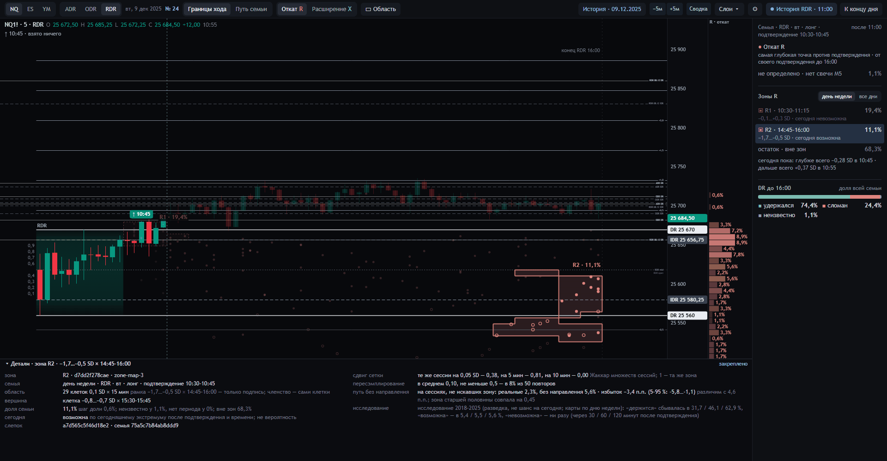

# 12 · Карта зон R / X: `zone-map-3` (01.10.2026)

**Статус.** Рабочая карта зон экрана 24; рамка «главный кластер» ([11](11-glavnyj-klaster.md)) с экрана ушла. В основе:
- спецификация DR-LAB-ZONE-MAP-2.0 ([lens/2026-10-01-zone-map-2](lens/2026-10-01-zone-map-2/README.md));
- поправки её независимого аудита.

Пороги приёмки на новых сессиях объявлены здесь (§6) до того, как такие сессии появились.

**Кто что решил.**
- **Оператор, 01.10.** Аудит принят как основание реализации. Объект — несколько ценово-временных зон R / X и остаток.
  - Семья по дню недели — стандарт, без дня недели — только явный выбор, автоматического перехода нет.
  - Слепок неподвижен. Статус зоны — по достижимому множеству.
  - Null, перенос и устойчивость — свойства зоны, а не разрешение ей существовать.
  - Доля зоны — не вероятность на сегодня.
  - В архитектурный цикл не возвращаться, если реализация не покажет противоречия.
- **Исполнитель предложил, решать оператору:** правило зоны (§1), определения диагностик и среза, ответы на линзы
  (§2), пороги приёмки (§6).

Противоречия между требованиями реализация не нашла. Цена единого правила одна — «плечо» в §2.1.

## 1. Что такое зона

Для события R или X одной семьи:
- **Сетка** — 0,1 ширины IDR × 15 минут по часам сессии.
- **Плотность D каждой клетки** — сколько событий семьи в квадрате 3 × 3 вокруг неё. Считается для всех клеток, и для
  пустых тоже.
- **Зона** — связная область клеток (8 соседей), где D не ниже половины максимума этой же области и нет клетки выше
  этого максимума. Иначе говоря, область на половине высоты своей собственной вершины.
- **Порог поддержки.** В зоне не меньше max(4; 5 % N) сессий; иначе её сессии уходят в остаток.
- **Доля зоны** — её сессии / N; это доля семьи, не шанс на сегодня.
- **Остаток** — все остальные известные события. «Неизвестно» и «нет периода» остаются в N и места не получают.
- **Порядок зон** — по времени начала, затем по доле.
- **Статус на сегодня:**
  - «держится» — сегодняшний экстремум после подтверждения лежит в зоне;
  - «возможна» — более глубокий (для X — более далёкий) экстремум на более поздней свече ещё может попасть в зону;
  - «невозможна» — иначе;
  - «неизвестно» — если сегодня целиком нет M5.

## 2. Ответы на линзы оператора

1. **Самое простое правило.** Половина высоты своей вершины на плотности, посчитанной по всей сетке.
   - Область непрерывна: пустая клетка внутри сгущения получает плотность от соседей и входит в зону. Дыр больше нет —
     в V2 они составляли половину рамки.
   - Два сгущения — две зоны, если долина между ними ниже половины каждого.
   - Если долина выше половины большего, это один гребень.
   - Бугор, долина которого лежит между двумя половинами, — «плечо» большего сгущения. На половине высоты большего он
     в его область не входит, и его сессии остаются в остатке. Это единственная плата за одно правило.
2. **Одна операция.** Компоненты надуровневого множества. Слияние, водораздел и пол больше не отдельные шаги.
   - Тай-брейков нет: компонента — это множество, и порядок клеток её не меняет. Тест: те же события в другом порядке
     дают те же зоны.
   - Вершина нужна только для имени зоны.
   - Две честные реализации с одинаковыми D, соседством, половиной и порогом поддержки получат одинаковые зоны.
3. **Статус в продукте.** Да, на экране только «держится / возможна / невозможна».
   - Частоты, с которыми такие зоны сбывались, лежат в деталях зоны как исследование, с номером исследования и
     пометкой «не шанс на сегодня».
   - Различие огромное (§4), но измерено на уже виденном корпусе. До проспективной калибровки это исследование.
4. **Что заморозить до новых сессий** — §6.

## 3. Что изменилось против V2 — по аудиту

| Аудит V2 | `zone-map-3` |
|---|---|
| Маска из занятых клеток, решето | Область: клетки с плотностью не ниже половины своей вершины, пустые тоже |
| Слияние по меньшей вершине, пол по большей; 4,4 % зон распадались | Одно правило: компонента связна по построению |
| A1: ничьи водораздела | Водораздела нет |
| A2: плато, не являющееся вершиной | Плато — часть компоненты, особого случая нет |
| A4: срез t | Новый экстремум открывается не раньше закрытия последней закрытой M5 |
| §22: подтверждающая M5 | Не входит в сегодняшний экстремум, как в DR-LAB-SEM-1.0 |
| §30–31: «наиболее соответствующая», «recovery» | Жаккар множеств сессий с лучшей зоной другой карты. Сетка: три сдвига и минимум. Пересэмплирование: 50 повторов, среднее и доля ≥ 0,5 |
| §33.1: null на тех же сессиях | Старшая половина находит область (её зону, сильнее всего перекрывающую зону слепка), младшая сравнивается со своими копиями без направления (200), избыток с интервалом по годам и минимальный различимый избыток |
| §43: без порогов | §6 ниже |

Код: [`lab/zonemap24.py`](../lab/zonemap24.py), [`lab/scene24.py`](../lab/scene24.py) (зоны и сегодняшний статус),
страница [`design/sozvezdiya-24/src/`](../design/sozvezdiya-24/src/). Тесты:
- [`tests/sem24.py`](../tests/sem24.py), часть 3: синтетические зоны, долина, гребень, дыры, порядок событий, статус,
  база;
- [`tests/ui_check24.js`](../tests/ui_check24.js), пункт 10: страница пересчитывает каждую зону и сверяет статус с
  сервером.

## 4. Паспорт результатов на 2018–2025 (разведка)

Это исследование [`studies/zone_map_3_2026_10_01/`](../studies/zone_map_3_2026_10_01/README.md).
- Цели — сессии 2018–2025.
- Семья цели — её ключ строго до её даты, по дню недели; семьи от 60 сессий.
- Этот корпус линия уже видела, поэтому это разведка, а не приёмка.

**Перенос вперёд.** «Попало» — следующая сессия в какой-либо зоне. «Плотнее фона» — попаданий на клетку зоны против
клетки собственного диапазона семьи вне зон.

| | Масса зон → попало | Перенос | Ранние | Поздние | Плотнее фона | Без дня недели: перенос |
|---|---|---|---|---|---|---|
| ADR R | 23,9 → 18,8 % | 0,79 (0,74…0,83) | 0,86 | 0,62 | ×12,5 | 1,02 |
| ADR X | 25,1 → 17,4 % | 0,69 (0,65…0,74) | 0,81 | 0,41 | ×9,7 | 1,02 |
| ODR R | 32,2 → 22,5 % | 0,70 (0,66…0,73) | 0,84 | 0,52 | ×8,6 | 0,86 |
| ODR X | 31,8 → 21,2 % | 0,67 (0,62…0,71) | 0,79 | 0,44 | ×8,7 | 0,86 |
| RDR R | 33,4 → 27,3 % | 0,82 (0,77…0,86) | 1,06 | 0,50 | ×11,6 | 0,91 |
| RDR X | 33,3 → 25,3 % | 0,76 (0,71…0,80) | 0,76 | 0,76 | ×11,7 | 0,89 |

У V2 перенос был 0,44–0,61.

**Против более простых отображений.**
- «Та же площадь по гистограммам» — столько же клеток, сколько у зон, выбранных только по произведению ценовой и
  временной гистограмм, без совместной структуры.
- «Шаблон» — ранний блок 0,5 × 60, взятый из 2006–2017.

| | Зоны против той же площади по гистограммам, п.п. | Ранняя зона против шаблона, п.п. |
|---|---|---|
| ADR R | +2,7 (+1,3…+4,2) | 0,0 (−0,9…+1,0) |
| ADR X | −1,4 (−3,1…+0,5) | −0,8 (−2,1…+0,7) |
| ODR R | +2,8 (+0,5…+4,8) | −1,1 (−1,6…−0,7) |
| ODR X | −0,3 (−2,2…+1,7) | +0,9 (−0,2…+2,0) |
| RDR R | +3,8 (+2,6…+5,0) | −0,7 (−1,8…+0,5) |
| RDR X | 0,0 (−0,9…+0,8) | −1,6 (−2,5…−0,6) |

**Статус на сегодня** через 30 / 60 / 120 минут после подтверждения: доля зон и сколько их потом сбылось. «Невозможна»
не сбылась ни разу.

| | Невозможна | Держится → сбылась | Возможна → сбылась |
|---|---|---|---|
| ADR R | 18 / 34 / 54 % | 21 / 15 / 11 % → 29 / 43 / 64 % | 62 / 51 / 35 % → 4 / 4 / 5 % |
| ADR X | 26 / 44 / 58 % | 18 / 14 / 10 % → 35 / 49 / 67 % | 56 / 43 / 32 % → 3 / 4 / 4 % |
| ODR R | 13 / 27 / 42 % | 20 / 14 / 10 % → 28 / 40 / 61 % | 67 / 59 / 48 % → 5 / 6 / 6 % |
| ODR X | 23 / 38 / 52 % | 19 / 14 / 10 % → 33 / 48 / 66 % | 58 / 48 / 37 % → 4 / 4 / 4 % |
| RDR R | 13 / 25 / 36 % | 21 / 15 / 11 % → 32 / 46 / 63 % | 66 / 60 / 52 % → 5 / 6 / 6 % |
| RDR X | 17 / 32 / 43 % | 20 / 13 / 10 % → 27 / 41 / 57 % | 63 / 54 / 47 % → 6 / 6 / 7 % |

**Та же карта на путях без направления** (семьи от 60 сессий на конец базы, 20 повторов):

| | Зон: реальные / null | Масса | Поздних |
|---|---|---|---|
| ADR R | 2,4 / 2,6 | 26,0 / 26,7 % | 1,1 / 1,2 |
| ADR X | 2,5 / 2,7 | 26,8 / 26,4 % | 1,0 / 1,2 |
| ODR R | 3,0 / 2,9 | 34,2 / 33,9 % | 1,9 / 1,7 |
| ODR X | 2,9 / 3,0 | 32,8 / 33,5 % | 1,6 / 1,7 |
| RDR R | 2,7 / 2,9 | 34,4 / 35,0 % | 1,6 / 1,8 |
| RDR X | 2,9 / 3,0 | 34,8 / 33,8 % | 1,7 / 1,8 |

**Что из этого следует:**
1. **Решето было главным дефектом.** Перенос всей карты вырос с 0,44–0,61 до 0,67–0,82. Зоны на следующих сессиях
   в 9–12 раз плотнее фона.
2. **Для отката R совместная структура «цена × время» добавляет сведений сверх гистограмм:** +2,7…+3,8 п.п. на той же
   площади. Для расширения X — нет.
3. **Поздние зоны по дню недели переносятся хуже:** 0,41–0,76. Без дня недели вся карта переносится на 0,86–1,02.
4. **Ранняя зона почти не отличается от общего шаблона.**
5. **На путях без направления алгоритм строит такие же карты.** Зоны описывают, где лежат окончательные экстремумы
   таких сессий; это не доказательство рыночного механизма (V2 §33.3).
6. **Статус отсекает варианты фактом.** К 120-й минуте невозможны 36–58 % зон. «Держится» сбывается в 10–20 раз чаще,
   чем «возможна».

## 5. Экран 24

Семья RDR, вторник, лонг, подтверждение 10:30–10:45:
- **R1** (10:30–11:15) к 11:00 невозможна: сегодняшний минимум ушёл глубже неё. Она пунктирная и бледная.
- **R2** (14:45–16:00) возможна. Это её неровная область клеток, рамки нет.
- **В панели** — зоны в порядке времени с долей семьи и статусом, затем остаток и переключатель «день недели | все дни».
- **В деталях** — паспорт зоны слева и её диагностика справа. У R2 место плывёт: сдвиг сетки 0,38 / 0,81 / 0,00,
  пересэмплирование 0,10. На сессиях, не искавших зону, реальных в ней меньше, чем копий без направления. Там же
  частоты статусов из исследования.

Семья ODR, среда, лонг:
- X1 (04:00–04:45) держится: сегодняшний максимум пока в ней.
- X2 и X3 в 08:00–08:30 возможны.

Адрес: `#date=…&session=…&at=…&ev=X&scope=all&zone=2&det=1`.

## 6. Приёмка на новых сессиях — объявлено до журнала

Объявлено 01.10.2026, до того как появилась хоть одна новая сессия; 2018–2025 для приёмки больше не годится.
Зафиксированы:
- версия `zone-map-3` и её параметры: 3 × 3, половина, max(4; 5 % N), сдвиги, 50 пересэмплирований, 200 копий;
- сравнения, определённые в [`check.py`](../studies/zone_map_3_2026_10_01/check.py): шаблон 2006–2017, гистограммы на
  той же площади, время, цена;
- зёрна.

**Как считается.**
- Цели — сессии после 31.12.2025 с установленным подтверждением; семья цели — её слепок в день цели.
- Карты по дню недели — стандарт.
- Считается отдельно по ADR, ODR и RDR, вместе по инструментам и событиям.
- Оценка — не раньше 300 целей на сессию и 40 торговых дней.
- Интервалы — 5–95 % при пересэмплировании целых торговых недель.

**Пороги.** Они выведены из смысла продукта, а не из чисел 2018–2025.

| | Что | Порог | Если не выполнено |
|---|---|---|---|
| A1 | Перенос всей карты: попало / масса зон | ≥ 0,8, нижняя граница ≥ 0,65 | Доля зоны завышает перенос: подпись «доля семьи» дополняется переносом класса |
| A2 | Перенос поздних зон (начало позже часа от окна семьи) | ≥ 0,7 | Поздние зоны показываются бледно с пометкой «без переноса» |
| A3 | Добавка к гистограммам: зоны против той же площади по гистограммам | Нижняя граница > 0: добавляет; интервал с нулём: не хуже; верхняя < 0: хуже | Совместная структура не дала сведений; карта остаётся описанием |
| A4 | Статус разделяет | «держится» через 60 минут сбывается хотя бы втрое чаще «возможна» | Статус остаётся фактом, без чисел исследования |
| A5 | Логика статуса | «невозможна» не сбылась ни разу | Ошибка: работа останавливается до исправления |
| A6 | Плотность | попаданий на клетку зоны хотя бы втрое больше, чем на клетку фона | Зоны не сгущения: решение оператора |

**Без порога, только отчёт:**
- день недели против всех дней — это решение оператора по §2;
- ранняя зона против шаблона;
- null-карта.

Для этого нужен журнал новых сессий (V2 §44). Он ещё не сделан: журнал пишет на диск слепок и исход каждой живой
сессии, поэтому нужно согласие оператора.

## 7. Пределы

- 2018–2025 видели все версии этой линии, поэтому §4 — разведка.
- Карта на путях без направления такая же: это описание, а не механизм.
- Ранняя зона почти совпадает с общим шаблоном.
- Поздние зоны по дню недели переносятся вперёд слабее.
- Первая загрузка семьи с диагностикой занимает 1–3 секунды, у семьи по всем дням — до 6 секунд. Слепок кэшируется,
  срез его не пересчитывает.
- Новый адрес `view=…:all` — это семья по всем дням. Сервер `lab/server.py` не менялся.
