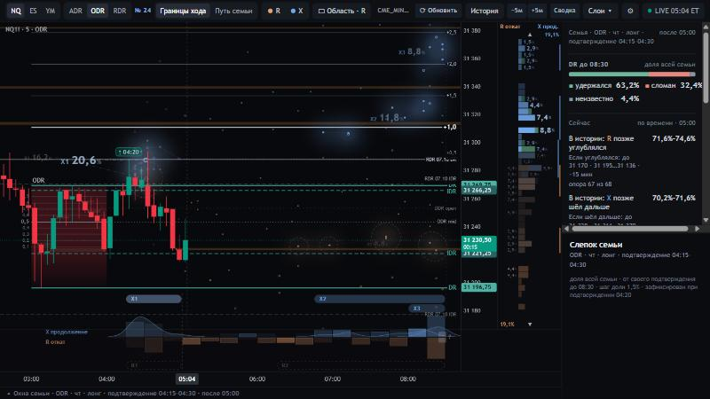
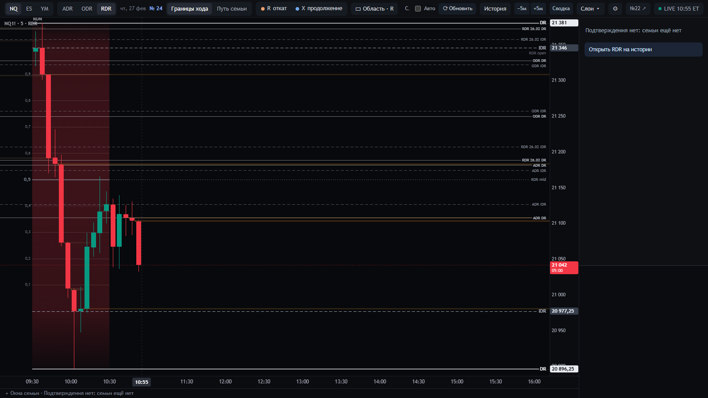
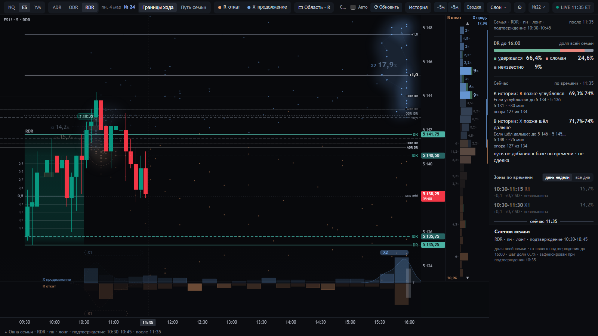
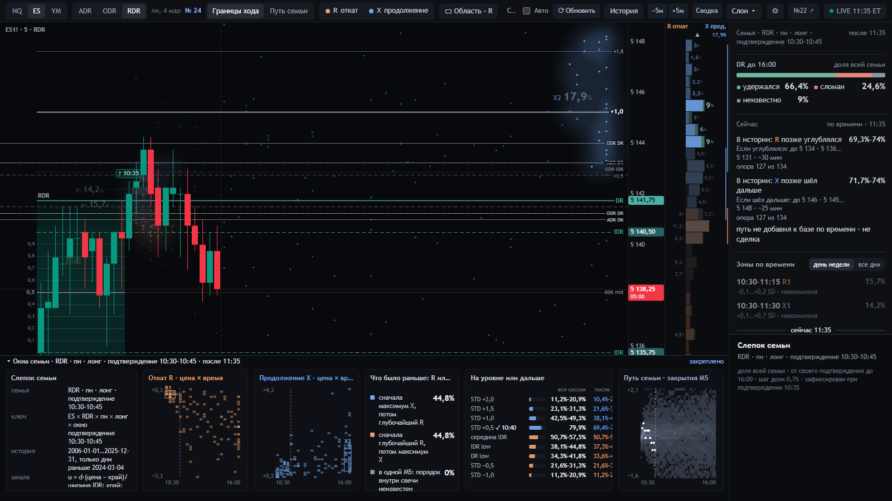
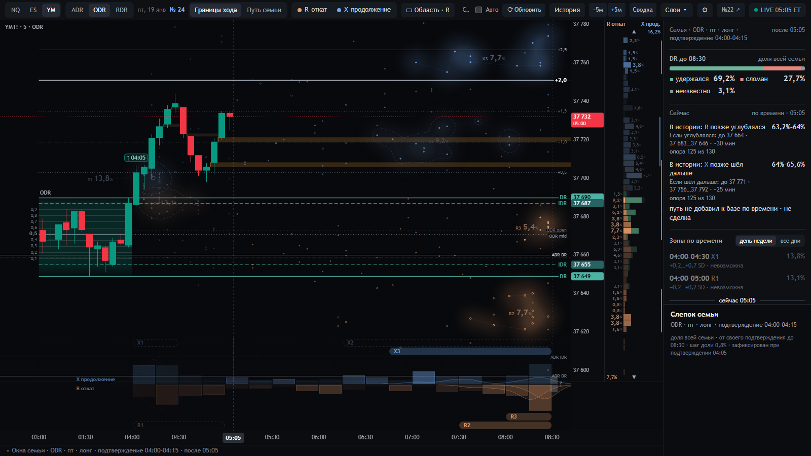
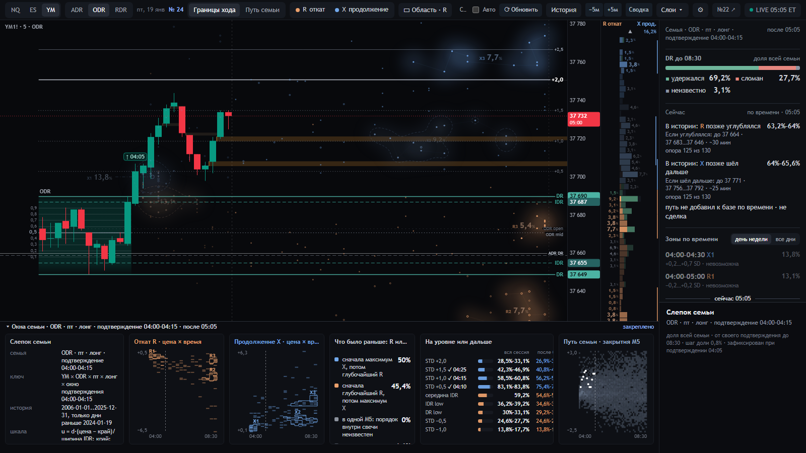
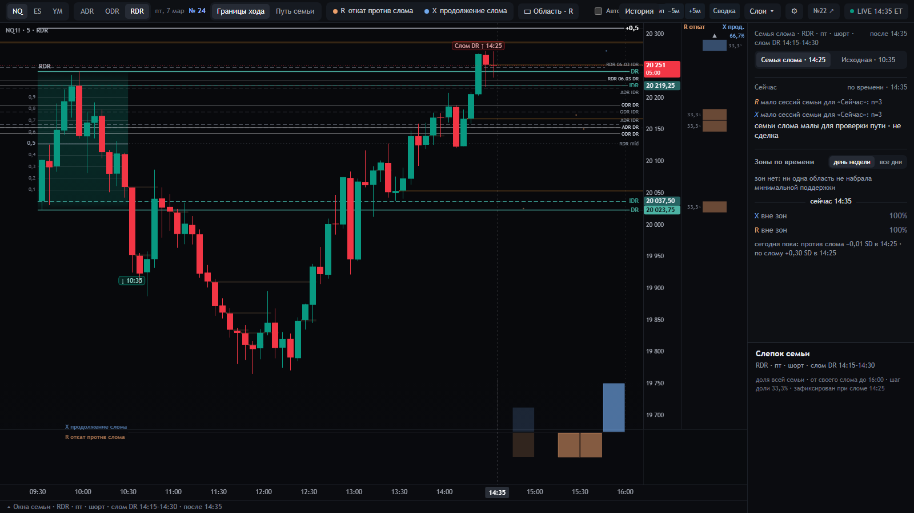
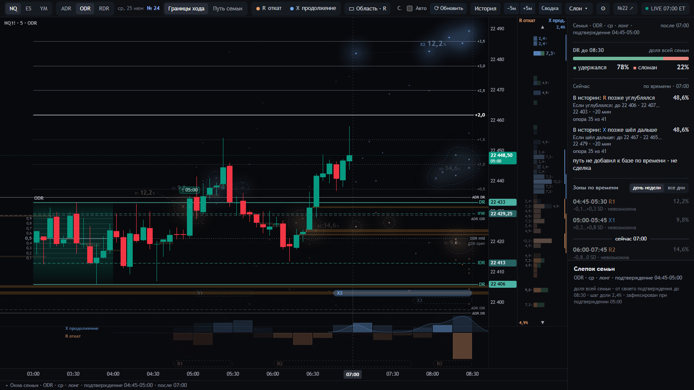
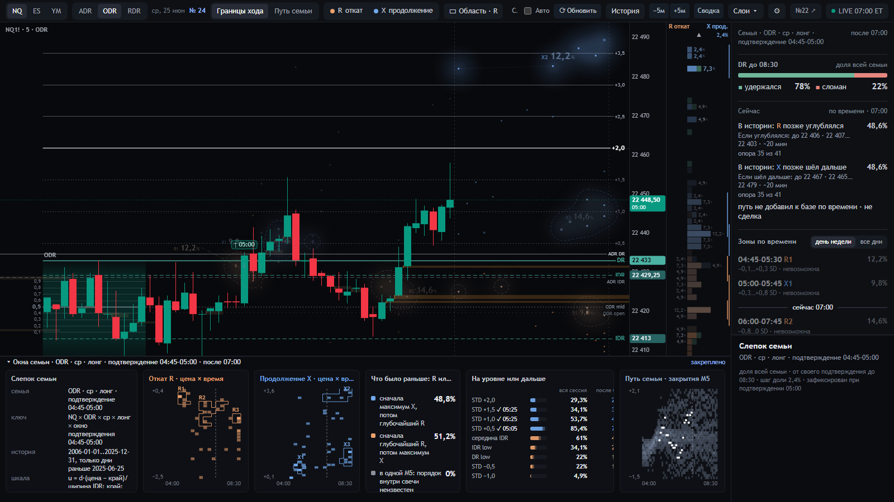

# 17 · Работа трейдера и DR Lab: проверка прикладной полноты (08.10.2026)

**Что это.** Проверка того, насколько уже построенная смысловая система DR Lab (SC-1.1, SWPC-1.1, экран 24 в `main`)
обслуживает анализ рынка оператором по DR/IDR. Это не новая онтология и не редизайн. SC-1.1, SWPC-1.1, рабочая сборка,
данные и настройки оператора не тронуты. Задача поставлена оператором 08.10: «проверка прикладной полноты уже созданной
смысловой системы» и кураторская директива «восстановление прикладного смыслового контура».

**Метки происхождения** (у каждого существенного утверждения):

| Метка | Что значит |
|---|---|
| **[С]** | действующий смысл: SC-1.1, реестр контракта (`contract/build/registry.json`), SWPC-1.1 или принятое решение продукта |
| **[О]** | прямое свидетельство оператора: его слова или действия, с датой и местом записи |
| **[А]** | правило автора DR/IDR, как оно восстановлено в [`docs/STRATEGY.md`](../docs/STRATEGY.md), с меткой автора (П, Э, Ч) |
| **[В]** | исследовательский вывод этой работы, с основанием; «замер» — посчитано на нашей истории |
| **[Г]** | гипотеза: не проверена, указано, что её проверит |

Хронология: экран 24 — рабочий с 01.10, в `main` с 07.10. Прежнее «где цена впервые приходила» (правило 10 от 29.09)
заменено «границами хода», то есть окончательными R и X (01.10). Это смена вопроса по решению оператора, а не ошибка
[С [10](10-dizajn-24.md) §2]. Отчёты, написанные до слияния в `main`, здесь читаются с этой поправкой.

## 0. Что строится и где этот контур держится

DR Lab — не экран, который думает за трейдера. Это инструмент, который расширяет то, что трейдер способен различить: он
показывает исторические структуры поведения цены, которые невозможно удержать в голове, просматривая тысячи сессий. У
инструмента две обязанности сразу: расширять наблюдаемость и держать границу знания, потому что историческая частота —
не закон будущего. SC-1.1 отвечает за то, что сказанное верно; SWPC-1.1 — за то, чтобы это верно воспринималось; работа
трейдера задаёт, зачем это знание нужно. Контур, которым работает трейдер, и то, как в нём держится уже построенное:

| Звено контура | Что это в DR Lab (уже построено) | Что нашла проверка | Оценка |
|---|---|---|---|
| 1. Рынок — непрерывный процесс | наблюдения: существующие M5-свечи NQ, ES, YM 2006–2025 и живой день; срез — последняя закрытая M5 [С SC-1.1 O0–O3, E0; П10] | на всех шести сценах на экране ровно прожитое к срезу, будущего нет (проверено) | держится |
| 2. Язык DR/IDR: какие отношения и события выделяет трейдер | коробка, DR/IDR, подтверждение, слом, шкала в ширинах IDR, STD [С S0–S2, M0–M1]; [А §1] | словарь экрана — объекты автора. «Откат после +0,5» не понадобился: на вопрос отвечает лесенка [О 08.10]. Модели дня пока нет [А §2; решено 06.10, не сделано]. До подтверждения язык истории не работает вовсе | частично: до подтверждения — пусто |
| 3. История: повторяемость этих отношений | семья F с одним N; окончательные R и X, зоны, исход DR, уровни, порядок, путь семьи; «Сейчас» — остаток после среза [С H, P, T] | всё проверяемо: паспорта, сверка сервером, неизвестное не теряется. На все подтверждённые вопросы после подтверждения величины есть [О 08.10]. До подтверждения набора нет, а он нужен (Н6) | держится после подтверждения; до подтверждения — пусто |
| 4. Онтология: точный смысл и граница знания | классы утверждений C0–C3, запрещённые прочтения, грамматика истории [С §10, K33] | на шести сценах ни одно число и ни одна подпись экрана не сформулированы как прогноз; граница соблюдена | держится |
| 5. Представление: знание в форме, доступной восприятию | SWPC-1.1: W01–W14, привязки B01–B16; экран 24 [С] | историческая геометрия стабильна и читается первой [О 06.10]. Но главный вопрос фазы разбросан по пяти местам (Н2), ответы по запросу спрятаны (Н5), время зоны читается как длительность (Н4, подтверждено), а слова «Сейчас» не читаются | частично |
| 6. Понимание и собственные гипотезы трейдера | гипотезы — его: торговой политики в SC-1.1 нет [С слой 9]; экран должен давать проверить свою гипотезу по истории | гипотезы строятся: чтение 05:00 «+0,5 → откат → +1,0» [О 08.10]. Главное решение, которое меняет DR Lab, — «где ждать откат» [О 08.10]. Проверка своей гипотезы по уровню есть, но спрятана (Н5). «Зона ≠ цель» держится в словах инструмента, а назвать зону своей целью — право трейдера | частично |
| 7. Новая M5 — обновление и пересмотр | пересчёт на каждой закрытой M5: факты дня, статусы зон, часы истории, «Сейчас»; базовая карта не меняется [С П6] | пересчёт есть, слом виден переключателем семьи. Замечает ли трейдер, что изменилось с новой M5, эта проверка не устанавливала: статичные снимки этого не показывают | держится по вычислению; восприятие не проверено |

**Где контур рвётся** — после двух серий ответов оператора 08.10.
- **После подтверждения — в звене 5 (восприятие и доступ), а не в знании.**
  - На каждый подтверждённый вопрос трейдера величина есть: откат от максимума, длительность, ниже дна, границы хода,
    исход DR.
  - Но ответы спрятаны или в другом режиме, время зоны внушает неверное прочтение, а вопрос «откат уже был?» не собран
    в одном месте.
- **До подтверждения — в звене 3:** исторического набора нет вовсе, а оператору он нужен.

Мои промежуточные выводы о разрыве «по часам» и об отсутствии величин опровергнуты ответами. Лучше всего держится
достоверность (звенья 1, 3 и 4): SC-1.1 сделал то, ради чего строился.

## 1. Ответ коротко

Учтены ответы оператора 08.10 — три серии, раздел 7 — и строгая проверка данных (разделы 6а и 9.3). Вывод проверен
этими ответами.

1. **После подтверждения онтология покрывает все подтверждённые вопросы трейдера: на каждый уже есть величина**
   [О ответы 08.10]:
   - «докуда дойдёт откат от максимума» — доли «на уровне или дальше после среза» в сторону отката: середина IDR,
     противоположный край IDR, DR. Ответ оператора: «да, это оно»;
   - «сколько цена простоит» — «Путь семьи»: где закрывались сессии семьи на каждой следующей пятиминутке. Ответ:
     «да, это оно»;
   - «уйдёт ли ниже сегодняшнего дна» — строка R «Сейчас». Ответ: «полезно как есть»;
   - где лежали границы хода и исход DR — зоны, колонка у цены, лента времени, «DR до конца».

   Новых величин для этих вопросов не нужно: ни «отката после +0,5», ни длительности, ни порядка — отдельная строка
   порядка ему не нужна.
2. **Разрыв — в восприятии и доступе, а не в знании.** Здесь прав OSC.
   - Ответы на его вопросы лежат в свёрнутых «Окнах семьи» (лесенка), в другом режиме («Путь семьи») и при наведении
     (картинка «Сейчас»).
   - Время зоны окончательного R внушает «сколько цена простоит», хотя ответ на это — «Путь семьи». SWPC эту опасность
     не называет.
   - Слова блока «Сейчас» не читаются.
   - Главный вопрос «откат уже был?» разнесён по пяти местам, а оператор хочет видеть его в одном — это его решение
     06.10, оно не сделано. На экране оно допустимо только как его названное правило, а не как состояние рынка.
3. **До подтверждения онтология работу не обслуживает вовсе, а второй экран оператору нужен** [О ответ 08.10].
   - Действующий профиль BASE-24 семьи до подтверждения не знает.
   - Это единственная подтверждённая недостающая связь в самом знании. Нужен отдельный исторический набор до
     подтверждения — например, по цвету коробки и модели дня; в дизайне 22 такой подбор был.
   - Порядок: решение оператора, затем смысл в SC-1.1, затем проверка на истории.
4. **Работа вне DR Lab и главная роль второго экрана** — прямые слова оператора, третья серия [О 08.10]:
   - **из TradingView** он берёт отказы у уровней, вход, стоп, уровни и имбалансы;
   - **в DR Lab** смотрит всю сессию: до подтверждения, сразу после, во время отката и у целей;
   - **главное решение, которое меняет DR Lab, — «где ждать откат».** Значит, ядро его работы с DR Lab — сторона отката:
     зоны R, лесенка в сторону отката, «Сейчас» R, время отката. Именно оно сейчас разбросано и спрятано (Н1′, Н2, Н5);
   - **до подтверждения** он спросил бы историю: в какую сторону подтвердит, когда подтвердит и что было после
     подтверждения в каждую сторону. «Будет ли подтверждение вообще» ему не нужно (Н6).
5. **Что не нужно:** отдельная строка порядка «что раньше». По истории порядок почти целиком повторяет геометрию, видную на
   графике, и оператору такая строка не нужна.
6. **Опровергнуто по ходу работы:**
   - «знание по часам ему не годится» — по словам оператора, оно полезно;
   - «у отката от максимума и у длительности нет величин» — величины есть, оператор их принял;
   - «история не различает порядок» — различает, но геометрией.
7. **Элементы экрана** (раздел 5а):
   - историческая ориентация после подтверждения обоснована и работает;
   - лесенка, «Путь семьи» и картинка «Сейчас» нужны по ответам оператора, но до него не доходят;
   - карточка порядка не нужна;
   - подпись «Сейчас» в нынешних словах не работает;
   - до подтверждения экран пуст там, где оператору нужно знание.
8. **Проверка полноты закрыта, решения по найденным связям приняты оператором 08.10** (раздел 7):
   - набор до подтверждения — по цвету коробки, модели дня и положению цены в коробке; при опоре меньше 20 честно
     писать «мало сессий»;
   - правило фазы — его названное правило: «откат сделан», когда достигнута зона retirement (−0,7) и прошло время отката
     семьи;
   - доступ к лесенке и «Пути семьи» — как сейчас: теперь известно, где ответы;
   - «Сейчас» для отката — только число и отметки у шкалы цены, продолжение X — как сейчас.

   Это решения о том, что строить. Реализация — отдельный этап; новой онтологии и немедленного редизайна, как задано,
   здесь нет.

## 2. Модель: стадия → вопрос → знание → различение

Колонка «Что отвечает в DR Lab» — вопросы T0 и величины T1 реестра SC-1.1 (17 вопросов, 53 величины), не элементы
экрана. Экран указан только там, где это важно для доступа.

Стадии заданы наблюдаемыми событиями и фактами префикса. «Откат сделан» и «фаза X» — гипотезы трейдера: DR Lab даёт к ним свидетельство, но установить их на срезе не может [С E1; поправка 08.10 по линзе OSC-1.0].

| Стадия | Что решает трейдер | Отношения стратегии [А] | Что отвечает в DR Lab [С] | Что должно быть различимо [С], SWPC-1.1 | Связь [В] |
|---|---|---|---|---|---|
| Подготовка (переходное окно) | живые модели, барьеры, сценарии (§4) | модели дня, прошлые DR-уровни за 3 недели, имбалансы, уровни ADR/ODR | ничего статистического | — | граница: TradingView и опыт |
| Коробка, до подтверждения | в какую сторону подтвердится, где уровень подтверждения | цвет коробки — стартовая вероятность ~70 % (§5), ранний признак, модели | семьи нет (BASE-24) | «нет семьи» ≠ ноль (W09) | второй экран нужен [О ответ 08.10]; знания нет (Н6) |
| Подтверждение | что обычно бывало у таких сессий; держать ли сторону | правило DR (§1.5); окно подтверждения как ключ (S3) | слепок F и N; Q:B-DR; Q:B-RX, Q:B-ZONE — где лежали окончательные R и X | слепок — фиксированная история, не шанс сегодня (C0); какая семья и какой N (W02) | есть, видно |
| После подтверждения: цена ниже сегодняшнего максимума (наблюдаемо; сегодняшнее дно отката r_seen известно, окончательный R — нет) | откат уже был? насколько глубже может уйти? | максимальный откат; зона retirement −0,7…; откат после +0,5 (§1.6); медианное время отката — после него «откат сделан» (S3 п. 9) | Q:B-ZONE-R и Q:TODAY-Z (статус зон); Q:B-CLOCK-R (часы истории); Q:B-RX окно R (лента); «Сейчас»: Q:N-NEW, N-IF-NEW, N-TIME; факт дня r_seen | сегодняшняя глубина ≠ окончательный R (E1, W04); доля истории ≠ шанс сегодня (C1 ≠ C2); живые к этому часу ≠ похожие по пути (H3, W08); масса истории ≠ достижимость ≠ часы (W07) | разбросано (оператор хочет в одном месте); «Сейчас» полезен, но не читается; «откат от максимума / после +0,5» нет |
| Трейдер считает откат сделанным — это его гипотеза, а не наблюдаемое состояние (окончательный R до конца сессии неизвестен) | дойдёт ли до +0,5 / +1,0; где обычно кончалось продолжение | цели +0,5 («почти всегда»), +1,0, 70-й перцентиль расширения (§8, S3 п. 6) | Q:B-ZONE-X; Q:B-LEVEL — EST:B-LEVEL-REST после среза; «Сейчас»: N-NEW-X, N-IF-NEW-X | зона окончательного X ≠ цель (запрещённое прочтение «цель» в формах утверждений); доля после среза — по всей семье, не от сегодняшней цены (в SWPC не названо) | есть, главное спрятано |
| Порядок, сценарий | сначала глубже откат или сразу продолжение; рейндж или ход сейчас | +0,5 → откат → +1,0 (§8 п. 3); три сценария по глубине отката (§2.6) | Q:B-ORDER — порядок окончательных R и X за всю сессию; Q:B-CLOSE — «Путь семьи» | порядок окончательных ≠ что будет следующим после среза; когда был экстремум ≠ сколько цена стояла (W12) | «что следующим» нет; по истории оно почти целиком повторяет геометрию положения цены (9.3); время зоны читается как длительность — подтверждено |
| Слом DR | сторона умерла? что теперь | ложная сессия (§1.5); вход по слому S7 — продвинутый, выключен (§6.7) | семья слома: свой N, ориентация по слому; исходная — переключателем | другая семья с другим N ≠ обновление той же (W02); малая опора — состояние доверия, не «нет структуры» (W09) | есть; N бывает тремя сессиями |
| Поздний срез | что ещё возможно до конца; сессия сделана? | последний час не входить (§3, §11); «сыграно — новых целей нет» (§8) | Q:TODAY-Z; E4 (впереди пусто / только прошлое); EST:B-LEVEL-REST; «Сейчас» | прошедшее по часам ≠ выброшенное из N (W07) | есть |
| После сессии | сравнить показанное при активации с тем, что было | — | «История»: любой прошлый день как сегодня | — | есть; переход «активация ↔ сейчас» решён, не сделан [О 06.10] |

## 3. Вопросы оператора и что на них отвечает

Состояние: ✔ покрыт и виден · ◐ покрыт, но спрятан или разбросан · ✗ не представлен · ⚠ риск подмены смысла.

| № | Вопрос и источник | T0 → T1 [С] | Где на экране | Состояние [В] |
|---|---|---|---|---|
| В1 | Есть ли активация и в какую сторону [О 06.10] | событие стратегии | заголовок семьи, отметка подтверждения на графике | ✔ |
| В2 | Что у таких сессий было в целом; держать ли сторону. Пример оператора: «из 25 у 16 % DR сломался — лонг не держать» [О, [10](10-dizajn-24.md) §1] | Q:B-DR → EST:B-DR | «Сводка» | ✔ |
| В3 | Был ли уже откат, насколько глубже уйдёт [О 06.10; 08.10] | «Откат уже закончился?» → Q:N-NEW, N-DELTA, N-IF-NEW, N-TIME; рядом Q:B-CLOCK, Q:B-RX (окно), Q:TODAY-Z | «Сейчас» (текст), лента времени, статусы зон, «сегодня пока» | ◐ разбросано, «Сейчас» не читается; ⚠ строка R — о новом минимуме ниже дна, а не об откате от максимума |
| В3′ | Насколько глубоким будет **этот** откат после +0,5, от максимума [О 08.10: «достигли 0,5, сейчас идёт откат… насколько будет глубокий откат»; ответ 08.10: «откат от максимума»] | Q:B-LEVEL → EST:B-LEVEL-REST для уровней в сторону отката — «да, это оно» [О ответ 08.10]; объект автора «откат после +0,5» не понадобился | лесенка в «Окнах семьи», закрепление уровня | ✔ знание есть; ◐ спрятано |
| В4 | Если откат не был — где он будет [О 06.10] | Q:B-ZONE / Q:B-RX (R) + Q:TODAY-Z | зоны R, колонка у цены | ✔; зона ≠ вход [С C3] |
| В5 | Куда дальше; дойдём ли до +1,0 [О 06.10; 08.10] | Q:B-ZONE (X); Q:B-LEVEL → EST:B-LEVEL-REST; N-NEW-X | зоны X видно; +1,0 после среза — в «Окнах семьи» и при закреплении уровня | ◐ спрятано; ⚠ это доля всей семьи после среза, а не «от сегодняшней цены» — оператору этого достаточно [О ответ 08.10] |
| В6 | Когда: сейчас или к ~06:15; затянется ли рейндж [О 08.10] | Q:B-RX (окно), Q:B-CLOCK (пик 15 минут), Q:B-CLOSE, N-TIME | капсулы и лента времени; «Путь семьи» | ✔ «Путь семьи» — «да, это оно» [О ответ 08.10]; ◐ другой режим; ⚠ время зоны читается как длительность — подтверждено |
| В7 | Что раньше: глубже откат или новый максимум [О 08.10; А §8 п. 3] | Q:B-ORDER — только окончательные, за всю сессию | «Окна семьи» | не нужен [О ответ 08.10]; по истории это почти целиком геометрия: ближний экстремум раньше [В замер, раздел 9.3] |
| В8 | Прошло ли время отката, открыто ли окно входа [А S3 п. 3, 9; О 06.10: «медианное время отката семьи» в решённой подсветке фазы] | Q:B-RX (окно R), Q:B-CLOCK | лента времени: холмы R и срез | ◐ медиана как отметка не показана; подсветка фазы решена, не сделана |
| В9 | Какая модель дня [А §2, §4 п. 1; О 06.10: «модель дня — в “Сводке”, её читают один раз»] | вне профилей экрана 24 | нет | ✗ по решению оператора, ждёт реализации |
| В10 | DR сломан — что теперь [А §1.5, §6.7] | семья слома (H1, F_break) | переключатель «Семья слома / Исходная» | ✔; ⚠ малый N |
| В11 | Что ещё возможно до конца сессии [А §3, §8, §11] | Q:TODAY-Z, E4, EST:B-LEVEL-REST | статусы зон, «впереди / прошло» | ✔ |
| В12 | Где я: день, сессия, сторона [О 08.10: «не вижу, какой день»] | факты | верхняя строка и заголовок семьи | ◐ на снимках 1600 px день и дата в верхней строке есть; оператор их не нашёл; в узком окне встроенного браузера (05:04) их не видно — проверить на его ширине экрана |
| В13 | Сравнить показанное при активации с фактом [О 06.10] | «История» | режим «История» | ◐ быстрый переход не сделан |

## 4. Сцены

Пять реальных дней истории — разные стадии — и живой экран того утра, который оператор читал. Каждая сцена показана так, как трейдер видел бы её
вживую на срезе: день обрезан на срезе, ни одной свечи после него.

Как сцены проверены (`research/rabota-1/scenes.mjs`):
- на экране — дата сцены, срез и режим «вживую»;
- семья и ответ «Сейчас» — те же, что даёт сервер, если спросить его напрямую по этой дате и срезу;
- нарушений контракта нет;
- сборка — та, что отдаёт сервер, она же сборка паспорта кандидата.

Если хоть одна проверка не проходит, снимок не сохраняется. Числа ниже — паспорта самого экрана. «Замер» — исследовательский
подсчёт по тем же сессиям: **на экране его нет, и это не новая величина продукта**. Снимки и числа лежат локально в
`research/rabota-1/`: в git их нет, это рыночные данные.

Сцены выбраны правилами, а не по виду:
- сцены 2, 3 и 5 — из выборки замера (зерно 20261008), опора «Сейчас» не меньше 20;
- сцены 1 и 4 — первые подходящие дни RDR 2024–2025 в списке, перемешанном с тем же зерном: «подтверждения нет хотя бы до
  11:20» и «DR сломан не раньше чем через 30 минут после подтверждения и не позже чем за 90 минут до конца»;
- декабрь 2025 и 05.11.2025 исключены.

### Сцена 0 · живой экран · NQ ODR · 08.10.2026, 05:00 (свободное чтение оператора)

Снимок — тот же живой экран 24 в 05:04, открытый во встроенном браузере исполнителя. Окно оператора не снималось: его
чтение известно по его словам.

- **Наблюдение.** Лонг, подтверждение в окне 04:15–04:30 (на графике ↑ 04:20). Цена дошла до +0,5 и откатывает, сейчас
  около 31 230.
- **Слова оператора** [О 08.10]:
  - «мы достигли 0,5, и сейчас идёт откат»;
  - «у меня вопрос — насколько будет глубокий откат»;
  - «я жду рейндж, и либо он сильно затянется, либо мы потихоньку выходим вверх, чтобы достичь один стандарт deviation»;
  - о зоне: «я вижу, что оно растянуто, этот кластер… значит, цена будет болтаться долго»;
  - «x1, в принципе, это выполнено».
  - О «Сейчас»: «позже — позже чего?», «эту цену я должен искать сам», «путь не добавил к базе по времени, не сделка —
    что это такое?»
- **Стратегия** [А]: +0,5 взят — дальше по методу откат, затем +1,0 (§8 п. 3). Это «откат после +0,5» (§1.6).
- **Что отвечает DR Lab** [С]:
  - DR удержался 63,2 %, сломан 32,4 %, неизвестно 4,4 %;
  - «Сейчас»: R позже углублялся 71,6–74,6 % (если да — до 31 170, середина 31 195…31 136, ~15 мин), X позже шёл
    дальше 70,2–71,6 %; опора 67 из 68.
- **Допустимый вывод** [С K33]: «после 05:00 у 48–50 из 67 сессий семьи, живых к этому часу, откат позже уходил ниже
  сегодняшнего дна». Не «откат углубится с вероятностью 72 %».
- **Чего не хватило** [В]:
  - якорей вопроса — «после 05:00» и «ниже какой цены»;
  - понимания, что «по времени» значит «все живые к этому часу», а не похожие по пути. Само число при этом ему полезно
    [О ответ 08.10].
  - Ответ на сам вопрос — глубину этого отката — есть в лесенке «на уровне или дальше» в сторону отката (В3′, проверено
    оператором на сцене 2), но она спрятана в «Окнах семьи». «Выполнено» о зоне X1 — его рабочая гипотеза о цели,
    которую инструмент утверждать не может (запрещённое прочтение «цель», [С CF:N-NEW-X]).

### Сцена 1 · NQ RDR · 27.02.2025, 10:55 · коробка сформирована, подтверждения нет

- **Наблюдение.** Красная коробка RDR: DR 21 381 / 20 896, IDR 21 346 / 20 977. Цена 21 042, в нижней части IDR.
  На графике уровни прошлых сессий.
- **Стратегия** [А]:
  - красная коробка — стартовая вероятность шорта ~70 % (§5; на нашей ленте 62–64 % у красных RDR);
  - подтверждение — закрытие M5 за DR, ранний признак — закрытие за IDR (§1.5).
- **Вопрос трейдера** [А §4 п. 4–5]: в какую сторону войдёт сессия, что цена должна сделать до входа.
- **DR Lab** [С]: «Подтверждения нет: семьи ещё нет» — статистики нет по определению BASE-24.
- **Вывод** [В]: второй экран здесь не участвует. Это совпадает с «главный режим — после подтверждения» [О 06.10].
- **Следующий переход:** первое закрытие M5 за DR фиксирует семью.

### Сцена 2 · ES RDR · 04.03.2024, 11:35 · откат дошёл до сегодняшнего дна

- **Наблюдение.**
  - Лонг, подтверждение в окне 10:30–10:45 (↑ 10:35). +0,5 взят в 10:40, дальше всего +0,79.
  - Откат до −0,58 SD в 11:20 — глубже середины IDR.
  - Цена 5 138,25, всего на 0,11 SD над сегодняшним дном.
- **Стратегия** [А]:
  - откат прошёл середину и подходит к зоне retirement (−0,7…−0,75) — зоне второй пули (§1.6, §6.2);
  - слом стороны — закрытие ниже DR low 5 135,25 (§1.5).
- **Вопрос трейдера** [О 06.10 п. 2]: откат уже был или пойдёт глубже? Если пойдёт — докуда? Дойдём ли потом до +1,0?
- **DR Lab** [С], N = 134:
  - DR удержался 66,4 %, сломан 24,6 %, неизвестно 9 %;
  - зон R впереди нет: единственная R1 (10:30–11:15) невозможна, 73,9 % окончательных R лежат вне зон, 10,4 % не
    определено;
  - «Сейчас»: R позже углублялся 69,3–74 % — у 88–94 из 127 (если да — до 5 134, середина 5 131–5 136, ~30 мин);
    X позже шёл дальше 71,7–74 % (до 5 146, ~25 мин);
  - «Окна семьи»: сначала X, потом R — 44,8 %; сначала R, потом X — 44,8 %. +1,0 после 11:35 — у 38,1–47,8 % семьи.
- **Что различить** [С]:
  - сегодняшнее дно −0,58 — не окончательный R;
  - «зон R впереди нет» ≠ «откат закончен»: 73,9 % вне зон значит, что окончательный R у семьи был рассыпан, а не
    сгущён;
  - 69 % и 72 % вместе — у большинства сессий потом было и то, и другое.
- **Замер** [В] (не на экране) — 127 сессий, живых к 11:35:

  | после 11:35 | сессий |
  |---|---|
  | позже было и глубже, и выше | 54 |
  | только глубже | 32 |
  | только выше | 32 |
  | ни того, ни другого | 1 |

  Когда было и то, и другое, раньше шло глубже у 26, выше — у 28. По всей семье — поровну; с учётом положения каждой
  сессии порядок различим, но почти целиком геометрией (9.3).
- **Следующий переход:** новый минимум ниже 5 138 (обновит дно, «Сейчас» пересчитается); закрытие ниже 5 135,25 (слом);
  новый максимум выше +0,79.

### Сцена 3 · YM ODR · 19.01.2024, 05:05 · откат от максимума идёт, а цена далеко над дном

- **Наблюдение.**
  - Лонг, подтверждение в окне 04:00–04:15. Очень быстрое расширение: +0,5 в 04:10, +1,0 в 04:15, +1,5 в 04:25, дальше
    всего +1,78.
  - Дно отката +0,22 в 04:05: откат в IDR не заходил.
  - Сейчас цена около +1,41 — откат от максимума на 0,37 SD, при этом на 1,19 SD над дном.
- **Стратегия** [А]: +1,0 — натуральная цель — уже взят; «в сильном тренде откат неглубокий» — эвристика автора [Э,
  §2.6 п. 2], а не наблюдение; дальше — следующие STD (§8).
- **Вопрос трейдера** (как в сцене 0): насколько глубоким будет этот откат от максимума и пойдёт ли выше +1,78?
- **DR Lab** [С], N = 130:
  - DR удержался 69,2 %, сломан 27,7 %, неизвестно 3,1 %;
  - впереди возможны X3 (+2,1…+2,9; 06:45–08:30) 7,7 %, R2 (−2,1…−1,4) 7,7 % и R3 (−0,6…−0,2) 5,4 %;
    X2 невозможна — сегодня цена уже дальше;
  - «Сейчас»: R позже углублялся 63,2–64 %. Это ниже 37 694 — сегодняшнего дна, на ~38 пунктов ниже текущей цены, а не
    глубина нынешнего отката от максимума. X позже шёл дальше 64–65,6 % (до 37 771);
  - «Окна семьи»: сначала X, потом R — 50 %; сначала R, потом X — 45,4 %. +2,0 после 05:05 — у 26,9–30,8 % семьи.
- **Что различить** [С P0.3]: строка R «Сейчас» — о новом минимуме ниже сегодняшнего дна, а не о глубине отката от
  максимума. Это разные объекты.
- **Неполнота** [В]:
  - Замер по выборке: в 55 % срезов, где идёт откат от максимума хотя бы на 0,25 SD, цена ещё не меньше чем на 0,25 SD над
    дном. Значит, вопрос «насколько глубок нынешний откат» часто не совпадает со строкой R.
  - Ответ на него — лесенка «на уровне или дальше» в сторону отката (В3′, проверено оператором), а не строка R.
- **Замер** [В] (не на экране) — 125 сессий: и то и другое 38, только глубже 40, только выше 42, ни того ни другого 3;
  раньше глубже 20, раньше выше 18.

### Сцена 4 · NQ RDR · 07.03.2025, 14:35 · DR сломан

- **Наблюдение.** Шорт ↓ 10:35. Цена ушла до ~19 760 к 12:05, затем развернулась и в 14:25 закрылась выше DR high — это
  слом.
- **Стратегия** [А]: сессия ложная (§1.5); вход по слому S7 — продвинутый, по умолчанию выключен (§6.7).
- **Вопрос трейдера:** что теперь — куда может пойти по слому и сколько осталось.
- **DR Lab** [С]:
  - семья слома (RDR · пт · окно слома 14:15–14:30) — N = 3, шаг доли 33,3 %;
  - зон нет: ни одна область не набрала минимальной поддержки;
  - «Сейчас»: «мало сессий семьи: n=3»;
  - исходная семья доступна переключателем «Исходная · 10:35».
- **Что различить** [С; отчёт 16]: семья слома — другая семья с другим N и перевёрнутой ориентацией, а не обновление
  исходной. N = 3 — состояние доверия, а не «у рынка нет структуры».
- **Неполнота** [В]: знания по слому в этом окне фактически нет. Охват «все дни» (переключатель рядом) даст больше
  сессий, но это отдельная семья и выбор оператора [С].

### Сцена 5 · NQ ODR · 25.06.2025, 07:00 · поздний срез после глубокого отката и нового максимума

- **Наблюдение.**
  - Лонг, подтверждение в окне 04:45–05:00.
  - Откат до −0,97 SD в 06:10 — почти до противоположного края IDR. Затем рост до +1,77 к 06:55.
  - Сейчас цена около +1,18: на 2,15 SD над сегодняшним дном. До конца сессии 90 минут.
- **Стратегия** [А]: зона retirement пройдена, DR не сломан, +1,0 и +1,5 взяты. С 07:30 — последний час, в который не
  входят (§3).
- **Вопрос трейдера:** что ещё может быть до конца — выше или назад?
- **DR Lab** [С], N = 41, шаг 2,4 %:
  - DR удержался 78 %, сломан 22 %;
  - впереди возможна только X2 (+3,1…+3,9; 06:45–08:30) 12,2 %, остальные зоны невозможны;
  - «Сейчас»: R позже углублялся 48,6 % — у 17 из 35, то есть ниже 22 413, сегодняшнего дна. X позже шёл дальше 48,6 %
    (до 22 467);
  - «Окна семьи»: сначала X, потом R — 48,8 %; сначала R, потом X — 51,2 %. +2,0 после 07:00 — у 29,3 %.
- **Главное различение** [В]:
  - «R позже углублялся у 48,6 %» — правда о 35 сессиях, живых к 07:00, каждая относительно своего дна.
  - Сегодня цена на 2,15 SD над своим дном: новый R сегодня — падение больше чем на две ширины IDR за 90 минут.
  - Строка R по определению не зависит от этого расстояния: на сценах 2, 3 и 5 расстояние до дна 0,11, 1,19 и 2,15 SD,
    а строка даёт 73 %, 64 % и 49 %. Оператор сказал, что число полезно ему как есть [О ответ 08.10]: для него это знание
    о семье к этому часу, а не ответ «отсюда».
- **Замер** [В] (не на экране) — 35 сессий: и то и другое 5, только глубже 12, только выше 12, ни того ни другого 6;
  раньше глубже 2, раньше выше 3.

## 5. Роль второго экрана

| Функция | Где сейчас | Свидетельство | Какой должна быть доступность |
|---|---|---|---|
| Ориентация: день, сессия, сторона, семья, срез (W01, W02) | верхняя строка, заголовок семьи | [О 06.10 п. 1; О 08.10 «не вижу, какой день»] | постоянно, на стабильном месте |
| Исторический ориентир: где и когда лежали границы хода семьи | зоны на графике, колонки у цены, лента времени | [О 06.10 п. 4: «взгляд сначала на созвездия»]; [С: BASE не меняется со срезом] | постоянно, стабильная геометрия |
| Фаза: был ли откат, сколько истории уже прошло по часам | разбросано: статусы зон, лента, «Сейчас», «сегодня пока» | [О 06.10 п. 2; решённая подсветка фазы] | постоянно и в одном прочтении? — решает оператор (Н2) |
| Проверка своей гипотезы: «дойдёт ли до L», «зайдёт ли в полосу» | лесенка в «Окнах семьи», закрепление уровня, рамка «Область» | [О 28.09: не строить экран вокруг «дойдёт ли до X»; О 08.10: спросил про +1,0] | по вопросу, но находимо (Н5) |
| Сопоставление сценариев: что раньше, рейндж или ход | Q:B-ORDER (окончательные), «Путь семьи» | [О 08.10] | порядок не нужен [О ответ 08.10]; «рейндж или ход» — «Путь семьи» (Н4) |
| Восстановление после события: подтверждение, слом, новый экстремум (W02, W07) | переключатель семьи слома; пересчёт на каждой M5 | [С; отчёт 16: слом — смена рамки] | заметный переход, затем стабильная рамка |
| Учёба: сравнить показанное при активации с фактом | «История» | [О 06.10 п. 5] | отдельный процесс |
| История до подтверждения: например, по цвету коробки и модели дня | нет | [О ответ 08.10: «нужен»] | нужна; профиля до подтверждения в SC-1.1 нет (Н6) |
| Не роль DR Lab: отказы у уровней, вход, стоп; уровни прошлых дней и недель, имбалансы | TradingView | [О 08.10, третья серия]; наблюдение его TradingView 08.10: уровни, сетки STD и коробка нарисованы вручную, инструменты позиции, исторической статистики нет; [С: SC-1.1, слой 9 — торговой политики нет] | — |
| Модель дня | нет; решена в «Сводку» 06.10, не сделана | [О 06.10]; в TradingView её не отмечал [О 08.10] | нужна в DR Lab, читается один раз |
| Когда второй экран в работе | вся сессия: до подтверждения, сразу после, во время отката, у целей | [О 08.10, третья серия] | главное решение — «где ждать откат» |

## 5а. Элементы экрана: что обосновано работой трейдера, а что нет

Вердикт ставится только по свидетельству. Пометки:
- **✔ обосновано** — у элемента есть роль в работе и свидетельство нужности; оставить.
- **↗ обосновано, но доступ или прочтение не годится** — функция нужна, форма или место — нет.
- **? нужность не доказана** — свидетельства использования нет; кандидат уйти из постоянного поля, решает оператор.
- **✗ в нынешнем виде не нужно** — только при прямом свидетельстве, что элемент не работает.

Отсутствие упоминания — слабое свидетельство, поэтому «?» ставится вместо «✗».

| № | Элемент | Роль в работе (стадия, вопрос) | Свидетельство | Вердикт |
|---|---|---|---|---|
| 1 | Свечи, DR/IDR, сетка STD | наблюдение, язык метода; основа всех стадий | [О 06.10: «свечи крупно»; А §1] | ✔ |
| 2 | Уровни прошлых сессий, VI на графике | контекст стратегии (у автора — барьеры и магниты) | просьбы оператора [О 06.10; журнал 13 № 17, 27, 36]; дублируют TradingView | ✔ по решению оператора |
| 3 | Верхняя строка: инструмент, сессия, день, «вживую», срез | ориентация (W01) | оператор не нашёл день [О 08.10] | ↗ |
| 4 | Заголовок семьи, переключатель семьи слома, охват «день недели / все дни» | ориентация в семье (W02); слом; малые семьи | сцена 4: N = 3, охват «все дни» — единственный путь к большему N | ✔ |
| 5 | Зоны R и X на графике, подписи долей | исторический ориентир: где и когда лежали границы хода | «взгляд сначала на созвездия» [О 06.10 п. 4]; чтение зон 05:00 [О 08.10] | ✔; ↗ «время зоны = длительность» — подтверждено [О ответ 08.10] (Н4); «зона = цель» — гипотеза H-CLAIM отчёта 16, не проверена |
| 6 | Колонка R/X у цены | где по цене лежали границы хода | «одна колонка R/X с градацией силы» — просьба оператора [О 06.10] | ✔ |
| 7 | Лента времени и капсулы зон | когда были границы хода; вопрос «сейчас или позже» | читал по ней «следующий кластер к 06:15» [О 08.10] | ✔; ↗ прочтение длительности подтверждено (Н4) |
| 8 | «DR до конца»: удержался / сломан / неизвестно | держать ли сторону | «из 25 у 16 % DR сломался — лонг не держать» [О 01.10] | ✔ |
| 9 | «Зоны по времени» в «Сводке»: статус и разделитель «сейчас» | фаза: что ещё достижимо, что по часам прошло (W07) | часть ответа о фазе; разбросано (Н2) | ↗ |
| 10 | «сегодня пока»: факты дня | состояние: сегодняшняя глубина и дальность (W04) | часть ответа о фазе; мелкая строка внизу «Сводки» | ↗ |
| 11 | Блок «Сейчас» | формальный ответ на главный вопрос «откат уже был?» | функцию задал сам оператор (спецификация NOW-1.0, 06.10), но сегодня он блок не прочёл [О 08.10]. Знание почти целиком — часы (замер; Н1) | ✔ содержание: «полезно как есть» [О ответ 08.10]. Решение 08.10: строка отката — только число и отметки у шкалы цены, X — как сейчас |
| 11а | Его подпись «путь не добавил к базе по времени · не сделка» | должна передать W08: «по времени», а не «похожий путь» | «что это такое, я не понимаю» [О 08.10] | ✗ в нынешних словах. Для строки отката подпись уходит по решению 08.10; смысл W08 (по времени) остаётся в подсказке и паспорте |
| 12 | Карточка «Слепок семьи» внизу «Сводки» | паспорт набора: доверие, разбор | повторяет первую карточку «Окон семьи»; «Сводку» читают последней [О 06.10 п. 4] | ? кандидат — по запросу |
| 13 | «Окна семьи», лесенка «на уровне или дальше» | проверка своей гипотезы: «дойдёт ли до +1,0» | спрашивал про +1,0 и не нашёл ответа, а он здесь [О 08.10]; строки в сторону отката отвечают на «докуда дойдёт откат» — «да, это оно» [О ответ 08.10] | ✔ знание; ↗ спрятано (Н5) |
| 13а | «Окна семьи», порядок R/X | сценарий: что раньше | отдельная строка порядка не нужна [О ответ 08.10]; по истории порядок — почти геометрия (9.3) | ✗ не нужна — кандидат убрать |
| 13б | «Окна семьи», R и X цена × время | разбор зон | повторяют зоны графика; следов использования нет | ? |
| 13в | «Окна семьи», паспорт и путь семьи (мини) | доверие (W13), разбор | — | ✔ по запросу |
| 14 | Режим «Путь семьи» | где была цена по часам: вопросы о времени | ответ на «сколько цена простоит» — «да, это оно» [О ответ 08.10]; частоту прошлой пятиминутки он не прочёл [О 08.10] | ✔ знание; ↗ другой режим и наведение (Н4) |
| 15 | Инспектор, закрепление, «▭ Область» | разбор и проверка своей гипотезы на стабильном месте | стабильное место поддержано отчётом 16 | ✔; ↗ находимость (Н5) |
| 16 | Картинка «Сейчас» на графике при наведении | где по цене лежат уровни «Сейчас» | «нету визуала» — не нашёл [О 08.10] | для отката — постоянные отметки у шкалы по решению 08.10 (прототип: вариант C в `research/now-1`) |
| 17 | Уведомления о цене | рабочий инструмент трейдера, не знание | просьба оператора [журнал 13 № 45] | ✔ |
| 18 | «История», «К концу дня» | учёба: показанное при активации против факта | [О 06.10 п. 5]; быстрый переход «активация ↔ сейчас» решён, не сделан | ✔ |
| 19 | Знак и уведомление о нарушении контракта | доверие: число снято (W13) | законный передний план [отчёт 16] | ✔ |
| 20 | До подтверждения: «Подтверждения нет: семьи ещё нет» | ожидание подтверждения: в какую сторону, что говорит история | второй экран здесь нужен [О ответ 08.10] | ✗ пусто там, где нужно знание (Н6) |

**Итог по элементам** — после ответов оператора 08.10:
- **Обоснованы и работают:** 1, 2, 4–8, 13в, 15, 17–19 — опора исторической ориентации после подтверждения и честности
  знания.
- **Обоснованы ответами оператора, но до него не доходят:**
  - лесенка (13) — ответ на «докуда дойдёт откат» и «дойдёт ли до +1,0»;
  - «Путь семьи» (14) — ответ на «сколько цена простоит»;
  - картинка «Сейчас» (16), верхняя строка (3), части ответа о фазе (9, 10).
- **Не нужно:** отдельная карточка порядка (13а) — по ответу оператора.
- **Нужность в постоянном поле не доказана:** карточка «Слепок семьи» (12), тепловые карты в «Окнах» (13б).
- **В нынешних словах не работает:** подпись «Сейчас» (11а). Содержание «Сейчас» (11) оператору полезно.
- **Пусто там, где нужно знание:** до подтверждения (20).

**Обслуживает ли построенное работу трейдера** — проверено ответами оператора:
- **Онтология после подтверждения — да.** На каждый подтверждённый вопрос есть величина: откат от максимума, длительность,
  ниже дна, где лежали границы хода, исход DR, что ещё логически возможно.
- **Перцептивная архитектура после подтверждения — частично.** Знание есть, но:
  - ответы спрятаны или лежат в другом режиме;
  - время зоны внушает неверное прочтение;
  - фаза разнесена по пяти местам;
  - слова «Сейчас» не читаются.
- **До подтверждения — нет.** Исторического набора нет вовсе, а второй экран оператору нужен.

## 6. Существенные несоответствия

Только те, что способны изменить архитектуру. Ни одно ничего не добавляет в продукт: новые объекты — исследовательские
кандидаты до решения оператора. Статус — после ответов оператора 08.10.

**Н1′. «Докуда дойдёт откат от максимума» — ответ есть, но спрятан. Подтверждено проверкой.**
- **Вопрос.** «Откат» оператора — это откат от максимума [О 08.10]. Строка R «Сейчас» о другом: о новом минимуме ниже
  дна [С P0.3].
- **Ответ есть.** Проверка на сцене 2: доли «на уровне или дальше после 11:35» в сторону отката — середина IDR,
  противоположный край IDR, DR — оператор назвал: «да, это оно» [О 08.10].
- **Что это значит.** Новая величина, в том числе объект автора «откат после +0,5», не нужна. Нужен доступ: лесенка
  лежит в свёрнутых «Окнах семьи» и не подписана под этот вопрос. Здесь прав OSC: разрыв — в отображении вопроса на
  существующее свидетельство.
- **Что опровергнуто по ходу.**
  - Прежний Н1: «знание по часам ему не годится» — доля всей семьи к этому часу ему полезна.
  - «У вопроса нет величины» — величина есть.

**Н2. Фаза собрана из пяти мест — подтверждено, оператор хочет её в одном месте.**
- **Свидетельство.** Порядок чтения [О 06.10]; ответ «в одном месте» [О 08.10]; подсветка фазы решена 06.10 и не сделана
  [О журнал 13].
- **Что это значит.** Это не новый вопрос, а невыполненное решение.
- **Решение оператора 08.10.** Правило «откат сделан» — его названное правило, на экране так и подписано, это не факт
  рынка. Оно срабатывает, когда выполнены оба условия:
  - сегодняшний откат достиг зоны retirement (−0,7), середина IDR при этом пройдена сама собой;
  - прошло время отката семьи: у половины сессий семьи окончательный R к этому часу уже был.

  Оба признака — уже существующие факты и величины: r_seen и часы истории R. Новой величины не нужно.

**Н3. «Что следующим» — закрыто.**
- Отдельная строка порядка оператору не нужна [О ответ 08.10].
- По истории порядок почти целиком повторяет геометрию положения цены, видную на графике (раздел 9.3).
- Карточку порядка в «Окнах семьи» можно убрать — это решение оператора.

**Н4. Время зоны окончательного R читается как длительность, а ответ на «сколько цена простоит» — «Путь семьи». Подтверждено.**
- **Свидетельство.**
  - Оператор читает время зоны как «сколько цена простоит» [О 08.10].
  - SC-1.1 время пребывания не измеряет (P0.2), а время зоны означает, когда был окончательный экстремум [С].
  - На вопрос о длительности «Путь семьи» — где закрывались сессии семьи на каждой следующей пятиминутке — по словам
    оператора, отвечает: «да, это оно» [О 08.10].
- **Что требует решения.**
  - Назвать эту опасность в SWPC: «время итоговой точки прочитано как длительность пребывания».
  - Направить вопрос о длительности к «Пути семьи»: сейчас это другой режим, а частоту прошлой пятиминутки оператор при
    наведении не прочёл.
  - Новая величина длительности не нужна.

**Н5. Ответы по запросу спрятаны — решено оператором: доступ оставить как есть.**
- **Свидетельство.** Окна снизу и по мыши — его решение; сегодня он не нашёл лесенку и картинку «Сейчас» [О 08.10].
- **Решение 08.10.** «Как сейчас»: окна выезжают от мыши, путь — отдельным режимом. Теперь, когда известно, где лежат
  ответы, способ доступа менять не нужно.

**Мелкое, архитектуру не меняет** [В по снимкам]:
- день и дата: оператор их не нашёл, а в узком окне верхняя строка их не показывает (снимок 05:04);
- отметка «✓ сегодня» в лесенке стоит только у ступеней STD — у середины IDR и краёв её не бывает;
- при 1600 px правая колонка лесенки «после ЧЧ:ММ» обрезана.

**Н6. До подтверждения второй экран нужен, а знания нет — подтверждено.**
- **Свидетельство.**
  - Ответ оператора: «нужен» [О 08.10].
  - Профиль BASE-24: «до подтверждения базовой направленной семьи нет» [С SC-1.1 §12.1].
  - Работа трейдера до подтверждения по методу — цвет коробки как стартовая вероятность, модели дня, ранний признак
    [А §2, §5].
  - В дизайне 22 подбор похожих сессий до подтверждения по модели дня был [С [07](07-cepochka-reshenij.md), 29–30.09].
- **Что это значит.** Это единственная подтверждённая недостающая связь в самом знании.
  - Нужен отдельный исторический набор до подтверждения со своим ключом и своим N.
  - SC-1.1 такого профиля не задаёт. Это новый смысл: решение оператора, затем запись в контракте, затем проверка на
    истории.
- **Задачи подтверждены** [О 08.10, третья серия]. До подтверждения у истории спрашивают:
  - в какую сторону подтвердит;
  - когда подтвердит — в какие 15 минут;
  - что было после подтверждения в каждую сторону, заранее.

  «Будет ли подтверждение вообще» не нужно. По методу автора сюда относятся цвет коробки как стартовая вероятность и
  модели дня [А §2, §5]. На нашей ленте цвет совпадает с направлением в 70–71 % подтверждённых RDR — это в основном
  геометрия диапазона [А §5, §14.5].
- **Решение оператора 08.10.**
  - Подбирать по цвету коробки, модели дня и положению цены в коробке к срезу (размер коробки не нужен).
  - Если похожих сессий меньше 20, честно писать «мало сессий: n=…» и ничего не расширять.
- **Что это требует при реализации.** Новый профиль набора до подтверждения в SC-1.1 — свой ключ, свой N, свой срез.
  Третья задача — «что было после подтверждения в каждую сторону» — близка к уже существующей семье, если заранее взять
  обе ветки, лонг и шорт, по ближайшему окну. Это новый смысл «если подтвердит так», его надо записать в SC-1.1.

### 6а. Строгая проверка: что перестаёт следовать из данных

| Вывод | Совместные события, неизвестные исходы, зависимость | Что остаётся |
|---|---|---|
| «Что следующим» — поровну | Неизвестные исходы взяты как границы; одна точка на дневную сессию (116), затем по датам (103): медиана «R раньше» 0,54, q10–q90 0,46–0,65. В 23 из 116 срезов уже границы выходят за 40–60 %. Все 116 срезов — из 12 групп «инструмент × сессия × год», а семьи соседних дней почти совпадают: независимых наблюдений гораздо меньше | описание: обычно около поровну, в каждом пятом срезе — перевес. Общий вывод «история по часам порядок не различает» **не следует** |
| «Сейчас» почти целиком — часы (60 % вариации объясняют минуты после подтверждения) | 541 срез — это 116 сессий по 5 срезов; срезы одного дня зависимы; падение доли со временем отчасти механическое (остаётся меньше времени) | только описание выборки. Вывод «мало пользы» **не следует** — и оператор его опроверг |
| «Обе доли выше половины в 78 % срезов» | события R и X не исключают друг друга: у половины сессий потом было и то, и другое | логика: две отдельные доли не дают порядка — это следует и без данных |
| «Строка R не зависит от расстояния до дна» (сцены 2, 3, 5) | три сцены — иллюстрация, а не проверка | следует из определения B0, данные не нужны. Вредно ли это — оператор ответил: нет |
| «В 55 % срезов идёт откат от максимума, а цена далеко над дном» | срезы зависимы | логика: строка R и откат от максимума — разные объекты; число — лишь описание |
| Счёт по сценам (например, 58 / 60 на сцене 2) | счёт внутри одной семьи; 8 неизвестных из 127 дают границы 46–52 % | держится как описание сцены |
| Совместная частота из двух долей | 92 среза: совместная доля ниже произведения долей везде, медиана −0,055 | события R и X зависимы: из долей совместную частоту не получить (раздел 9.3) |
| «Поровну» значит «неразличимо» | по собственному положению сессии на срезе: 0,89 … 0,14 против случайного блуждания 0,90 … 0,10 | **не следует**: порядок различим, но почти целиком геометрией (раздел 9.3) |

Воспроизвести: `research/rabota-1/now_joint.json`, расчёт в этой работе — одна точка на сессию через 30 минут после
подтверждения, неизвестные взяты как границы.

### 6б. Граница DR Lab: из кода или из решений оператора

| Граница | Откуда | Что это меняет |
|---|---|---|
| До подтверждения семьи нет | профиль BASE-24 в SC-1.1 (принят 07.10) и код. Оператор говорил: «главный режим — после подтверждения» [06.10]. Решения «второй экран до подтверждения не нужен» нет; в дизайне 22 подбор до подтверждения по модели дня был | не граница: оператору второй экран здесь нужен [О ответ 08.10] (Н6) |
| Подсветка фазы, модель дня в «Сводке», переход «активация ↔ сейчас» | решения оператора 06.10; в коде их нет | невыполненные решения, а не пробелы смысла: это работа инженера, не исследование |
| Уровни сегодняшнего цикла и прошлых сессий, VI на графике | просьбы оператора 06.10 (журнал 13, № 17, 27, 36) | **прежняя запись «прошлые уровни и имбалансы — не роль DR Lab» была неверна**. На экране нет только уровней за 3 недели, кластеров и GIB |
| Торговой политики нет: вход, стоп, цель | SC-1.1, слой 9 (принят) | граница по решению |
| Ответы — в свёрнутых «Окнах семьи» | дизайн оператора (окна снизу); как их открывать — его открытый вопрос | свидетельство к этому вопросу, а не дефект |
| Знание «после сейчас» выровнено по часам | итог проверки по правилам, которые сам оператор задал в NOW-1.0 | не пробел: это свойство, и оператор его принимает |
| Семья слома — по окну слома; «все дни» — только явный выбор | SC-1.1 H1 и решение оператора | граница по решению |

## 7. Ответы и решения оператора

**Ответы оператора 08.10** (вопросы в чате, по сценам):

| Вопрос | Ответ | Что это значит для выводов |
|---|---|---|
| «Насколько глубоким будет откат» — что вы имеете в виду? | откат от максимума | вопрос — откат от максимума, строка R «Сейчас» о другом; ответ нашёлся во второй серии (лесенка) |
| Сцена 5: «у 48,6 % похожих сессий откат потом уходил ниже их дна», когда сегодня цена на 2,15 SD над дном, — это вам полезно? | да, полезно как есть | прежний Н1 опровергнут; содержание «Сейчас» полезно |
| Зону отката, растянутую по времени, вы читаете как… | сколько цена простоит | Н4: прочтение, которого объект не поддерживает; ответ — «Путь семьи» (вторая серия) |
| «Откат уже был?» — как вам удобнее это видеть? | в одном месте | Н2 подтверждено; совпадает с его решением 06.10 |
| Сцена 2: отвечают ли доли «на уровне или дальше после 11:35» в сторону отката (середина IDR 51–57 %, противоположный край IDR 37–45 %, противоположный DR 34–42 %) на «докуда дойдёт откат»? | да, это оно | Н1′: знание есть, нужен доступ; новый объект не нужен |
| Отвечает ли «Путь семьи» на «сколько цена простоит»? | да, это оно | Н4: ответ — в «Пути семьи»; время зоны — опасность прочтения |
| Нужна ли отдельная строка порядка, если он почти целиком повторяет геометрию? | не нужна | Н3 закрыт |
| Нужен ли второй экран до подтверждения? | нужен | Н6: единственная подтверждённая недостающая связь в знании |
| Что вы берёте из TradingView, а не из DR Lab? | отказы, вход, стоп; уровни и имбалансы | граница с TradingView — его словами (раздел 5) |
| Когда за сессию вы смотрите в DR Lab? | до подтверждения, сразу после, во время отката, у целей | второй экран — на всю сессию |
| До подтверждения какой вопрос вы задали бы истории? | в какую сторону подтвердит; когда подтвердит; что было после подтверждения | задачи Н6 подтверждены |
| Какое решение DR Lab чаще всего меняет у вас? | где ждать откат | ядро — сторона отката (Н1′, Н2, Н5) |

**Что установлено без ответов оператора** — факты смысла, данных и экрана, их можно перепроверить:
- величины «откат после +0,5» в реестре нет;
- время пребывания цены SC-1.1 не измеряет, а SWPC не называет опасности «время зоны прочитано как длительность»;
- лесенка и порядок лежат в свёрнутых «Окнах семьи», картинка «Сейчас» — только при наведении;
- ответ о фазе разнесён по пяти местам;
- знание «после среза» считается по всей семье по часам;
- до подтверждения семьи нет;
- семья позднего слома бывает из трёх сессий;
- «что следующим» по всей семье около поровну, а с учётом положения сессии почти целиком определяется геометрией;
  совместная частота нового дна и нового максимума ниже произведения долей (9.3).

**Решения оператора по найденным связям — 08.10:**

| Связь | Решение | Что это требует при реализации |
|---|---|---|
| Н6 — до подтверждения | подбирать по цвету коробки, модели дня и положению цены в коробке; при n < 20 честно писать «мало сессий» | новый профиль набора до подтверждения в SC-1.1 и его проверка на истории |
| Н2 — фаза | его названное правило: «откат сделан», когда достигнута зона retirement (−0,7) и у половины семьи окончательный R к этому часу уже был | правило в контракте как названное правило оператора, не утверждение о рынке; подпись на экране |
| Н1′, Н4, Н5 — доступ | как сейчас: окна от мыши, путь — режимом | ничего; опасность «время зоны = длительность» назвать в SWPC |
| Слова «Сейчас» | строка отката — только число и отметки у шкалы цены; X — как сейчас | изменить привязку «Сейчас» в SWPC-1.1 и подпись в реестре SC-1.1; смысл W08 — в подсказке и паспорте |
| После слома DR | как сейчас: семья слома со своим N, при малом N честно писать «мало сессий», исходная семья — переключателем | семья слома и переключатель уже есть; надписи «мало сессий» на экране нет — вариант ответа ошибочно описал её как существующую (найдено исполнителем 08.10); сделать |

Решения приняты оператором в этом чате 08.10, в форме вопросов с вариантами; записаны здесь его ответами.

**Проверка полноты закрыта.** Открытых вопросов к оператору по ней нет. Дальше — только реализация решений, отдельным
этапом:
- SC-1.1 — профиль до подтверждения, правило фазы, подпись «Сейчас», «мало сессий» при n < 20;
- SWPC-1.1 — привязка «Сейчас», опасность «время зоны = длительность»;
- затем проверка на истории и приёмка вида.

## 8. Как воспроизвести и что здесь не утверждается

- **Сцены:** `node research/rabota-1/scenes.mjs`.
  - Одноразовый Chrome со своим временным профилем: настройки, уведомления и данные оператора не задействованы.
  - На каждой сцене проверяется происхождение; при любом расхождении снимков нет.
  - Числа сцен — `research/rabota-1/scenes.json`.
- **Замер:** `python -B research/rabota-1/now_joint.py`.
  - 541 срез: 116 дневных сессий NQ, ES, YM × ODR, RDR, 2024–2025, через 15–120 минут после подтверждения.
  - Отбор с зерном 20261008. Набор сессий B0 взят ровно так, как его берёт `lab/now24.py`; сверка с `/api/d24/now` на
    одном срезе совпала.
- **Совместное событие и порядок по положению:** `python -B research/rabota-1/order_by_state.py`. Те же срезы, одна
  точка на дневную сессию; результат — в разделе 9.3.
- **Не утверждается:** торговая польза, прогноз на сегодняшний день, ошибочность действующей онтологии.
  - Варианты «Сейчас» из `research/now-1/` сохранены и не развиты.
  - Число замера — исследовательское описание истории (C1), а не величина продукта.
- **Основания:** [`docs/STRATEGY.md`](../docs/STRATEGY.md); SC-1.1 и его реестр; отчёты 15 и 16 (`spec/`); SWPC-1.1;
  [07](07-cepochka-reshenij.md), [10](10-dizajn-24.md), [13](13-zhurnal-vizualizacii.md),
  [15](15-sloj-seichas.md); слова оператора 06.10 и 08.10.

## 9. Пересечение с OSC-1.0 (08.10): что выдерживает обе проверки

OSC-1.0 — независимая реконструкция куратора по коду и документам, без сцен и без оператора
([lens/2026-10-08-osc-1.0/DR-LAB-OSC-1.0.md](lens/2026-10-08-osc-1.0/DR-LAB-OSC-1.0.md)). Здесь не согласование двух
текстов, а то, что выдерживает обе проверки.

### 9.1 Каркас

Контур OSC выдерживает обе проверки:

> наблюдение O(t) → интерпретация по стратегии S(t) → вопрос трейдера Q(t) → свидетельство E(Q,t) → допустимое
> утверждение C(Q,t) → изображение P → гипотеза трейдера H(t) → новая M5

Выдерживает и его различение четырёх субъектов истины: рынок, стратегия, DR Lab, трейдер. Каждое наблюдение этой
работы ложится в одно звено, и ни одно его не опровергает.

Сцены и ответы оператора добавляют три уточнения:

1. **В вопросе Q решают якорь и тип исхода.**
   - Якорь — от чего мерить: от сегодняшнего максимума после +0,5, от дна после подтверждения или от часа.
   - Тип исхода — что считать исходом: окончательную точку, путь или длительность.
   - Оба подтверждённых затруднения лежат ровно здесь, и оба снимаются выбором правильного существующего объекта:
     - «откат от максимума» → лесенка уровней в сторону отката, а не строка R «Сейчас»;
     - «сколько цена простоит» → «Путь семьи», а не время зоны.
   - Ошибка якоря или типа исхода и стала источником затруднения.
2. **Звено P → H двустороннее: изображение само внушает прочтение.** У OSC это запрет (I13, I14). Теперь есть
   наблюдённый случай: время зоны окончательного R прочитано как длительность [О 08.10]. У каждого изображения нужно
   проверять, какое прочтение оно внушает.
3. **Свидетельство E надо сравнивать с геометрией того, что уже видно в O.**
   - Порядок «что раньше» различим почти ровно так, как предсказывает случайное блуждание между двумя экстремумами
     (9.3). Здесь история почти ничего не добавляет к положению цены, которое трейдер и так видит на графике.
   - Общее правило: ценность исторического знания — то, что оно добавляет сверх геометрии наблюдаемого состояния.
     Ср. STRATEGY §14.5: описательные закономерности DR — в основном геометрия диапазона.

### 9.2 Три вопроса куратора

**1. Что не зависит от нынешней реализации, а что возникло из экранных объектов.**
- **Не зависит от экрана:**
  - вопросы трейдера — откат от максимума, длительность, «откат уже был?» — и то, что строка R «Сейчас» и время зоны на
    них не отвечают;
  - логика: две отдельные доли не дают ни совместной частоты, ни порядка;
  - граница C1 ≠ C2;
  - геометрическая природа порядка.
- **Возникло из экрана:**
  - «ответ о фазе в пяти местах» и «ответы спрятаны»;
  - прочтение «время зоны = длительность» — его вызывает именно изображение окончательных точек с их временем;
  - вердикты по элементам (§5а);
  - выбор «Сейчас» как точки входа в исследование.
- Таблица стадий (§2) частично строилась по объектам экрана — «фаза R / фаза X». Исправлено: теперь стадии заданы
  наблюдаемыми событиями.

**2. Где интерпретация трейдера стала состоянием.**
- **§2.** Строки «фаза R» и «откат сделан → фаза X» были поданы как стадии сессии. «Откат сделан» на срезе не
  наблюдаем: окончательный R неизвестен до конца сессии. Это гипотеза трейдера H. Исправлено в §2.
- **Н2.** Был сформулирован как показ состояния. Правильно так:
  - в одном месте — наблюдаемые факты и свидетельства к вопросу «откат уже был?»;
  - подсветка фазы, если оператор её оставляет, — это его названное правило с видимыми критериями (глубина −0,5 / −0,7,
    вход в зону R, часы истории R), а не утверждение о рынке.
- **Сцена 3.** «Сильный тренд — откат неглубокий» — эвристика автора [Э], а не наблюдение. Помечено.

**3. Н1–Н5 через линзу OSC.**

| Вывод | Что говорит OSC | Что нового дала эта работа | Сохранить | Перепроверить |
|---|---|---|---|---|
| Н1′ — откат от максимума | NOT_ESTABLISHED (по реконструкции) | вопрос подтверждён оператором; ответ — лесенка в сторону отката, его проверка: «да, это оно» | ответ есть — нужен доступ | не нужно: проверено |
| Н2 — фаза в одном месте | «нет автоматического вывода R → фаза X» | оператор хочет её в одном месте и решил подсветку 06.10 | свидетельства к вопросу — вместе | форма: правило оператора с критериями, а не состояние |
| Н3 — порядок | PARTIAL; две доли не дают порядка | порядок условно различим почти как у случайного блуждания; оператору строка не нужна | отдельной величины порядка не вводить | не нужно: закрыто |
| Н4 — время зоны как длительность | длительность — NOT_ESTABLISHED; G4 — смешение события и пути | прочтение подтверждено; ответ на длительность — «Путь семьи», проверка оператора: «да, это оно» | назвать опасность в SWPC; вести вопрос к «Пути семьи» | не нужно: проверено |
| Н5 — спрятанные ответы | детали — по запросу; картинка при наведении уже есть | он не нашёл ни лесенку, ни картинку «Сейчас» | находимость ответов по запросу | способ открытия окон — его открытый вопрос |

### 9.3 Статистика: два замечания куратора

Воспроизвести: `python -B research/rabota-1/order_by_state.py`. Те же срезы, одна точка на дневную сессию через 30 минут
после подтверждения, набор B0 — как у экрана.

**Совместное событие.**
- 92 среза с опорой не меньше 20. Доля сессий, у которых потом было и новое дно, и новый максимум, — медиана 0,51.
  Произведение двух долей даёт 0,57.
- Совместная доля ниже произведения на всех 92 срезах, медиана −0,055.
- Значит, события R и X зависимы, и зависимость отрицательная. Из двух долей совместную частоту не получить: допущение
  независимости её завысило бы.
- Слова OSC I03 «независимые распределения» надо читать как «раздельные», а не как «независимые события».

**Условная различимость порядка.** Положение каждой исторической сессии на срезе: 0 — у своего дна, 1 — у своего
максимума.

| Положение | Новое дно раньше нового максимума | Случайное блуждание между экстремумами |
|---|---:|---:|
| 0–0,2 | 0,89 | 0,90 |
| 0,2–0,4 | 0,72 | 0,71 |
| 0,4–0,6 | 0,50 | 0,50 |
| 0,6–0,8 | 0,33 | 0,30 |
| 0,8–1,0 | 0,14 | 0,10 |
| все | 0,54 | 0,53 |

- Ровное распределение в общей выборке скрывает сильную условную различимость. Но это почти целиком геометрия:
  раньше достигается ближний экстремум.
- Сверх геометрии история добавляет не больше 3–4 п. п., и то у самого максимума.
- Случаи сессий повторяются между срезами (8 882 случая), поэтому это описание, а не вывод с доверительными границами.

**Что это меняет.** Мой прежний вывод «по часам поровну → недостаёт учёта состояния» был неточен дважды:
- порядок различим — по положению цены;
- различает его геометрия, которую трейдер видит и без DR Lab.

### 9.4 Принципиальные расхождения, которые остаются

1. **Отображение или недостающая величина — решено проверкой в пользу OSC** (после подтверждения). Лесенка в сторону
   отката и «Путь семьи» отвечают на оба вопроса оператора [О 08.10]. Новые проекции не нужны.
2. **Новое расхождение — граница до подтверждения.** OSC (WF2, G1) считает отсутствие семьи до подтверждения нормальной
   границей продукта. Оператор: второй экран там нужен [О 08.10]. По этому пункту абстракцию OSC надо пересмотреть.
3. **Фаза.** Решение оператора 06.10 (подсветка фазы) и запрет OSC на автоматическое «откат сделан» совместимы только в
   одной форме: названное правило оператора. Согласен ли он на такую форму — решать ему.
4. **Работа вне DR Lab: слова оператора подтверждены наблюдением его TradingView** (08.10, 07:52 ET, с его
   разрешения, только чтение).
   - **Что на графике.** NQ на 5 и 1 минуте — минутка для точного входа, как у автора [А §1.1]. Индикаторов в момент
     чтения не было. Коробка, ступени STD от −4 до +4 и уровни нарисованы вручную.
   - **Рисунки.** На раскладке 363 объекта: прямоугольники, лучи-уровни, сетки Фибоначчи в шагах STD, вертикали
     сессий, трендовые линии и инструменты «длинная/короткая позиция» — вход, стоп, цель. Внизу панель бумажной
     торговли.
   - **Статистики истории в TradingView нет вовсе.**
   - **Что это подтверждает.** TradingView — уровни, вход, стоп, исполнение [О: «отказы, вход, стоп; уровни и
     имбалансы»]. DR Lab — единственный источник исторического знания в его работе.
   - **Что не наблюдалось.** Как он работает в течение целой сессии. Это один снимок раскладки, а не наблюдение
     сессии.

### 9.5 Что мы действительно узнали нового

- **После подтверждения** онтология покрывает все подтверждённые вопросы трейдера. Разрыв — в восприятии и доступе:
  ответы спрятаны, время зоны внушает длительность, фаза разнесена, слова «Сейчас» не читаются.
- **До подтверждения** знания нет, а оно нужно. Это единственная подтверждённая недостающая связь в самом знании.
- **Доля «Сейчас»** по всей семье к этому часу оператору полезна как есть; не годится её форма.
- **Совместная частота** нового дна и нового максимума ниже произведения долей на всех срезах: события зависимы.
- **Порядок «что раньше»** почти целиком определяется геометрией положения цены. Строка порядка оператору не нужна.
- **Фаза** живёт в гипотезе трейдера. На экране она допустима только как его названное правило.
- **Главная роль второго экрана** — решение «где ждать откат»; вход, стоп и отказы у уровней остаются в TradingView.
  Это подтверждено и словами, и снимком его TradingView: исторической статистики там нет, DR Lab — её единственный
  источник.
