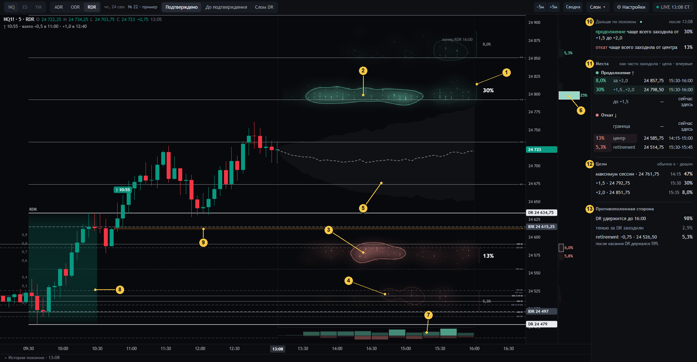

# Смысловой слой DR Lab — вход для агента без кода

Здесь собрано всё, что нужно, чтобы понимать DR Lab, спорить о нём и предлагать изменения **на уровне смысла, не
открывая код**. Код, данные и проверки ведёт агент-исполнитель (его вход — [`../AGENTS.md`](../AGENTS.md)). Решения
принимает оператор — трейдер, для которого сделан инструмент.

Состояние на **29 сентября 2026**.

## За пять минут

- **Что это.** DR Lab — второй экран трейдера, который торгует по методу DR/IDR (автор TheMas7er, академия M7DR). Рядом
  с TradingView он показывает для текущей сессии NQ, ES или YM, **где и когда цена чаще всего бывала в похожих сессиях
  2006–2025**: уровни DR/IDR как в индикаторе автора и «созвездия» — места, куда похожие сессии приходили чаще всего.
  Это описание истории, а не сигнал и не сделка.
- **Что на экране сейчас.** Рабочий экран — **дизайн 22 «смысл числа»** на рыночных данных (с 29.09; до этого 21):
  [04-dizajn-22.md](04-dizajn-22.md). Звёзды, созвездия и проценты мест показывают, **куда и когда цена похожих сессий
  приходила после текущей свечи**; процент места — как часто заходила (решение оператора 29.09; прежний смысл
  «окончательный экстремум дня» придумали агенты, он отменён).
- **Что мы узнали 29.09** ([03-dokazatelstva.md](03-dokazatelstva.md)):
  - частоты, на которые опирается метод («DR держится около 80 %», «цвет коробки угадывает направление около 70 %»,
    «модели дня задают направление»), воспроизводятся на путях цены, которые ничего не знают о коробке, то есть это
    геометрия диапазона при волатильности дня, а не особое отношение рынка к уровням;
  - экран в основном откалиброван на новых днях, но числа, у которых не удалось сопоставить сегодняшнюю цену с
    историей, хуже постоянной оценки, а после слома DR похожих сессий часто мало;
  - часть чисел легко прочитать не как то событие, которое посчитано: процент места относится ко всей ценовой полосе, а
    нарисован на ядре; веер — это разброс в каждую минуту, а не коридор пути; «время» места было моментом окончательного
    экстремума, который по построению копится у конца сессии (исправлено 29.09: теперь это первый приход).
- **Что мы конструируем.** Карту истории, в которой у каждого числа видно: **какое это событие, после какого момента
  и до какого, по какой области и насколько история похожа на сегодня**. Числа без такого ответа на экран не попадают.

## Порядок чтения

| Файл | О чём | Минут |
|---|---|---|
| [01-zachem.md](01-zachem.md) | Зачем экран, вопросы оператора, его решения, чего экран не делает | 5 |
| [02-sobytiya.md](02-sobytiya.md) | Словарь: объекты метода, похожие сессии, каждое число экрана как событие, различия, которые нельзя смешивать | 10 |
| [03-dokazatelstva.md](03-dokazatelstva.md) | Что проверено на ленте 2006–2025 и насколько надёжно, с числами и статусами | 10 |
| [04-dizajn-22.md](04-dizajn-22.md) | Дизайн 22: картинки с номерами, что каждый элемент значит, что изменилось против 21 и почему | 10 |
| [05-otkrytye-voprosy.md](05-otkrytye-voprosy.md) | Что решает оператор, какие смысловые вопросы открыты, что проверить дальше | 5 |
| [06-protokol.md](06-protokol.md) | Как смысловой агент и агент-исполнитель работают вместе через этот репозиторий | 5 |
| [lens/](lens/) | Тексты смысловых линз и ответы на них, по датам | — |

Если нужны подробности, на которые ссылаются эти файлы: определения чисел рабочего экрана —
[`../docs/SEMANTICS.md`](../docs/SEMANTICS.md); метод автора целиком — [`../docs/STRATEGY.md`](../docs/STRATEGY.md);
история дизайнов 1–22 и замечания оператора по раундам — [`../design/README.md`](../design/README.md); решения с датами —
[`../docs/DECISIONS.md`](../docs/DECISIONS.md). Всё это текст, не код.

## Метки статуса

Во всех файлах папки утверждения помечены:

| Метка | Значит |
|---|---|
| **[проверено]** | Измерено на ленте 2006–2025 с заранее записанным правилом; есть скрипт и журнал в `studies/` |
| **[частично]** | Измерено, но объяснение или граница применимости не установлены до конца |
| **[вывод]** | Следует из проверенного, но отдельно не измерялось |
| **[гипотеза]** | Предположение, которое можно проверить |
| **[опровергнуто]** | Проверено, не подтвердилось |
| **[решение оператора]** | Сказал оператор; дата и источник в `docs/DECISIONS.md` |
| **[предложение]** | Предложил агент; действует только после решения оператора |
| **[открыто]** | Никто не решил и не проверил |

## Как предложить что-то

Коротко: текст линзы попадает в [`lens/`](lens/) (через оператора, Issue или PR), агент-исполнитель отвечает там же
файлом `…-otvet.md`, проверяет утверждения на данных и обновляет эти файлы; решения остаются за оператором. Подробно —
[06-protokol.md](06-protokol.md).
