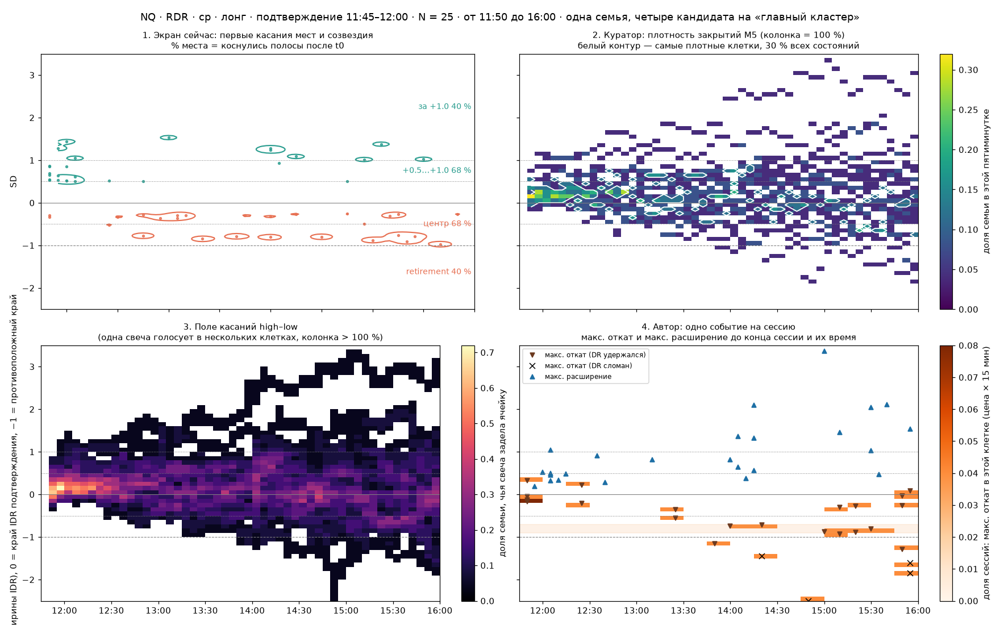
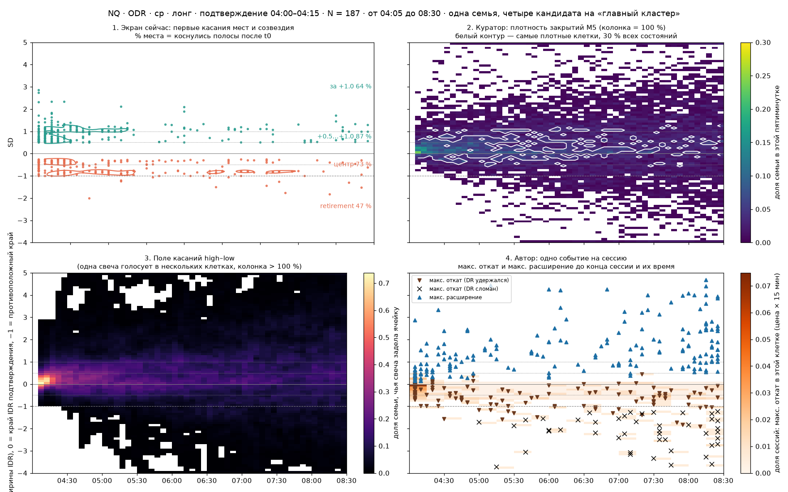

# Ответ исполнителя на линзу 14 — проценты и кластеры экрана (30.09.2026)

**На что отвечает:** [2026-09-30-linza-14.md](2026-09-30-linza-14.md) — рабочий документ куратора для двух
рецензентов. Оператор просил включиться как архитектор и исследователь, без субагентов, и главное — не подменять принципы
автора.

**Что сделано перед ответом:**
- заново прочитана реконструкция метода автора ([2026-09-30-otvet-6.md](2026-09-30-otvet-6.md): конвейер A1, строка
  сессии B1, зоны C1);
- проведён эксперимент, который куратор просит в §16.5: [`../../studies/percent_semantics_2026_09_30/`](../../studies/percent_semantics_2026_09_30/README.md).
  На двух сегодняшних семьях — RDR, N = 25 и ODR, N = 187 — в одних осях «время × SD» сравнены четыре кандидата на
  главный кластер. Код экрана не менялся.

## Коротко

1. **Диагноз куратора верен.** Экран смешивает разные вопросы, и оператор не может прочитать их как одну картину.
   Критерий консенсуса §17 исполнитель принимает целиком: для каждого числа — «X % чего, из какого N, за какой горизонт,
   с каким атомом, может ли сессия попасть в число дважды».
2. **Главный спор — какой объект главный.**
   - Куратор предлагает новый объект — плотность закрытий M5.
   - Оператор просит слепок «как у автора».
   - У автора главный объект другой: **одна сессия — одно событие**. Это самая глубокая точка отката до конца сессии,
     самая дальняя точка расширения и время каждой, в долях сессий ключа. Поэтому его распределения делят 100 %. Это и
     есть «слепок дня», о котором говорит оператор.
3. **Эксперимент.** Плотность закрытий на живых семьях — гребень от уровня подтверждения, который расширяется к концу
   сессии.
   - Самая плотная клетка — в первой же пятиминутке: 32 % семьи RDR, 24 % семьи ODR.
   - Самая плотная область, где 30 % всех состояний, рассыпается примерно на 70 кусков.
   - Её крупнейший кусок — первые 45 минут у уровня подтверждения (RDR) или широкая полоса −0,5…+0,9 на всю сессию (ODR).
   - Это веер в другой форме, а веер оператор сегодня убрал как пустой. Главным кластером это быть не может. Как «чаша
     весов на каждой M5» в динамическом слое — может.
4. **Объекты автора на тех же семьях показывают то, чем торгуют по методу:**
   - где кончались откаты — зона входа и стопа;
   - докуда шло расширение — цель;
   - когда это было;
   - хвост за противоположным DR — сломы.
5. **«Дошли хотя бы до» и распределение — не разные объекты.** Лестница достижения — это хвост распределения
   максимального расширения (линза 6, п. 4). На 11:50 экранные 68 % и 40 % — ровно доли сессий, чьё максимальное
   расширение ≥ +0,5 и ≥ +1,0. Скобки и гистограмма на 100 % согласуются, если обе построены из одного события.
6. **Узел — правило 10.** Объекты автора — это окончательный экстремум сессии. Слепок «как у автора» требует решения
   оператора: уточнить правило 10 (это вариант «а» открытого вопроса О13).
7. **Схема исполнителя** — три слоя одной семьи:
   - А — исход (100 %);
   - Б — слепок автора на момент активации: главный, весь день не меняется;
   - В — наш динамический слой от среза, подписанный «после ЧЧ:ММ».

## 1. Реконструкция: что оператор хочет увидеть на снимке 11:50

- **Корзина** — 25 сессий ключа «NQ · RDR · среда · лонг · 11:45–12:00». Она фиксирована и знаменатель у всех чисел один.
- **Главный слепок** — как у автора: на момент активации, чем кончался день у каждой из 25. Каждая сессия — одна точка
  в каждой главной статистике, проценты делят 100 %. Например:
  - «у 5 из 25 откат кончился в −0,9…−0,7»;
  - «у 17 из 25 расширение дошло хотя бы до +0,5»;
  - «4 из 25 сломали DR».
- **Созвездия** — где эти точки гуще по времени и по SD. Это кластеры в смысле автора: зона и окно времени.
- **Динамика.** На каждой выбранной M5 — та же корзина, остаток её фильма, для быстрых решений. Главный слепок от этого
  не меняется.
- **Граница:** не подменять принципы автора, DR Lab только расширяет ответ.

Где реконструкция куратора уходит в сторону: §2.3 «где семья дольше всего жила» — это пересказ куратора, а не слова
оператора. Оператор говорит «как у автора», «слепок дня», «100 %». Но в чате 30.09 он сам описывал матрицу «где каждая
из 25 была каждые пять минут», и это близко к плотности закрытий. Обе трактовки записаны, выбирает оператор (раздел 6).

## 2. Аудит текущего экрана

| Группа | Что сейчас значит | Соответствие автору |
|---|---|---|
| Большие скобки и доли мест | доля N, чья свеча после среза хоть раз задела полосу | На срезе подтверждения это хвосты распределений автора: 68 % = максимальное расширение ≥ +0,5. На поздних срезах это «достижение с этого места», и для семьи лестница не вложена: на 15:25 цель +0,5 — 44 %, полоса +0,5…+1,0 — 36 % |
| Проценты у цены, созвездия | первые касания мест — звёзды, их плотность | Наш объект, у автора такого нет. Цена звезды — глубина первой задевшей свечи, смысл слабый |
| Шесть окон | из тех же звёзд, плюс путь закрытий | Названия «Глубина отката» и «Расширение» — авторские, а содержание — первые касания |
| DR удержался | единственное разбиение на 100 % | как у автора (DR true), но без отбора |

## 3. Аудит предложения куратора

**Принимается:**
- диагноз (§4);
- критерий консенсуса (§17);
- три разных величины, которые нельзя складывать (§7);
- исход DR — отдельно (§3.5, §11.4);
- исходная карта фиксирована, динамический слой подписан «оставшаяся часть после t» (§13);
- поле касаний high–low не годится как поле на 100 % (§6);
- «проторговка» — не название измерения (§5.4);
- сначала расчёт, потом интерфейс (§16.5, §18).

**Не принимается: плотность закрытий M5 как главный кластер.**
1. **Это не объект автора.** Оператор прямо просил не подменять принципы.
2. **Плотность прибита к старту.** Семья начинает с одной цены и расходится, поэтому самая плотная клетка всегда в
   первые минуты. В эксперименте максимум колонки — в t0: 32 % (RDR) и 24 % (ODR).
3. **Кластер задаёт правило выделения, а не данные.** Область, где 30 % всех состояний, при N = 25 распадается на 70
   кусков, при N = 187 — на 69. Именно об этой опасности куратор сам пишет в §15 I («красивая искусственная
   кластеризация»).
4. **Масса зависит от длины горизонта.** Масса = состояния / (N × T). Одна клетка семьи из 25 — 0,08 % всех состояний.
   Карта от 11:50 (50 колонок) и от 15:25 (7 колонок) несравнимы. Трейдеру трудно прочитать «32,7 % массы пути».
5. **Закрытие теряет экстремумы.** Метод торгует экстремумами: вход у экстремума отката, стоп за ним, цель у экстремума
   расширения.
6. **По сути это веер:** середина и разброс закрытий на каждую пятиминутку. Его оператор сегодня убрал.

**Поправки к математике куратора:**
- §5.1 «Σ P(k, j) = 1» верно только для сессий, у которых есть свеча в колонке. Нужно задать N_j или отдельную
  корзину «нет данных». Сегодня нет данных у 0–0,1 % состояний.
- §7 «reach — отдельная производная» не совсем так: достижение и распределение максимального расширения — один объект,
  прочитанный накопленно и по ячейкам.
- §10 «правило 10 не нарушается» — верно для плотности закрытий. Для слепка автора правило 10 затронуто, и это надо
  сказать прямо (раздел 4).

**Ответы на вопросы §15:**

| Вопрос | Ответ исполнителя |
|---|---|
| A. Верно ли восстановлен замысел | Верно: семья, фильм, исход отдельно, динамика не меняет семью. Нет главного: слепок — «как у автора» |
| B. Плотность закрытий M5 как главный атом | Нет. Главный атом — событие сессии: самая глубокая точка отката, самая дальняя точка расширения, их время. Закрытие годится для динамической «чаши весов» |
| C. Нормированная масса кластера | Да, но **в долях сессий**, а не состояний: зоны + остальное = 100 % сессий по данному событию |
| D. Названия | «дошли хотя бы до» (достижение); «откат кончился здесь» (самая глубокая точка до конца сессии); «расширение дошло до» (самая дальняя); «DR удержался / сломан» (исход); «где была семья в ЧЧ:ММ» (чаша весов) |
| E. Что в больших скобках | Зоны автора с долей сессий: откат — зона T&P, расширение — цель. Пример на 11:50 — раздел 5 |
| F. Проценты у цены | Гистограммы автора: самая глубокая точка отката на стороне отката, самая дальняя точка расширения на стороне продолжения; каждая сторона — 100 % |
| G. Нынешние созвездия | Перенести в динамический слой: «где впервые приходили после ЧЧ:ММ». Главные созвездия — точки автора, по одной на сессию |
| H. Шесть окон | Панели автора: откат по цене и по времени, расширение по цене и по времени, карта «цена × время» отката (как M7 Heatmap), исход DR. Путь закрытий — в динамический слой |
| I. Опасности | Раздел 4, «Риски» |

## 4. Схема исполнителя

**Атом.** Сессия i семьи F (N сессий) и её путь после t0 в своей шкале SD: 0 — край IDR стороны подтверждения,
−1 — противоположный край. Из пути берутся:
- m_i — самая глубокая точка отката до конца сессии, τ_i — её время;
- x_i — самая дальняя точка расширения, ξ_i — её время;
- o_i — исход DR: удержался или сломан, от своего подтверждения до конца сессии.

**Слой А — исход, фиксирован на t0.** Доля сломов B = #{o_i = сломан} / N. Удержался + сломан = 100 %.

**Слой Б — слепок автора на t0, главный.** Вся семья, без отбора DR true (решение оператора 30.09).
- **Откат по цене:** P_R(k) = #{m_i ∈ k} / N по ячейкам 0,1 SD, Σ = 100 %. Ячейки за противоположным DR — хвост сломов.
- **Откат по времени:** P_Rτ(b) = #{τ_i ∈ b} / N по 15 минут, с раскраской по исходу. Вместо отбора DR true: у сломанных
  самая глубокая точка поздняя.
- **Карта «цена × время» отката:** H(k, b) = #{m_i ∈ k, τ_i ∈ b} / N, аналог M7 Heatmap. Главные созвездия — по звезде
  на сессию в точке (τ_i, m_i) и (ξ_i, x_i).
- **Зона T&P и скобка:** масса зоны Z = #{m_i ∈ Z} / N. Все зоны плюс остальное = 100 %. Правило зоны объявить заранее:
  например, самая частая ячейка и соседние, где не меньше половины её сессий, расширенные до медианы. Автор выбирает
  зоны вручную (линза 6, C1).
- **Расширение и цель:** P_X(k) = #{x_i ∈ k} / N, Σ = 100 %. Линия «70 %» — уровень, до которого дошли 70 %
  (30-й перцентиль x_i).
- **Лестница «дошли хотя бы до»:** R(L) = #{x_i ≥ L} / N = Σ_{k ≥ L} P_X(k) — то же распределение, прочитанное
  накопленно.
- **Проценты у цены:** P_R на стороне отката, P_X на стороне продолжения.

**Слой В — динамика, на каждой закрытой M5 t, наш, подписан «после ЧЧ:ММ».** Та же семья, остаток фильма:
- **чаша весов:** P_t(k, j) = доля N, чьё закрытие в колонке j > t лежит в ячейке k. В колонке 100 %, с корзиной
  «нет данных»;
- **достижение с этого места и первые касания** — нынешние звёзды и места, как вторичный слой;
- **исходная карта Б** остаётся видимой, например серыми контурами. Она не переписывается.

**Что меняется на каждой M5:** только В. Слои А и Б фиксируются на t0.

**Правило 10.** Слой Б — окончательный экстремум сессии, поэтому решение за оператором (О13, вариант а):
- разрешить его как объект автора под именами «самая глубокая точка отката до конца сессии» и «самая дальняя точка
  расширения»;
- время показывать с раскраской по исходу;
- запрет выдавать эти точки за «где и когда цена приходила» оставить.

**Риски:**
- **Время расширения копится у конца сессии:** в последние 30 минут у RDR 20 %, у ODR 29 %. Это то самое явление,
  из-за которого появилось правило 10. В 2024–26 автор строит окно времени по откату; время расширения у него — только
  панель дашборда.
- **Время отката у сломанных сессий позднее.** У RDR 24 % самых глубоких точек — в 15:45–16:00. Поэтому раскраска по
  исходу обязательна.
- **N = 25 — это 4 % на сессию.** Зоны из двух-трёх сессий шумные. У автора ключи обычно 88–346 сессий (часто окно
  30 минут), а после отбора DR true — меньше.
- **Люфт окна.** У части семьи своё подтверждение на 5–10 минут позже t0.
- **M7 retracement автора 2026** не раскрыт (линза 6, D1) и в схеме не используется.

## 5. Эксперимент

Скрипт и картинки: [`../../studies/percent_semantics_2026_09_30/`](../../studies/percent_semantics_2026_09_30/README.md).
Каждая картинка — четыре панели в одних осях: экран сейчас, плотность закрытий, поле касаний, объекты автора.

| Что считает главным | RDR · ср · лонг · 11:45–12:00, N = 25 | ODR · ср · лонг · 04:00–04:15, N = 187 |
|---|---|---|
| Исход DR | удержался 84 %, сломан 16 % | удержался 73 %, сломан 27 % |
| Экран сейчас: доли мест (коснулись после t0) | +0,5…+1,0 — 68 %; за +1,0 — 40 %; центр — 68 %; retirement — 40 %; созвездия — маленькие пятна вокруг нескольких звёзд | 87 / 64 / 73 / 47 %; созвездия у ближних мест — 04:10–04:30, сразу после t0 |
| Куратор: плотность закрытий | лучшая ячейка цены 9,4 % (+0,1…+0,2); самая плотная клетка — t0 (32 %); самая плотная область с 30 % состояний — 70 кусков, крупнейший 10 %: −0,1…+0,5, 11:50–12:35 | лучшая ячейка 6,4 %; t0 — 24 %; 69 кусков, крупнейший 27 %: −0,5…+0,9, 04:05–07:15 |
| Поле касаний | колонка 2,6–4,8 × N; максимум — в t0 (72 %) | 3,8–5,6 × N; максимум в t0 (74 %) |
| Автор: самая глубокая точка отката | медиана −0,56; «70 %» −0,89. Две группы: −0,9…−0,8 (12 %) и −0,3…−0,2 (12 %). Зона −0,9…−0,7 — 20 % сессий, время 14:00–14:30. Время: 15:45–16:00 — 24 %, 11:45–12:00 — 16 % | медиана −0,65; «70 %» −1,29. Время 04:00–04:15 — 25 % (откат сразу), медиана 05:55. Зона −0,7…+0,1 — 47 % сессий |
| Автор: самая дальняя точка расширения | медиана +0,81; «70 %» +0,49. Время 12:00–12:15 — 24 %, медиана 14:05, в последние 30 минут 20 % | медиана +1,34; «70 %» +0,84. В последние 30 минут 29 % |
| Лестница = хвост расширения | ≥ +0,5 — 68 %, ≥ +1,0 — 40 %, ≥ +1,5 — 20 % (ровно доли мест экрана на 11:50) | 87 / 64 / 45 % |

**Чтение:**
- **Плотность закрытий** называет главным уровень подтверждения и первые минуты — то, что семья начинает вместе. Зону
  входа, стоп или цель она не выделяет.
- **Объекты автора** выделяют:
  - две группы откатов: мелкий у −0,25 и глубокий у −0,85 — это две зоны T&P в духе автора;
  - цель — уровень, до которого дошли 70 %;
  - хвост сломов.
- **Нынешние доли мест на срезе подтверждения** совпадают с лестницей автора.

## 6. Что решает оператор

1. **Главный слепок** — объекты автора (слой Б, рекомендация исполнителя) или плотность закрытий M5 (предложение
   куратора)?
2. **Правило 10:** уточнить его для слоя Б, как в О13 «а»: экстремум дня как объект автора под его именем.
3. **Правило зоны:** объявленное (самая частая ячейка и соседи, где не меньше половины её сессий) или ручной выбор,
   как у автора?
4. **Динамический слой:** что в нём оставить — чашу весов по закрытиям, приходы, достижение с этого места?
5. **Малые семьи:** при N = 25 одна сессия — 4 %. Показывать ли где-то размер семьи или порог, ниже которого зоны не
   рисуются?

Код экрана до решения по пунктам 1–2 исполнитель не меняет.
