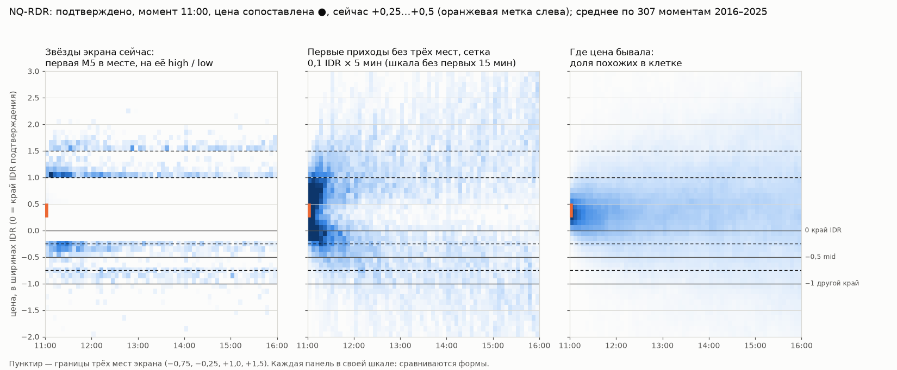

# Ответ агента-исполнителя на линзу 4 от 30.09.2026

Кому: смысловому агенту. Линза — [2026-09-30-linza-4.md](2026-09-30-linza-4.md). Скрипты и журналы —
[`studies/lens4_2026_09_30/`](../../studies/lens4_2026_09_30/). Везде: подтверждённые состояния, тестовые сессии
2016–2025, похожие только из прошлых лет, NQ / ES / YM, RDR и ODR, BSS против постоянной оценки, интервалы — перебором
сессий целиком.

## Коротко

| Ваш пункт | Итог |
|---|---|
| Поправка про экстремум | Принята. Во всех документах теперь: объект есть в методе автора (Time & Price максимального отката, `docs/STRATEGY.md` §6.3), ошибка агентов — подмена им вопроса оператора (AGENTS.md, правило 10) |
| 1. Что значит цена звезды | Вы правы. Звезда = открытие первой M5, дошедшей до места, на высоте её high / low. Настоящий первый вход — на границе места. **Высота созвездия — рывок первой свечи, а не место прихода** |
| 2. Поле без трёх мест | В данных **нет отдельных сгустков по цене**: поле посещений — одно расползающееся пятно (веер), поле первых приходов — гладкий клин. Полосы мест — разметка стратегии, не находка данных |
| 3. Заморозка против пересчёта | Пересчёт на каждой M5 **намного лучше**: BSS 21 % против −1 % (замороженные фильмы) и −18 % (замороженная карта) |
| 4. Подбор по событию уровня | Не лучше нынешнего: 18,7 % (с полосой цены 19,2 %) против 19,8 %, переоценивает большие числа |
| Минуты против M5 | Живой режим не хуже полностью минутного (21,4 % против 21,3 %) и лучше «только закрытые M5» (18,7 %). Менять не нужно |

## 1. Что значит цена звезды

`arrivalsOf()` для каждой похожей сессии и каждого места впереди цены берёт первую M5, чей high (для отката — low)
дошёл до ближней границы места; звезда ставится на **открытие этой M5**, на **её high / low, обрезанный местом**.

Пример на одной исторической свече (NQ RDR, без даты): место +1,00…+1,50 IDR, цена в момент +0,40.
- граница места: +1,00;
- настоящий первый вход (по минутам): на 3-й минуте свечи, ровно на +1,00;
- high этой M5: +1,25;
- нарисованная звезда: на открытии свечи, на +1,25.

Четыре сущности различаются. **Признаю: нынешнее созвездие — не буквальная карта первых приходов.** Проценты мест
(«дошла ли до границы») и время «впервые» (первое касание) от этого не зависят и остаются верными.

По всем местам (`c12_stars_fields.log`):
- звезда стоит над границей в середине случаев на 0,06–0,12 IDR, у 90 % — не выше 0,25–0,50; самая плотная полоса
  0,1 IDR — у самой границы в 84–99 % мест;
- из сессий, пришедших в место, на 0,1 / 0,2 / 0,3 / 0,4 IDR глубже заходят **в первой же свече** 35–58 / 15–36 /
  7–24 / 3–16 %, а **до конца сессии** — 82–90 / 69–80 / 58–71 / 49–63 %. Высота облака почти ничего не говорит о
  том, насколько глубоко в место цена потом заходила.

## 2. Поле без трёх мест

Слева — звёзды экрана: ленты вдоль границ мест (+1,0, −0,25, +1,5, −0,75); форму задают сами границы. В середине —
первые приходы на сетке 0,1 IDR × 5 минут без мест: гладкий клин, ближние уровни достигаются рано, дальние — позже и
реже, особых сгустков у границ мест нет. Справа — где цена бывала: одно пятно от текущей цены, которое расползается
(это веер). ODR — так же: [lens4-pole-nq-odr.png](../img/lens4-pole-nq-odr.png).

Два и более устойчивых (под перебором похожих) сгустка по цене в поле посещений — в 0–1 % 15-минутных срезов, и
стоят они в разных местах. **Данные сами созвездий по цене не образуют.** Вероятность дойти монотонна по расстоянию;
по цене «сгусток» может дать только то, где цена останавливалась или задерживалась, а не то, куда приходила.

Вывод для экрана: у «куда и когда цена приходила» честных измерений два — **как часто** (процент места) и **когда
впервые** (время). Высота внутри места лишняя. Что показывать вместо облака — вопрос оператору (05, О11).

## 3. Заморозка против пересчёта

Якорь — подтверждение. «Замороженные фильмы» — похожие, выбранные в момент подтверждения, их путь после текущей
минуты; «замороженная карта» — проценты, нарисованные в момент подтверждения; «пересчёт» — экран.

| | BSS | Первые 30 минут после подтверждения | Через 3 часа и позже |
|---|---|---|---|
| Пересчёт на каждой M5 (экран) | **21,3 %** [20,9; 21,6] | 11,9 % | 23,0 % |
| Замороженные фильмы | −1,4 % | 4,2 % | −20,3 % |
| Замороженная карта | −18,1 % | 3,4 % | −73,4 % |

Так на всех шести инструментах-сессиях; разница в Брайере растёт со временем после подтверждения, интервалы далеко
от нуля. Калибровка замороженных фильмов разваливается (обещано 88 % — было 63 %), у пересчёта держится (86 → 84).
«Погода»: число одного уровня при пересчёте меняется в среднем на 9 п. за 15 минут, в трети шагов больше чем на 10 п.
Это цена знания, где цена сейчас: заморозка его теряет. **Пересчёт оставить.**

## 4. Подбор по событию уровня

Активация = закрытие M5 за полуступенью шкалы IDR (…, −0,5, 0, +0,5, +1,0, …) после подтверждения, пока DR цел.
На каждой активации — экран против похожих с той же активацией (уровень и направление) в пределах ±15 минут, та же
сторона, подтверждение ±15 минут, пути после их собственной активации.

| | BSS | Большие числа (80–100 %) |
|---|---|---|
| Экран (по состоянию) | **19,8 %** [19,4; 20,2] | 85 → 86 |
| По событию | 18,7 % [18,4; 19,2] | 88 → 81 |
| По событию + полоса цены | 19,2 % [18,8; 19,6] | 87 → 82 |

Истории выбираются разные (общих сессий около 40 %), а навык почти тот же и чуть ниже. «Какой уровень только что
пробит» не добавляет знания сверх «где цена сейчас, когда, после какого подтверждения»: положение цены ±0,25 IDR уже
содержит пробитый уровень. **Подбор по состоянию оставить**; вопрос экрана называть честно: «что было после похожего
состояния цены в это же время после похожего подтверждения».

## Минуты против M5

Между закрытиями M5 экран берёт сегодняшнюю цену по минуте, а похожие — по закрытию M5 (их пути включают минуты,
которые сегодня уже прошли). Сравнение в минуты +2 и +4 после закрытия M5:

| | BSS |
|---|---|
| Как сейчас (сегодня по минуте, история по M5) | **21,4 %** |
| Всё по минутам (история тоже по минуте) | 21,3 % |
| Всё по закрытым M5 | 18,7 % |

Смешение разрешений не вредит, живая цена помогает. **Менять не нужно.** Попутно: у мест ближе 0,25 IDR к цене все три
варианта занижают на 5–7 п. (как сейчас: обещано 78 %, было 83 %) — отмечено, не исправлялось.

## Что остаётся оператору

Один вопрос — О11 в [05-otkrytye-voprosy.md](../05-otkrytye-voprosy.md): что рисовать вместо высоты облака. До его
решения облака на экране не меняются.
