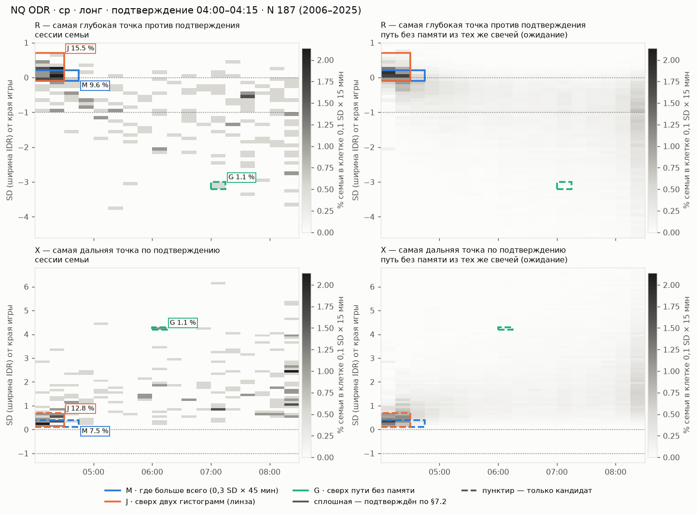
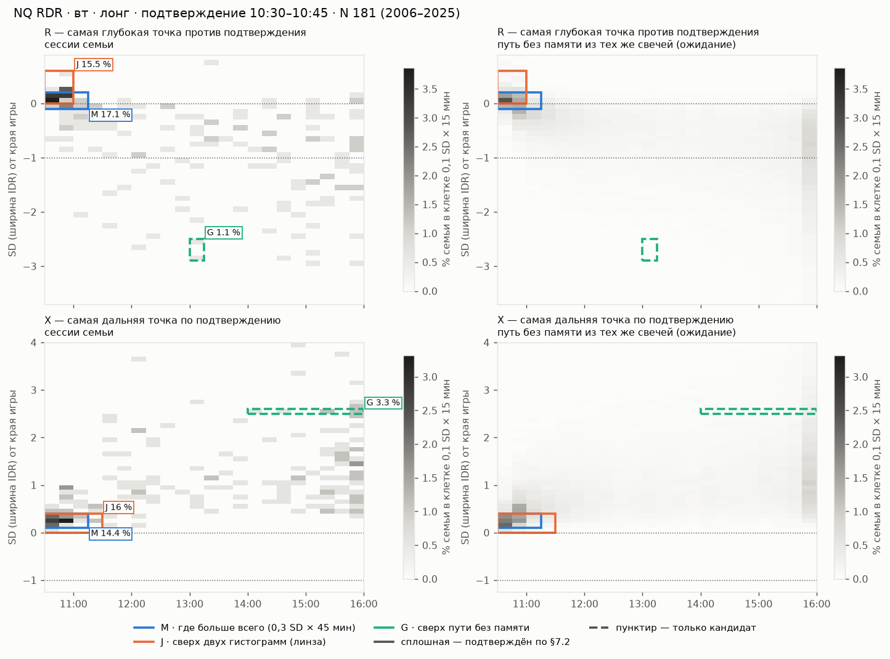

# Ответ исполнителя на линзу 15 — автоматический главный кластер R / X (01.10.2026)

**На что отвечает:** [2026-10-01-linza-15.md](2026-10-01-linza-15.md). Экраны 22 и 24 этим ответом не менялись.

**Опыт:** [`../../studies/lens15_2026_10_01/`](../../studies/lens15_2026_10_01/README.md).
- Правила объявлены в коде до счёта на ленте (sha256 `192444c7…`, 01.10, 14:31); отладка — только на синтетике.
- Семьи и события равны `lab/scene24.py`: сверено на пяти семьях до и после правок `scene24.py` другой сессией.
- Инструменты: NQ — основной, ES и YM — повтор тем же кодом.

**Независимость.** Параллельно другая сессия исполнителя делала свой главный кластер. Она закоммитила правило и
показала кластер в дизайне 24 (`6f3552e`, `23322e8`, [11-glavnyj-klaster.md](../11-glavnyj-klaster.md)). После заморозки
опыта я случайно увидел заголовок её модуля; по слову оператора дальше её код и текст не читал. Ни опыт, ни этот ответ
на них не опираются. Сопоставить два результата — отдельный шаг (раздел 6).

## Коротко

1. **Принято из линзы:**
   - кластер — прямоугольник внутри таблицы A_E одной семьи;
   - его доля — сессии / N;
   - «максимум доли» вырождается расширением;
   - R и X не смешиваются;
   - два статуса: кандидат и подтверждённый;
   - рисунок 22 — только показ уже найденного.
2. **Не принято: база сравнения «произведение двух гистограмм».** У окончательной точки цена и время связаны самой
   формой пути. Если цена сразу ушла, самая глубокая точка R — в первые минуты, у цены подтверждения. Если откат шёл
   долго, он глубже. Путь без памяти, собранный из тех же свечей с направлением по монетке, даёт такие же «совместные
   сгущения». Критерий линзы их «подтверждает» так же часто, как на настоящих сессиях.
3. **Лента: подтверждённые главные области, число семей с N ≥ 20.** В каждой клетке — настоящие сессии / пути без памяти
   из тех же свечей.

   | Событие · определение | NQ, 166 семей | ES, 182 | YM, 168 |
   |---|---|---|---|
   | R · M «где больше всего» (0,3 SD × 45 мин) | 29 / 37 | 39 / 33 | 28 / 25 |
   | R · J «сверх двух гистограмм» (линза) | 32 / 30 | 39 / 39 | 31 / 29 |
   | R · G «сверх пути без памяти» | **0 / 0** | **1 / 0** | **0 / 0** |
   | X · M | 20 / 21 | 31 / 28 | 21 / 24 |
   | X · J | 14 / 24 | 13 / 24 | 13 / 18 |
   | X · G | **0 / 0** | **0 / 0** | **0 / 0** |

   Все подтверждённые M и J на всех трёх инструментах лежат в первых 30 минутах после подтверждения, у цены
   подтверждения. Так и на настоящих сессиях, и на путях без памяти.
4. **Ответ на вопрос линзы.** Право называться главным кластером даёт только сгущение, которое выполняет два условия:
   - держится по условиям §7.2;
   - превышает путь без памяти из тех же свечей.

   На NQ, ES и YM при сетке 0,1 SD × 15 мин и N ≤ 190 такого нет. Исключение — один случай на 1032 проверки (раздел 3.3).
   Без сравнения с путём без памяти автоматика почти всегда находит «сразу после подтверждения». Это геометрия
   окончательной точки, а не место, где рынок разворачивался.

## 1. Сверка утверждений линзы

| Утверждение | Где | Итог |
|---|---|---|
| В 22 созвездие — KDE звёзд с контуром 38 % | `design/sozvezdiya-22/src/app.js`: `kde()`, `zoneOf()` (`g.peak * 0.38`) | Верно. Два уточнения: контур искался внутри каждого из трёх заданных мест, а не по всей карте; первые 15 минут в облако не входили и показывались одним числом (`NEAR = 15`) |
| §7.1 запрещает 38 % KDE, половину пика, три места, заданное число островов | спецификация §7.1 | Верно |
| §7.2 — условия доказательства | §7.2 | Верно. Там же: это условия будущего исследования, а не разрешение инженеру придумать порог; задачу поставил оператор (О20, задача 1) |
| Звезда 22 и точка 24 — разные атомы | правило 10; [10](../10-dizajn-24.md) П2 | Верно |
| A_E(k,b): одна сессия — один голос; цена и время — проекции одной таблицы | §6; `scene24._snapshot` | Верно; проверяется `tests/sem24.py` |

## 2. Почему произведение гистограмм ловит геометрию

Пример линзы верен арифметически: 30 % × 40 % = 12 %. Но независимость цены и времени — неверная точка отсчёта для
окончательной точки сессии. Возьмём путь, где каждая свеча идёт вверх или вниз по монетке:

- если первые свечи пошли по подтверждению, R остаётся у первой свечи: рано и мелко;
- если цена долго шла против, R успевает уйти глубже: поздно и глубоко;
- для X то же самое: «сразу развернулась» — рано и у цены подтверждения, «шла весь день» — поздно и далеко.

Поэтому у любого пути «ранний и мелкий» и «поздний и глубокий» встречаются чаще, чем при независимости. Критерий линзы
находит прежде всего это. На ленте его проверка «лучше случая» срабатывает:
- для R: NQ 92 из 166 семей, ES 110 из 182, YM 90 из 168;
- на путях без памяти: 95, 111 и 84.

## 3. Опыт

### 3.1. Что объявлено до счёта

Атом, сетка и семья — без изменений (DR-LAB-SEM-1.0, `scene24`). Кандидаты — прямоугольники внутри возможных часов
семьи: от её окна подтверждения до конца блока. Три определения сгущения:

- **M** — окно 3 × 3 клетки (0,3 SD × 45 мин), где больше всего событий;
- **J** — линза: превышение произведения гистограмм; статистика сканирования Кульдорфа, прямоугольники до 1,0 SD × 2 ч;
- **G** — та же статистика, но против путей без памяти из свечей тех же сессий: каждая свеча на своём месте по часам,
  направление по монетке, 100 повторов на сессию.

**Подтверждён** = выполнено всё:
1. первая декада (2006–2015) находит то же место, что вся история;
2. во второй декаде (2016–2025) это место ещё сгущение, p < 0,05;
3. три сдвига сетки (+0,05 SD, +5 и +10 мин) находят то же место;
4. ≥ 50 % из 200 пересэмплирований сессий находят его, и оно держится без любой одной сессии;
5. для J и G: максимум лучше случая, p < 0,05.

Тот же конвейер прогнан на «нулевых данных»: каждая сессия заменена одним путём без памяти из её же свечей.

### 3.2. Что получилось

- **Где лежат главные области.** У M и J главная область всей истории попадает в первые 30 минут в 77–90 % семей. Так
  и у настоящих, и у путей без памяти. Подтверждённые M и J — там все до одной.
- **Доля событий в первые и последние 30 минут возможных часов** (средневзвешенная по N), настоящие / без памяти:

  | | NQ | ES | YM |
  |---|---|---|---|
  | R, первые 30 минут | 18,9 / 19,2 | 19,9 / 20,3 | 18,0 / 19,1 |
  | R, последние 30 минут | 19,3 / 20,7 | 20,2 / 21,3 | 19,8 / 22,4 |
  | X, первые 30 минут | 22,0 / 19,6 | 23,7 / 20,8 | 22,5 / 19,1 |
  | X, последние 30 минут | 19,2 / 21,3 | 19,6 / 22,2 | 18,3 / 21,4 |

  Оба скопления — у начала и у конца — пути без памяти воспроизводят почти целиком. Одна мелочь повторяется на всех трёх
  инструментах: X в первые 30 минут у настоящих сессий на 2–3 пункта чаще, чем у монетки, а в последние 30 минут — реже.
  Расширение чуть чаще кончается сразу. Это наблюдение после счёта, как утверждение оно не проверялось.
- **Размер главной области:**
  - M — медиана 12–14 % семьи, у путей без памяти столько же;
  - J — в 4–5 раз больше произведения гистограмм, у путей без памяти тоже;
  - лучшая область G — обычно одна-две сессии в хвосте (медиана 7 % семьи); они не держатся без одной сессии.
- **G «лучше случая»** — в 6–10 семьях из 166–182 на каждом событии и инструменте, у путей без памяти — столько же. При
  пороге 5 % этого и ждёшь от простой случайности.

### 3.3. Единственный случай G

ES, RDR, вт, шорт, подтверждение 11:00–11:15, N 59: R в −1,0…−0,2 SD × 14:30–15:30, 27 % семьи. Это в 5,3 раза больше
пути без памяти; вторая декада p = 0,009, пересэмплирование 64 %. Один случай на 1032 проверки (516 семей × R и X); у
путей без памяти таких 0. Правилом это не читается: место для проверки на новых сессиях, не кластер для экрана.

### 3.4. Чувствительность (добавлено после счёта, синтетика)

Сколько сильным должен быть настоящий кластер, чтобы G его подтвердил? В синтетических семьях доля s сессий получила
провал, кладущий R около −1,0…−1,5 SD в 11:45–12:30 (`power.py`, по 4 семьи на уровень).

| Подложено | N 60: G на месте | N 150: G на месте | M и J |
|---|---|---|---|
| 0 % (чистое блуждание) | 0 из 4 | 0 из 4 | M и J «подтверждают» начало часов в 1–3 семьях из 4 |
| 10 % | 0 из 4 | 1 из 4 | то же |
| 20 % | 1 из 4 | 0 из 4 | то же |
| 30 % | 0 из 4 | **4 из 4** (−1,8…−0,8 SD × 11:15–13:15, 26–33 % семьи) | J ни разу не нашёл подложенное место; M — в 2 семьях из 4 при N 150 |

Флаг «на подложенном месте» в `power.json` слишком узок (нижняя граница −1,4 SD); место видно по записанным областям.

Значит, «ноль» G на ленте говорит: кластеров силой около трети семьи сверх геометрии нет. Кластер на 10–20 % семьи на
N ≤ 190 не удостоверить никаким правилом §7.2. Критерий линзы не нашёл даже подложенный кластер на 30 %: его
«подтверждения» всегда в начале часов.

## 4. Примеры

Слева — сессии семьи, справа — ожидание пути без памяти из тех же свечей. Сплошная рамка — подтверждено по §7.2,
пунктир — только кандидат. Цвет клетки — доля семьи.

- **RDR, вт, лонг, 10:30 (N 181).** M для R: −0,1…+0,2 SD × 10:30–11:15, 17,1 %, подтверждён. У путей без памяти — то
  же место, 16,0 %, тоже подтверждён. X: +0,1…+0,4 × 10:30–11:15, 14,4 % против 13,8 %. Лучшие области G — одна-две
  сессии в хвосте (1,1 %; 3,3 %), не держатся.
- **ODR, ср, лонг, 04:00 (N 187, семья §12 спецификации).** M для R: −0,1…+0,2 × 04:00–04:45, 9,6 %. У путей без
  памяти — то же место, те же 9,6 %. J — −0,1…+0,7 × 04:00–04:30, 15,5 %, втрое больше произведения гистограмм.
- **RDR, ср, лонг, 11:45 (N 25, семья §12).** Ни одно определение ничего не подтвердило. Лучшее M — 4 сессии (16 %) в
  −1,0…−0,7 × 15:00–15:45; во второй декаде не держится.

## 5. Что предлагает исполнитель

**Селектор v0** — пять вещей, которые линза просит заморозить:

1. **Атом и сетка** — как в линзе.
2. **Пространство** — только возможные часы семьи: от её окна подтверждения до конца блока.
3. **Область** — прямоугольник целых клеток не больше 1,0 SD × 2 ч.
4. **Сгущение** — против пути без памяти из свечей тех же сессий (G), а не против произведения гистограмм.
5. **Устойчивость** — пять условий раздела 3.1.

Число на экране остаётся долей семьи (сессии / N). Во сколько раз больше пути без памяти — пишется в паспорт.

**Что это значит для экрана сейчас.**
- Подтверждённых главных кластеров R и X нет. Поэтому остаётся выбранная область оператора (спецификация §7.1).
- Сгущения у начала и у конца часов — свойство окончательной точки. Его уже показывает гистограмма времени. Называть его
  кластером — значит повторить путаницу 29.09 (правило 10), только у начала, а не у 16:00.
- Если оператор захочет, можно показывать у выбранной им области вторую строку паспорта: сколько там было бы у пути без
  памяти. Так видно, особенное ли это место или геометрия. Это новое число, поэтому только с его согласия (правило 7).

## 6. Что решает оператор

**О22. Главный кластер R/X.** Варианты:
- (а) без автоматики: выбранная область, при желании — со строкой «у пути без памяти» (**рекомендация исполнителя**);
- (б) автоматическое «самое частое место» с подписью, что у пути без памяти оно такое же;
- (в) искать слабые кластеры на больших группах, например без дня недели. Это меняет семью, поэтому только как
  исследование.

**Сопоставление с главным кластером другой сессии** (уже на экране 24). Если её правило выбирает место, где больше
всего R или X, мой опыт предсказывает: почти всегда это будут первые 30 минут после подтверждения, и у путей без памяти
то же самое. Это стоит проверить её же данными до того, как читать её кластер как место разворота. Решает оператор.

## 7. Границы

- Сетка, размер областей и пороги — из объявления; другие могли бы дать другие числа. Перебора не было.
- Путь без памяти сохраняет размеры свечей и их часы, но не порядок направлений. «Сверх него» значит «есть память
  направления» (тренд, возврат, реакция на уровни), а не обязательно уровень.
- Только семьи с N ≥ 20 (79–80 % сессий каждого инструмента). В меньших подтвердить что-либо нельзя.
- 2026 год не открывался.
