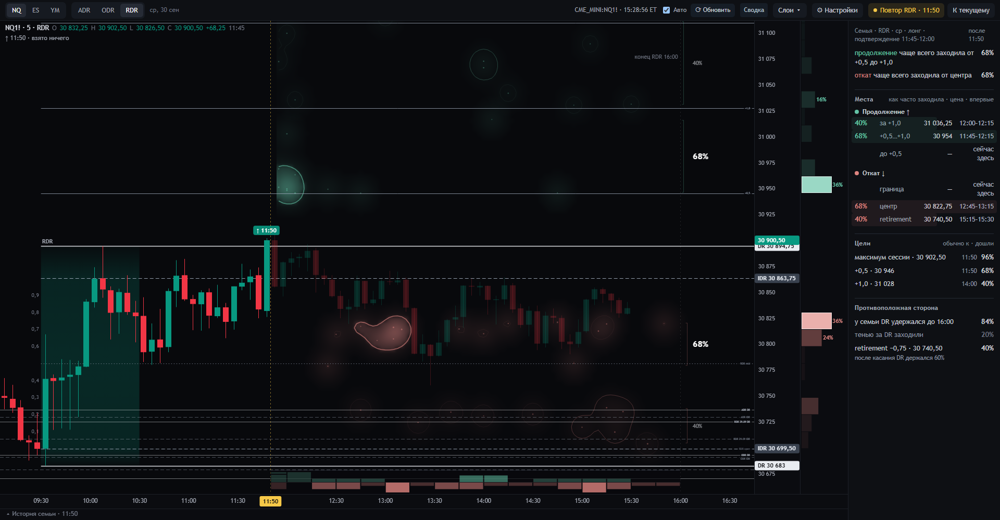
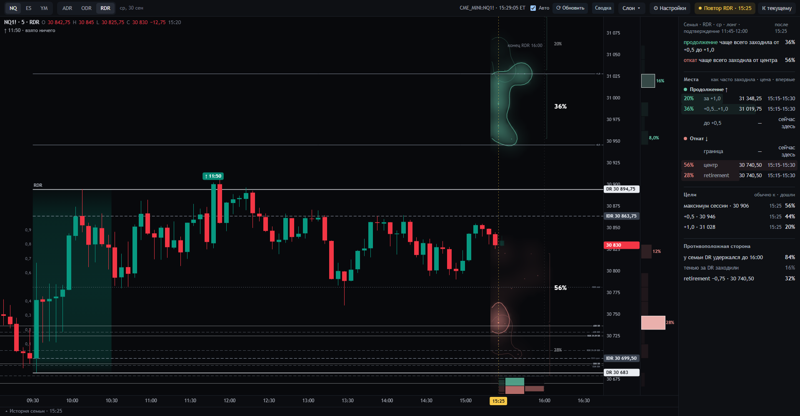
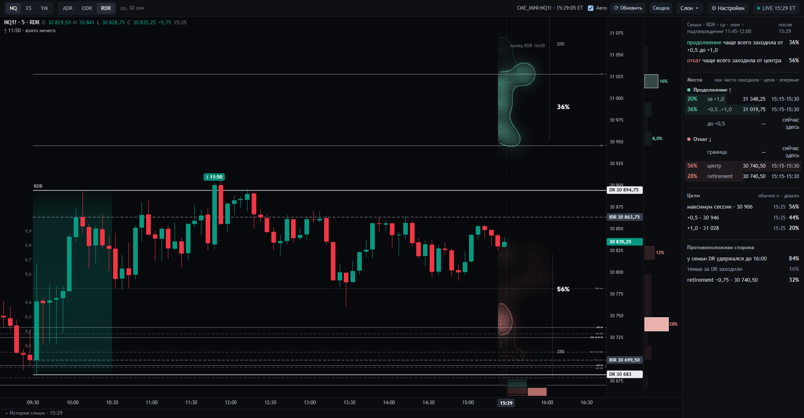
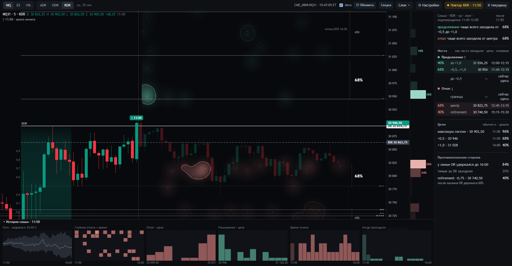
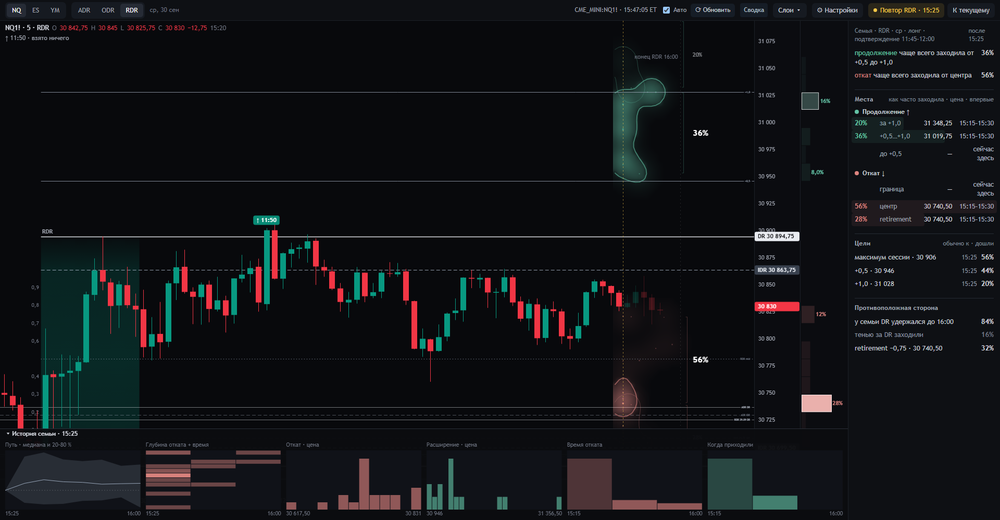

# Разбор процентов экрана на живом дне — RDR NQ, 30.09.2026 (к обсуждению)

**Зачем.** Оператор просил не объяснять абстрактно, а разобрать проценты на сегодняшних снимках экрана:
- какие числа где стоят;
- как они получаются из сервера;
- на чём основаны.

Документ для оператора и для агентов, которые проверяют, правильно ли сделано и понятно ли показано. Общая
спецификация без снимков — [../09-chisla-ekrana.md](../09-chisla-ekrana.md).

**Снимки** в этой папке (1920 × 1000, рабочий экран на рыночных данных):

| Файл | Момент | Что это |
|---|---|---|
| `1-rdr-1150.png` | повтор 11:50 | свеча подтверждения закрылась; корзина (семья) только что определилась — исходная карта |
| `2-rdr-1525.png` | повтор 15:25 | тот же день через 3,5 часа |
| `3-rdr-seychas.png` | живой экран, 15:29 ET | срез 15:25 (последняя закрытая M5); числа почти те же, что на снимке 2 |
| `4-istoriya-semi-1150.png`, `4-istoriya-semi-1525.png` | 11:50 и 15:25 | то же с открытыми шестью графиками «История семьи» (раздел 7) |

Снимки выложены в репозиторий по решению оператора (30.09): правило 1 касается ленты и того, что из неё построено, а не
снимков экрана. В тексте ниже цены не нужны, только уровни и проценты.

## 0. Откуда берутся все числа (одинаково для всех трёх снимков)

1. **Сервер собирает корзину один раз**, при подтверждении в 11:50 (`../../lab/scene21.py`, `family()`, ответ
   `/api/family`).
   - **Ключ корзины:** NQ · RDR · среда · лонг · подтверждение свечой в окне 11:45–12:00, сессии 2006–2025. Это 25
     сессий, **N = 25**.
   - **Для каждой сессии сервер отдаёт:**
     - её свечи M5 с 11:55 до 16:00: low, high, close в её собственной шкале IDR (0 — IDR high, −1 — IDR low, +0,5 и
       +1,0 — ступени STD);
     - удержала ли она DR до 16:00 (`held`);
     - свой противоположный DR (`uOpp`);
     - время своего слома (`fail`).
   - Сервер **процентов не считает**. Эти данные одинаковы весь день.
2. **Страница считает проценты сама на каждой закрытой M5** — это срез (`../../design/sozvezdiya-22/src/app.js` и
   `panel.js`).
   - Берёт у всех 25 сессий только свечи после среза, до 16:00.
   - Каждая сессия остаётся на своём месте своей шкалы. К сегодняшней цене её не сдвигают и не подбирают.
   - **Место** — ценовая полоса впереди сегодняшней цены. У продолжения это полуступени от текущей цены; у отката —
     граница (−0,25 и выше), центр (−0,75…−0,25), retirement (ниже −0,75).
   - **Звезда** — первая свеча сессии после среза, чей диапазон low–high задел полосу места. Одна сессия даёт не
     больше одной звезды на место.
3. **Знаменатель всех чисел — 25.** Исключение одно — «после касания DR держался» (раздел 1).
4. **Горизонт всех чисел** — от среза до 16:00. Исключение одно — «у семьи DR удержался»: там вся сессия каждой из 25,
   от её подтверждения до 16:00.

## 1. Снимок 11:50 — корзина только что определилась

| Где на экране | Число | Что именно посчитано | Функция |
|---|---|---|---|
| Крупная цифра у скобки, верхняя зелёная | **68 %** | из 25 сессий у 17 после 11:50 хоть одна свеча задела полосу +0,5…+1,0 | `arrivalsOf` → `zoneOf` (`k.pct`), рисует `drawMarks` |
| Скобка выше, мелкая | **40 %** | у 10 из 25 свеча задела полосу за +1,0 | то же |
| Крупная у нижней скобки | **68 %** | у 17 из 25 свеча задела центр (−0,75…−0,25) | то же |
| Нижняя мелкая | **40 %** | у 10 из 25 свеча ушла ниже −0,75 (retirement) | то же |
| Верх панели: «продолжение / откат чаще всего заходила …» | 68 % / 68 % | место с наибольшей долей на стороне — те же числа | `panelHtml` |
| «Места»: доля · цена · впервые | 40 · 68 · 68 · 40 | доли — те же. Цена — самая частая ступень 0,1 IDR среди звёзд места. «Впервые» — самое частое 15-минутное окно первых касаний: +0,5…+1,0 — 11:45–12:15, за +1,0 — 12:00–12:15, центр — 12:45–13:15, retirement — 15:15–15:30 | `hotOf`, `entryOf` |
| Столбик плотности справа от шкалы | 36 %, 16 % (зелёные) · 36 %, 24 % (красные) | по ступеням 0,1 IDR: доля 25, чья звезда (цена первого касания) легла в ступень. 36 % — ступень +0,5…+0,6; 16 % — +1,0…+1,1; 36 % — −0,2…−0,3; 24 % — −0,3…−0,4 | `role` (`R.pb`), `drawProj` |
| Цели · обычно к · дошли | максимум сессии 96 % (11:50) · +0,5 68 % (11:50) · +1,0 40 % (14:00) | доля 25, чья цена после 11:50 хоть раз дошла до уровня (включая сам уровень); «обычно к» — самое частое 5-минутное окно первого касания | `ov.touch`, `firstTouch` |
| у семьи DR удержался до 16:00 | **84 %** | у 21 из 25 от их подтверждения до 16:00 ни одно закрытие M5 не ушло за их противоположный DR. **Единственное число экрана, которое делит 100 %:** 84 удержали + 16 сломали | `finishOverlay` (`ov.holds`) |
| тенью за DR заходили | 20 % | у 5 из 25 после 11:50 тень M5 зашла за их противоположный DR | `ov.wick` |
| retirement −0,75 | 40 % | у 10 из 25 цена после 11:50 дошла до −0,75 (включая уровень) | `ov.touch` |
| после касания DR держался | 60 % | **другой знаменатель:** из тех 10, что дошли до −0,75, у 6 DR удержался до 16:00. Строка показывается, если таких не меньше 10 | `panelHtml` |
| Полоса времени снизу | самый высокий столбик 52 % (11:45–12:00, продолжение) | число звёзд стороны в 15-минутном окне, делённое на 25. Одна сессия может дать по звезде на каждое место стороны | `role` (`R.tb`), `drawStrip` |
| Созвездия (свечение и контур) | без чисел; в подсказке «яркое ядро»: 24 % (+0,5…+1,0), 8 % (за +1,0), 20 % (центр), 16 % (retirement) | плотность звёзд места во времени и цене; контур — 38 % от пика места; ядро — самая населённая часть контура, доля 25 | `kde`, `zoneOf` |

## 2. Снимок 15:25 — та же корзина через 3,5 часа

Те же 25 сессий, но считается только их путь после 15:25 до 16:00 (35 минут).

| Где | Число | Что посчитано |
|---|---|---|
| Скобки / места | +0,5…+1,0 **36 %** · за +1,0 **20 %** · центр **56 %** · retirement **28 %** | как на снимке 1, только после 15:25 |
| Верх панели | 36 % / 56 % | наибольшие на сторонах |
| «Впервые» у всех мест | 15:15–15:30 | сразу же — см. наблюдение 2 ниже |
| Столбик плотности | 16 % (+0,9…+1,0), 8 % (+0,5…+0,6), 28 % (−0,8…−0,7), 12 % (−0,3…−0,2) | как на снимке 1 |
| Цели | максимум сессии 56 % · +0,5 **44 %** · +1,0 20 %, «обычно к» у всех 15:25 | как на снимке 1 |
| DR удержался | 84 % | не меняется весь день: это итог всей сессии каждой из 25 |
| тенью за DR | 16 % | после 15:25 |
| retirement −0,75 | **32 %** | после 15:25, уровень включительно |
| Полоса времени | продолжение 44 %, откат **64 %** в окне 15:15–15:30 | звёзды, не сессии |

**Что видно на этом снимке:**
1. **Проценты за день уменьшились**, хотя корзина та же: к 15:25 впереди осталось 35 минут. Числа отвечают на вопрос «что
   будет после этой свечи», а не «чем кончился день».
2. **Каждая сессия корзины стоит на своём месте.** К 15:25 у 4 из 25 свечи уже целиком выше +1,0, у 7 — выше +0,5, у 1 —
   ниже −0,75. Они «заходят» в места сразу, поэтому «впервые» везде 15:15–15:30, а откат в полосе времени — 64 %.
3. **Цель +0,5 = 44 %, а место +0,5…+1,0 = 36 %.** Две сессии, уже стоявшие выше +1,0, считаются «дошедшими до +0,5», но в
   полосу +0,5…+1,0 после 15:25 не заходили. Лестница «дальнее не больше ближнего» для семьи строго не выполняется.
4. **Место retirement = 28 %, строка «retirement −0,75» = 32 %.** Одна сессия коснулась ровно −0,75: строка считает
   уровень включительно, полоса места — нет. Это техническое расхождение, его нужно убрать.

## 3. Снимок сейчас — живой экран, срез 15:25

Срез живого экрана — последняя закрытая M5 (15:25), поэтому числа совпадают со снимком 2. Панель на минуту позже, при
срезе 15:30, показала: места 32 · 20 · 52 · 28, цели 56 · 40 · 20, DR удержался 84, тенью 16, retirement 32. Сдвиг на одну
M5 меняет числа на несколько процентов: впереди остаётся на 5 минут меньше.

## 4. Что складывается в 100 % — и чего на экране нет

На экране в 100 % складывается только «DR удержался 84 %» (плюс 16 % сломали). Все остальные числа — отдельные вопросы
«было ли». Одна сессия попадает в несколько из них, поэтому сумма больше 100 %.

«Слепок дня» от корзины 11:50 — то, о чём говорит оператор. Числа посчитаны из тех же 25 сессий, **на экране их нет**:

| Вопрос о дне | Ответы (каждая сессия ровно в одном) |
|---|---|
| Сила бокса | DR удержался 84 % · сломался 16 % (4 из 25) |
| Сценарий к 16:00 | +1,0 раньше слома 40 % · слом раньше +1,0 12 % · ни то ни другое 48 % |
| Первый шаг после 11:50 | +0,5 раньше середины IDR 64 % · середина раньше 32 % · иначе 4 % |
| Докуда дошла вверх к 16:00 | ниже +0,5 32 % · +0,5…+1,0 28 % · +1,0…+1,5 20 % · выше +1,5 20 % |
| Самый глубокий откат к 16:00 | не глубже −0,25 32 % · −0,25…−0,75 28 % · глубже −0,75 40 % |

Две последние строки — «дальше всего до конца сессии», то есть окончательный экстремум. Правило 10 запрещает строить на
нём кластеры и время. Как распределение по цене, без времени, их можно показать только по решению оператора.

## 5. Как оператор видит правильную картину — с его слов 30.09

- **Главный большой кластер — слепок всего дня от корзины**, зафиксированный в момент, когда корзина определилась (11:50).
  Он показывает, чем кончался день у этих 25 сессий, и делит 100 %. Пример оператора: если 10 из 25 в итоге сломали DR —
  40 %, лонг долго не держать.
- **Внутри — созвездия:** где цена бывала (например, у +0,5…+0,7). По ним строится модель входа и выхода.
- **Сейчас на экране иначе:**
  - все проценты пересчитываются на каждой M5, от среза до 16:00, а не фиксируются на 11:50;
  - «чем кончился день» показывает только строка «DR удержался»;
  - скобки, проценты мест, цели, столбик плотности и полоса времени отвечают на разные вопросы «было ли», и оператор не
    может связать их между собой.

**Вопросы для обсуждения:**
1. Какое разбиение на 100 % — главный кластер: сила бокса, сценарий, первый шаг, «докуда дошла»?
2. Главные проценты фиксируются на корзине (11:50) и не меняются, а пересчёт на каждой M5 идёт отдельным слоем?
3. Как рисовать 100 % на графике (скобка, полоса, заливка), чтобы не путать с «было ли»?
4. Нужны ли вообще числа «было ли» у мест, или хватит созвездий без чисел?
5. Что делать с сессиями корзины, которые на срезе уже стоят в месте: «сразу» или отдельной пометкой?

## 6. Технические расхождения, видные на снимках (исправить при любом решении)

- **Граница уровня:** места считают полосу без её края, цели и строка retirement — с краем (снимок 2: 28 % и 32 %).
- **Полоса времени** считает звёзды, а не сессии (снимок 2: откат 64 %).
- **«после касания DR держался»** — другой знаменатель в одном списке с долями 25.
- **Цель и место** на одной ступени дают разные числа, когда часть корзины уже стоит выше (снимок 2: 44 % и 36 %).
- **Разные горизонты рядом:** «DR удержался» — за всю сессию, остальное — от среза.

## 7. Шесть графиков «История семьи» (открываются снизу при наведении)

Снимки `4-istoriya-semi-1150.png` и `4-istoriya-semi-1525.png` — те же моменты, что снимки 1 и 2, с открытой панелью.
Графики строятся из тех же 25 сессий и тех же звёзд, что места на графике цены. На столбиках чисел нет, процент
появляется в подсказке при наведении. Знаменатель везде 25.

| График | Что в нём | Процент в подсказке |
|---|---|---|
| Путь · медиана и 20–80 % | по каждой пятиминутке после среза — середина и разброс закрытий 25 сессий, каждая со своего места. Это данные удалённого с графика веера | процента нет; подсказка — цена медианы |
| Глубина отката + время | сетка: строки — ступени 0,1 IDR на стороне отката, столбцы — 15-минутные окна; яркость клетки — сколько звёзд отката (первых касаний мест отката) в этой ступени и в эти 15 минут | звёзды клетки / 25 |
| Откат · цена | звёзды отката по ступеням 0,1 IDR | звёзды ступени / 25 |
| Расширение · цена | то же для звёзд продолжения | то же |
| Время отката | звёзды отката по 15-минутным окнам | звёзды окна / 25 |
| Когда приходили | то же для звёзд продолжения | то же |

Ни один график не складывается в 100 %:
- у сессии может быть по звезде на каждое место стороны;
- у сессии, которая никуда не заходила, звёзд нет.

У гистограмм по цене и по времени отрезаны крайние 1 % звёзд.

**Для обсуждения.** Названия «Глубина отката» и «Расширение · цена» остались с дизайна 21. Тогда звезда была
окончательным экстремумом сессии, и эти графики повторяли «Max Retracement» и «Max Extension» из дашборда автора (раздел 8).
С 29.09 звезда — первое касание места, поэтому графики показывают, на какой цене сессии впервые заходили в места, а не
глубину отката и не расширение. Название и содержание расходятся.

## 8. Как это устроено у автора — для сравнения

Публичный снимок дашборда QuantX автора на его сайте: https://m7dr.com/images/quantx.webp (© M7DR, 2024). Его разбор —
[../lens/2026-09-30-otvet-6.md](../lens/2026-09-30-otvet-6.md), раздел C6. Коротко, своими словами:
- **Гистограммы по ячейкам 0,1:** M7 Retracement, Max Retracement, Max Extension, Max Retracement before Conf.
- **Время по 15 минут:** M7 Retracement Time, Max Retracement Time, Max Extension Time.
- **M7 Box SD.**
- **Плитки:** размер набора, доля DR true, медианы, доли «выше −0,5» и «выше 0,5».
- **M7 Price Model** — площади расширения и отката по времени.
- **M7 Heatmap** — таблица счётчиков: цена −0,5…+0,5 по 0,1 × время 10:30–11:45 по 15 минут.

По нашему разбору у автора каждая гистограмма — одно событие на сессию: максимальный откат, максимальное
расширение, их время. Поэтому такие распределения делят 100 %. Автор берёт ключ «инструмент · сессия · день · направление
· окно подтверждения» и чаще всего только DR-true сессии. DR Lab берёт тот же ключ, но всю семью, и показывает приходы в
места, а не одно событие на сессию. Отсюда и разница в процентах.

Сам снимок в эту папку не положен: это чужое изображение, защищённое авторским правом. Открывайте его по ссылке.

## 9. Где это в коде

- Сервер: `../../lab/scene21.py` — `family()` (корзина и её свечи), `window_of()` (окно по подписи свечи).
- Страница: `../../design/sozvezdiya-22/src/app.js`:
  - `familyOverlay` — берёт свечи после среза;
  - `arrivalsOf` — звёзды;
  - `role` — места, столбик плотности, полоса времени;
  - `zoneOf`, `kde` — созвездия, ядро;
  - `entryOf` — «впервые»;
  - `finishOverlay` — DR удержался, тенью, `touch` для целей.
- Страница: `../../design/sozvezdiya-22/src/panel.js` — `panelHtml` (строки панели, retirement и «после касания»),
  `targets21` (цели), `hotOf` (цена места), `firstTouch` («обычно к»).
