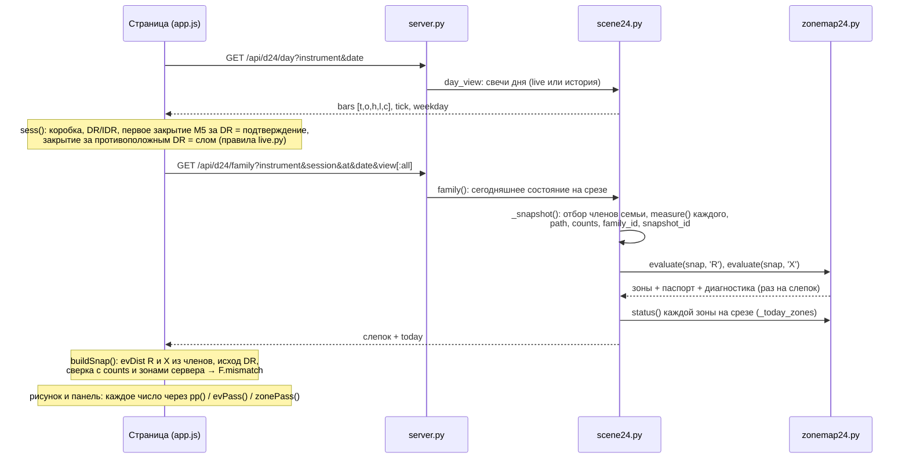

# 01 · Стек: от ленты до пикселя

[← к оглавлению](README.md)

## Карта файлов

| Слой | Файл | Что делает | Меняет смысл? |
|---|---|---|---|
| Данные | `lab/build_boxes.py` → `lab/.runtime/boxes_<inst>*` | Каждая сессия ADR / ODR / RDR 2006–2025: коробка, DR/IDR, первое подтверждение, первый слом, все M5 от начала коробки до конца блока, в целых тиках | да (атом и подтверждение) |
| Данные | `lab/live.py`, `lab/scene21.py` | Свечи сегодняшнего дня из TradingView; правила подтверждения и слома для сегодняшнего дня (`scene21._state`) | да |
| Сервер | `lab/scene24.py` | Семья, измерение каждой сессии-члена (R, X, исход DR, порядок, путь), счётчики для сверки, статусы зон сегодня | **да, главный** |
| Сервер | `lab/zonemap24.py` | Карта зон `zone-map-3`: зоны R и X, паспорт и диагностика каждой зоны, статус зоны | **да, главный** |
| Сервер | `lab/server.py` | Маршруты `/api/d24/day`, `/api/d24/family`, `/api/d24/dates`; `/` → `/24/`, `/22/` → дизайн 22 | нет |
| Страница | `design/sozvezdiya-24/src/app.js` | Состояние сегодняшней сессии, пересчёт распределений, паспорта, все рисунки, наведение | да (все проценты, кроме зон) |
| Страница | `design/sozvezdiya-24/src/panel.js` | Правая панель, инспектор (`showTip` пишет в `#insp`), шесть окон снизу | да (их проценты) |
| Страница | `page.html`, `panel.css` | Разметка и стили | нет |
| Сборка | `design/sozvezdiya-24/src/build.py` | `page.html` + `panel.css` → `lab/dist/24/index.html`; `app.js` + `panel.js` (вставка в `/*__PANEL24__*/`) → `lab/dist/24/d24.js` | нет |
| Проверки | `tests/sem24.py` | 32 эталонных случая определений, интеграция на базе, карта зон | — |
| Проверки | `tests/ui_check24.js` | Выполняется в странице: страница и сервер считают одинаково, у каждого процента паспорт, инварианты | — |
| Проверки | `tests/smoke.py` | Сервер и маршруты отвечают | — |

`lab/dist/24/*` собирается и не правится руками: правки только в `src/`, затем `python design/sozvezdiya-24/src/build.py`.
После правки Python сервер надо перезапустить (`stop-dr-lab.cmd`, затем `start-dr-lab.cmd`).

## Путь одного числа

## Что считает сервер и что считает страница

Одни и те же определения считаются дважды там, где это возможно, и сравниваются. Расхождение пишется в `F.mismatch`
и в консоль, а `tests/ui_check24.js` выдаёт его как проблему.

| Величина | Сервер | Страница | Сверка |
|---|---|---|---|
| Семья (кто в ней) | `scene24._snapshot` | — (берёт `members`) | `family_id` = sha1 ключа и списка id |
| R, X каждой сессии (v, t, ties, статус) | `scene24.measure` | — (берёт `members[i].R / X`) | `tests/sem24.py` (32 эталона) |
| Таблица R / X: клетка цены × окно времени | `counts.R / X.cells` | `evDist` → `F.ev[ev].cells` | `buildSnap`: равенство клеток, unknown, none |
| Исход DR (4 категории) | `counts.outcome` | `F.out` | `buildSnap` |
| Зоны: клетки, n, доля | `zonemap24.evaluate` | пересчёт n по клеткам (`buildSnap`) | `buildSnap` + `ui_check24` §10 |
| Статус зоны сегодня | `scene24._today_zones` → `zonemap24.status` | `zoneStatus` | `zoneStatus` (при срезе запроса) |
| «На уровне или дальше», заход в полосу, пересечение | `scene24.reach / visits / crosses` (эталоны) | `reachOne / visitOne / crossOne` по `path` | `ui_check24` §4: хвост X = «на уровне или дальше» |
| Путь семьи (закрытия на M5) | `members[i].path` | `filmOf` | `ui_check24` §5: колонка = 100 % |
| Порядок R / X | `members[i].order`, `counts.order` | `orderHtml` пересчитывает из `members` | — (одно поле) |
| Сегодняшние факты, перенос в цены | — | `sess`, `todayRows`, `F.u2p` | — |

## Арифметика: целые тики, ни одной округлённой цены в проверке

- Ориентация `d` = +1 для лонга, −1 для шорта. В семье слома ориентация перевёрнута: `d = −side`, нулевой край —
  противоположный край IDR.
- Ширина IDR: `w` = IDR high − IDR low, в тиках.
- Направленное значение `v = d·(p − e)` в тиках, где `e` — край IDR на стороне игры. Координата `u = v / w`
  (spec §3.1).
- Клетка цены: `k = floor(10·v / w)`, то есть полоса `[k/10, (k+1)/10)` ширины IDR. Сервер: `scene24.cell`. Страница:
  `fdiv(10·e.v, m.w)`, точное целое деление.
- Окно времени: `b = floor((t − f) / 15)`. Здесь `t` — минута ОТКРЫТИЯ первой M5, достигшей экстремума (её метка на
  TradingView), `f` — конец коробки. Сервер: `window_of`. Страница: `Math.floor((e.t − F.f) / 15)`.
- Уровень `u = a / b` проверяется как `v·b ≥ a·w` (вверх) или `v·b ≤ a·w` (вниз). Сегодняшний уровень переводится в
  точную дробь `levelRat` с половинными тиками.
- Перенос в сегодняшние цены — `F.u2p(u) = e0 + d0·u·w0` (сегодняшний край и ширина). Это перенос координат, не
  прогноз цены (spec §9.1).

## Ответ `/api/d24/family`: поля, которыми пользуется экран

| Поле | Смысл | Кто читает |
|---|---|---|
| `view` | `conf` — семья подтверждения, `brk` — семья слома | `snapOf`, все подписи «по слому / против слома» |
| `family_id`, `snapshot_id`, `semantics`, `source` | Идентичность слепка; меняется только если меняется состав или измерения | паспорта `pp()`, окно 1, панель (title) |
| `key {instrument, session, weekday, direction, event, window, cutoff, scope}` | Ключ семьи. `cutoff` — только дни раньше просматриваемого. `scope` — `weekday` или `all` | окно 1 «Слепок семьи» |
| `cond` | Строка ключа для людей | заголовок панели, ручка окон |
| `N`, `ids` | Число членов — знаменатель всех процентов | все проценты |
| `schedule {start, formed, end}` | Начало коробки, `f` — конец коробки и начало окон, `E` — конец блока | время всех событий |
| `grid` | Минуты закрытия общих M5 блока после коробки | путь семьи, уровни, заходы |
| `members[]` | На каждую сессию: `w`, `act` (её активация), `R`, `X` (`s` = known/unknown/none, `v`, `t`, `ties`), `order`, `orderDetail`, `outcome`, `brk`, `brkKnown`, `path[j] = [low, high, close]` направленные или `null` | всё |
| `counts` | Серверные таблицы для сверки | `buildSnap` |
| `zones {R, X}` | Карта зон каждого события (см. [06](06-zona-i-okna.md)) | созвездия, капсулы, холмы, панель, окна |
| `today {slice, c0, side, brk, zones {R, X: status[]}}` | Сегодняшнее состояние на срезе запроса | статус зон (сверка) |
| `journal` | Сессии, не вошедшие ни в одну семью из-за дырки до подтверждения или слома | только диагностика |

## Ключ семьи и неподвижность слепка

- Ключ: инструмент × сессия × день недели торговой даты × направление × 15-минутное окно подтверждающей M5 (по метке
  открытия, от конца коробки) × только даты раньше просматриваемой. Для семьи слома — окно M5, сломавшей DR.
- В ключе нет среза `at`. Поэтому слепок за день не меняется, при какой бы минуте его ни запросили.
  - Сервер кеширует слепок в `scene24._SNAP` по ключу без среза, зоны считаются один раз и хранятся в нём.
  - Страница кеширует ответ по `famKey`: дата, сессия, подтверждение, сторона, вид, слом, `scope`.
- Срез меняет только `today` (сегодняшние факты и статусы зон) и вопросы «после ЧЧ:ММ», которые страница считает по
  `path`.
- `scope=all` («все дни» в панели) — другая семья: другой ключ, другой N, другой слепок. Это явный выбор оператора,
  не запасной вариант при малом N (zone-map-3 §2.2).

## Кеши страницы, которые надо помнить при правке

| Кеш | Ключ | Сбрасывается |
|---|---|---|
| `A.fams` | `famKey` | смена дня, сессии, вида, `scope` |
| `r._F` | ответ сервера | никогда в пределах ответа (слепок неподвижен) |
| `F._cl` (созвездия) | размер графика, видимое время и цены | любой сдвиг или масштаб |
| `F.film` | — | никогда (путь семьи от среза не зависит) |
| окна снизу `#detg._k` | слепок, вид, срез, `pinKey` объекта, ширина, цвета | изменение любого из них |

`pinKey` включает событие (`ev`), полосу (`k0`), окно (`b0`) и клетку (`kk`). Без этого зона R2 и зона X2
совпадали бы по ключу, а окно 1 не обновлялось бы при переходе между полосами. Это исправлено 01.10, при сверке
снимка «зона».

## Адрес страницы (для проверки и снимков)

`/24/#date=2025-12-09&session=RDR&at=11:00` — исторический день на срезе. Дополнительно:

| Параметр | Что делает |
|---|---|
| `inst=ES` | инструмент |
| `ev=X` | событие по умолчанию для области и `zone=` |
| `mode=path` | «Путь семьи» |
| `view=conf` | после слома показать исходную семью |
| `scope=all` | семья всех дней недели |
| `det=1` | закрепить окна снизу |
| `area=k0:k1[:b0:b1]` | выбранная область |
| `pt=i` | сессия семьи |
| `lvl=u2` | уровень |
| `col=j` | колонка пути |
| `zone=n` | зона |
| `hov=pcell:X:9` или `hov=tcell:19` | наведение для снимков |
| `geo=1` | геометрия для `tools/annotate.py` |
