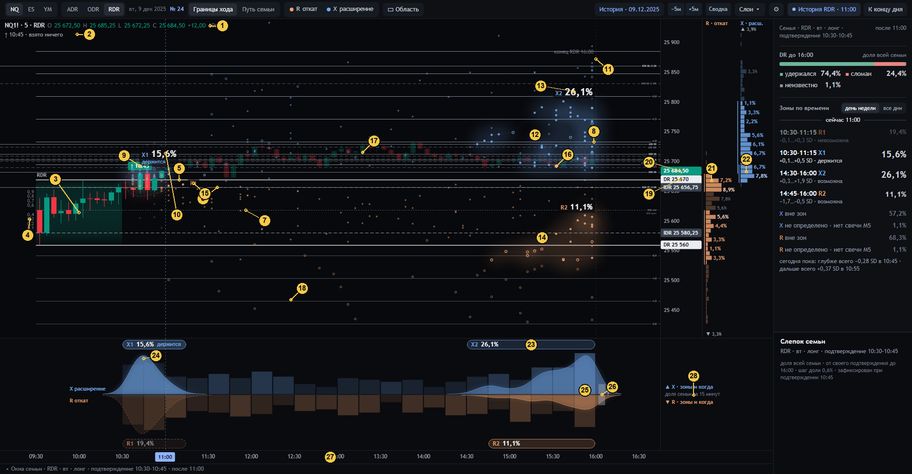

# 02 · Обзор: график

[← к оглавлению](README.md) · состояние `#date=2025-12-09&session=RDR&at=11:00` (NQ, вторник, лонг, подтверждение 10:45,
срез 11:00, N ≈ 180, шаг доли 0,6 %)

Сверху вниз на графике три зоны.
- **График** (свечи, уровни, созвездия, звёзды). Сегодняшние цены и, перенесённые в них, события семьи.
- **Колонки цены** справа от шкалы. Распределение R и X по цене за весь горизонт.
- **Лента времени** под графиком. Те же события по времени: зоны как капсулы и холмы, колонки по 15 минут.

Все три зоны — разные проекции одной таблицы «клетка цены 0,1 SD × окно 15 минут» на одно и то же N.

## Свечи и уровни сегодняшнего дня (1–11): факты, не доли

| № | Что видно | Смысл и как считается | Код | Как нельзя читать |
|---|---|---|---|---|
| 1 | Строка OHLC | Инструмент · M5 · сессия; O H L C свечи под курсором (или последней закрытой), изменение C − O, её время | `drawLegend` | — |
| 2 | «↑ 10:45 · взято ничего» | Сторона и время подтверждения (минута ЗАКРЫТИЯ подтверждающей M5) и шаги STD, которые сегодня уже взяты после подтверждения. Шаг взят, когда закрытая M5 дошла хвостом до уровня. Считаются до слома или среза. После слома строка: «Слом DR ↑ ЧЧ:ММ · сторона анализа …» | `sess` → `s.taken`, `drawLegend` | «взято» — факт сегодняшнего дня, не доля семьи |
| 3 | Коробка RDR | 09:30–10:30. DR — максимум и минимум хвостов в коробке, IDR — максимум и минимум тел (open / close). Цвет — направление коробки (close ≥ open) | `sess`, `drawBoxes` | — |
| 4 | Доли IDR 0,1…0,9 | Деления ширины IDR внутри коробки, как в Pine DR/IDR V1.5 | `drawLevels` | — |
| 5 | Линия DR | DR high / low сегодняшней коробки | `levels`, `drawLevels` | — |
| 6 | Линия IDR | IDR high / low, пунктир. Край на стороне подтверждения — ноль шкалы `u` | `levels` | — |
| 7 | mid | Середина IDR, точечная | `levels` | — |
| 8 | Линии STD | Шаги 0,5 ширины IDR от краёв IDR, до ±3,0. На стороне игры ярче. Подписи у правого края до ±2,0 | `levels`, `drawLevels`, `drawTags` | Это сетка Pine, не зоны |
| 9 | Плашка «↑ 10:45» | Первое закрытие M5 за DR после коробки. Время — минута закрытия свечи 10:40–10:45. Зелёная — выбранная сессия, серая — другие. Красная «Слом DR» — первое закрытие за противоположным DR | `sess`, `drawPills` | Окно семьи в заголовке «10:30–10:45» — по минуте ОТКРЫТИЯ этой свечи (10:40). Это не противоречие: одна свеча, две метки |
| 10 | Линия среза 11:00 | Последняя закрытая M5. В истории правее неё свечи бледные: это будущее для среза, оно не используется | `sliceOf`, `drawNow`, `drawCandles` | — |
| 11 | «конец RDR 16:00» | `E` — конец блока. Горизонт событий: каждая сессия семьи — от своей активации до `E`, M5, закрывшаяся в `E`, входит | `drawNow` | — |

## Созвездия и звёзды (12–18): события семьи в сегодняшних ценах

Одна звезда — одно событие одной сессии семьи.
- По горизонтали: минута открытия первой M5, где сессия достигла своего экстремума, плюс 2,5 минуты (центр свечи).
- По вертикали: её `u`, перенесённый в сегодняшние цены через сегодняшний край и ширину IDR (`F.u2p`).
- Без дрожания. Совпавшие точки стоят на одном месте.

| № | Что видно | Смысл и как считается | Код | Как нельзя читать |
|---|---|---|---|---|
| 12 | Созвездие X2 (дымка и нити) | **Рисунок** звёзд зоны X2, без числа. - Плотность в экранных пикселях (гаусс σ 18 px). - Мягкая заливка на 0,22 и 0,6 своего пика с размытием 14 и 7 px. - Нити: кратчайшее дерево между звёздами, 0,5 px. - Яркость: ×1,15, если зона сегодня «держится»; ×0,35, если «невозможна» | `kde`, `iso`, `mst`, `cloudsOf`, `drawClouds` | Контур дымки — НЕ граница зоны. Членство — точные клетки (`cell_mask`, видны пунктиром при наведении, [06](06-zona-i-okna.md)). Размер и яркость дымки — не доля |
| 13 | «X2 26,1 %» | **Доля зоны**: `n_zone / N`. Это число сессий семьи, чей X лёг в точные клетки зоны, на всём горизонте, от своего подтверждения до 16:00. - Кегль растёт с долей: `clamp(12 + 0,45·доля, 15, 21)` px. - «держится» под числом — сегодняшний статус. | сервер `zonemap24.evaluate` → `p_snapshot`; страница пересчитывает `n` по клеткам (`buildSnap`); подпись `drawZones`, паспорт `zonePass` | Не шанс на сегодня, не «цена пойдёт туда». Доли R и X не складываются. Зоны X + «X вне зон» + «X не определено» = 100 % |
| 14 | Созвездие R2 | То же для R (откат). Янтарный цвет R, небесный X | как 12 | как 12 |
| 15 | «R1 … %», пунктирная изолиния | Зона, которая сегодня уже **невозможна**. Сегодняшний предварительный R уже глубже её клеток, а глубже — значит дальше от её цен. Историческая доля остаётся рядом с именем тем же кеглем, который задаёт её `n/N`, но приглушена; status не меняет размер и значение процента | `zoneStatus`, `drawZones` | «Невозможна» — про сегодняшний день на срезе, а не про качество зоны и не про её историческую массу |
| 16 | Звезда в зоне | X одной сессии, лёгший в клетки зоны: ярче и крупнее | `drawPoints` (`inZone`) | — |
| 17 | Звезда остатка | X вне всех зон: меньше (×0,8) и тусклее (×0,62) | `drawPoints` | Остаток — тоже часть распределения, а не «шум» |
| 18 | Кольцо | Сессия, чей DR сломан. Это исход `broken`: закрытие M5 строго за своим противоположным DR. Она остаётся в семье, семья по исходу не прореживается | `drawPoints` (`m.outcome`) | Кольцо — исход DR этой сессии, а не «ложная» звезда |

## Шкала цены и колонки (19–22)

| № | Что видно | Смысл и как считается | Код | Как нельзя читать |
|---|---|---|---|---|
| 19 | Плашки DR / IDR | Сегодняшние цены DR и IDR на шкале | `drawPriceAxis` | — |
| 20 | Плашка текущей цены | Закрытие последней закрытой M5 на срезе | `drawPriceAxis` | — |
| 21 | Колонка «R · откат» | `P_R(k)`: доля семьи, чей R на всём горизонте лёг в полосу цены `k` (0,1 SD), в сегодняшних ценах. - R и X на **одной** шкале длины: максимум по обоим. - Строки зон ярче, самая плотная строка каждой зоны — крупным жирным. - Тонкая черта у левого края — ценовой охват зоны. - Подписаны строки зон, наведённая и строки ≥ 3 %. «▲ / ▼ x %» у краёв — доля за пределами видимых цен | `evDist` → `F.ev.R.P`; `drawProjRX` | Строка — вся полоса за ВСЁ время, а не доля зоны. Сумма строк в охвате зоны ≥ доли зоны: зона — это клетки, а строки считают всё время. Своя сотня R включает «R не определено» (панель) |
| 22 | Колонка «X · расш.» | `P_X(k)`, так же | `drawProjRX` | как 21 |

## Лента времени (23–28)

Один временной масштаб с графиком. X — над центральной линией, R — под ней.

| № | Что видно | Смысл и как считается | Код | Как нельзя читать |
|---|---|---|---|---|
| 23 | Капсула «X2 26,1 %» | Зона X2 по **всему** её окну времени: от первой до последней 15-минутной клетки её области. - Внутри: имя, доля (та же, что 13) и «держится», если держится. - Пунктир — зона невозможна. - До двух дорожек на событие, если зоны пересекаются по времени. | `bandHills` (`b0`, `b1`), `drawBand` | Ширина капсулы — охват клеток зоны, а не время, когда «будет движение» |
| 24 | Холм X1 | Форма времён звёзд зоны: гаусс σ 7 минут. Высота нормирована так, что самый высокий холм события занимает свою половину ленты | `bandHills`, `drawBand` | Высота холма не число. Холмы X и R по высоте не сравниваются. Числа несут капсула и колонки |
| 25 | Колонки по 15 минут | `T_X(b)` вверх, `T_R(b)` вниз — доля семьи, чей X (R) пришёлся на это окно, **при любой цене**. - Обе на одной шкале √ от общего максимума и на одном N, поэтому выше = больше семьи. - Колонка ярче, если её событие больше другого более чем на 15 % (тот же порог, что «больше X / больше R» в инспекторе). - Прошедшие окна тусклее. При наведении — числа без знака %. | `evDist` → `F.ev[ev].T`, `drawBand` | Колонка — все цены в окне, не доля зоны. Под капсулой сумма колонок ≠ доле зоны |
| 26 | «?» | Неизвестная масса события, `unknown + none`, на той же шкале: X вверх, R вниз | `drawBand` (`V.stripUnk`) | Неизвестное не рисуется ни в какой цене и ни в каком окне |
| 27 | Ось времени | Минуты ET. Плашки: срез, наведённое окно, минута под курсором | `drawTimeAxis` | — |
| 28 | Подпись угла | «▲ X · зоны и когда / доля семьи за 15 минут / ▼ R · зоны и когда» | `drawBand` | — |

## Что связывает три зоны

Одна точка семьи — одна запись `members[i].X` или `.R`. Она даёт:
- одну звезду на графике;
- одну единицу в строке колонки цены (`P`);
- одну единицу в колонке ленты (`T`);
- одну единицу в клетке таблицы (`cells`);
- одну единицу в доле зоны, если её клетка в `cell_mask`.

Отсюда равенства, которые проверяет `tests/ui_check24.js` §3 и §10:
- сумма `P` = сумма `T` = сумма клеток = известные;
- известные + неизвестные + «нет периода» = N;
- зоны + остаток + неизвестные + «нет периода» = N.
