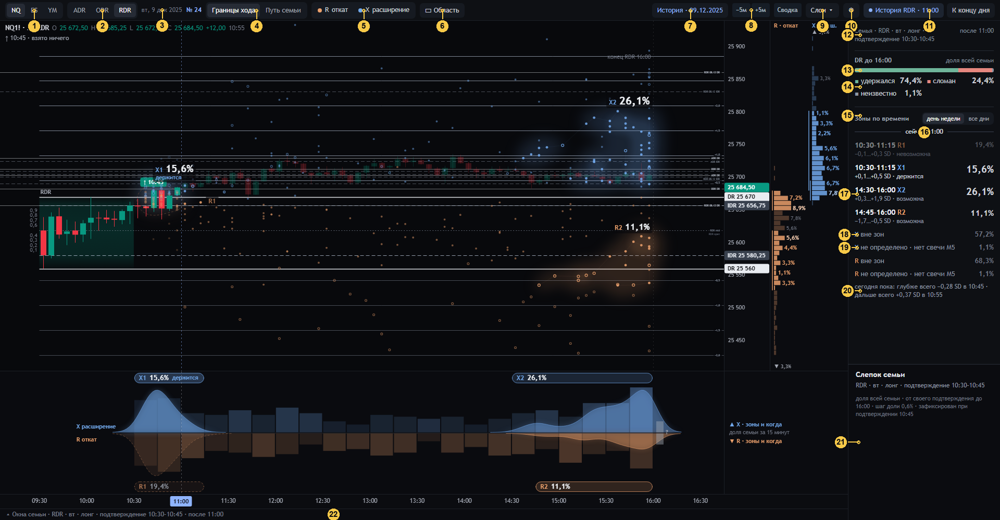

# 03 · Обзор: панель инструментов, правая панель, инспектор

[← к оглавлению](README.md) · то же состояние, что [02](02-obzor-grafik.md)

## Панель инструментов (1–11)

| № | Элемент | Что делает | Код |
|---|---|---|---|
| 1 | NQ · ES · YM | Инструмент: другая база сессий, другие семьи | `toolbar`, `#inst` |
| 2 | ADR · ODR · RDR | Сессия, чья семья на экране. Все три измеряются одинаково (атом M5 одинаков днём и ночью) | `selSession` |
| 3 | Дата · «№ 24» | Торговый день и номер экрана | `#date` |
| 4 | «Границы хода» / «Путь семьи» | Два режима. Границы: R и X, зоны, лента ([02](02-obzor-grafik.md)). Путь: закрытия M5 семьи ([09](09-put-semi.md)) | `st.mode` |
| 5 | «● R откат · ● X расширение» | Только названия и цвета. Переключателя нет: R и X на экране вместе (оператор, 01.10). Подсказка — определение события (`F.what`). После слома — «против слома / по слому» | `toolbar` (`.evc`) |
| 6 | «▭ Область · R» / «▭ Область · X» | Инструмент рамки: протянуть по графику полосу цены × окно времени. Буква всегда показывает, событие какого распределения будет посчитано; меняется вместе с R/X-фокусом ([08](08-oblast-i-uroven.md)) | `toolbar`, `areaFromDrag` |
| 7 | «История · 09.12.2025» | Выбор дня из базы. Предлагаются дни, где у сессии есть подтверждение (`/api/d24/dates`, буквы A O R). День открывается как сегодняшний, его семья — только из более ранних дней | `dayPicker`, `openHist` |
| 8 | −5м / +5м | Шаг среза на одну M5 | `stepReplay` |
| — | «Сводка» | Показать или скрыть правую панель и инспектор. Скрытая, при нарушении контракта на текущей сцене — немигающий красный «!» и контур, в подсказке причина и «откройте «Сводку»: причина вверху» (SWPC-1.1 §7.2, `meaning/13` № 49); без нарушения в подсказке только причина, по которой сводка показала бы не числа | `#panel21toggle`, `toolbar`, `integrity` |
| 9 | «Слои» | Звёзды, созвездия, колонка, лента, STD, прошлая сессия, VI, окна снизу | `LAYERS`, `st.L` |
| 10 | ⚙ | Цвета и прозрачности (в браузере, `localStorage`). Смысла не меняют | `cfgPanel` |
| 11 | «История RDR · 11:00», «К концу дня» | Срез. В live — часы ET и «К текущему» | `toolbar` (`#clock`) |

«№22 ↗» (в live) открывает дизайн 22 по адресу `/22/` с тем же инструментом, сессией и срезом.

## Правая панель (12–20)

Порядок панели постоянный:
1. Слепок.
2. Исход DR.
3. «Сейчас» (DR-LAB-NOW-1.0).
4. Зоны по времени.
5. Остаток и неизвестное.
6. Сегодняшние факты.
7. Выбранное (область, уровень, сессия).

Над ними — только при нарушении машинного контракта DR-LAB-SC-1.1 — красная строка «Контракт SC-1.1: …».

Каждая строка с процентом — ссылка: наведение подсвечивает объект на графике и пишет его в инспектор, щелчок закрепляет.
У каждого процента паспорт (`pp()`, атрибут `data-pp`). Он воспроизводит число из счётчика, N и горизонта.

| № | Что видно | Смысл и как считается | Своя сотня | Код | Как нельзя читать |
|---|---|---|---|---|---|
| — | «Контракт SC-1.1: …» (красная строка вверху, только при нарушении) | Нарушение машинного контракта (07.10, `contract/README.md`): страница собрана с другим реестром, чем у сервера; счёт страницы не совпал с пакетом сервера; эталон сервера пересчитал паспорт иначе; у числа «Сейчас» нет опубликованного пакета; слово вне реестра. Затронутое число заменено «—» вместе со своим рисунком; расхождение таблиц семьи снимает семью («Числа не публикуются: счёт страницы не совпал с пакетом сервера (…)»), карты зон одного события — эту карту, статуса — статус («—»); при чужом реестре чисел нет. Строка показывает только нарушения сцены на экране; исправный повторный ответ возвращает числа (SWPC-1.1 M14, M16, `meaning/13` № 50). Все причины — в подсказке строки | — | `scNotice`, `kViolate`, `kNow`, `ctxKeys`; `regFault`, `envCounts`, `verifyNow`, `nowBundle`, `lbl`; снятие — `F.held`, `ppHeld`, `zoneHeld` | Не сбой экрана: это контракт, который показывает, что число не доказано |
| 12 | «Семья · RDR · вт · лонг · подтверждение 10:30–10:45», справа «после 11:00» | Ключ семьи (`cond`) и срез. Подсказка: слепок зафиксирован при подтверждении 10:45 и за день не меняется; шаг доли 100/N; история только раньше даты; `snapshot_id`, `family_id`, `DR-LAB-SEM-1.0` | — | `panelHtml` | Окно «10:30–10:45» — по минуте открытия подтверждающей M5 |
| 13 | Полоса исхода DR | Четыре категории исхода DR каждой сессии семьи (spec §5.2) в одну полосу | **одна сотня**: удержался + сломан + неизвестно + нет периода = N | `outcomeHtml`; сервер `measure` → `outcome`, страница сверяет `F.out` с `counts.outcome` | — |
| 14 | «удержался 74,4 % · сломан 24,4 % · неизвестно 1,1 %» | **удержался** — ни одно закрытие M5 до 16:00 не ушло строго за свой противоположный DR. **сломан** — ушло (тень не считается, равенство не слом, возврат не отменяет). **неизвестно** — на горизонте нет целой M5, а среди наблюдённых закрытий слома нет (слом, увиденный и после дырки, — «сломан»; его время тогда неизвестно, `brkKnown`). **нет периода** — после подтверждения до конца блока не было M5 (показывается, только если > 0) | та же | `outcomeHtml`, `pp` | Сумма на экране может отличаться от 100 % на 0,1 из-за округления каждой доли. Это исход семьи, не прогноз сегодняшнего DR |
| 14б | «Фаза по вашему правилу · откат не сделан / откат сделан — смотрим X»; «откат −0,58 SD · нужно −0,7»; «окончательный R семьи к 11:35 был у 24,6%–35,1% · нужно половина» | Названное правило оператора (08.10): «откат сделан», когда сегодняшний откат после подтверждения достиг −0,7 и у не меньше половины семьи окончательный R по часам был раньше среза. «✓» — признак выполнен. Пока не сделан, у зон X дымка и точки тише, после — у зон R | доля семьи — паспорт `EST:B-CLOCK-R` на весь диапазон цен (`part EARLIER`), доля всей семьи N | `phaseOf`, `phaseHtml`, `phaseK`; форма `FF:PHASE-RULE` | Правило оператора, не факт рынка и не окончательный R; только у семьи подтверждения |
| 14а | Блок «Сейчас»: «В истории: R позже углублялся 72,5%–73,2%», «Если углублялся: до 25 312 · 25 259…25 396 · ~15 мин», «опора 149 из 156», внизу статус проверки на истории | Доля допустимых к срезу сессий семьи, у которых после среза был более глубокий R (у X — более дальний); диапазон — при неизвестных исходах. «Если углублялся / шёл дальше …» — медиана и квартили добавки у тех, кто ушёл дальше, перенесённые от сегодняшнего экстремума; «~мин» — медиана времени до нового экстремума. Опора — всегда. Слова оператора (07.10), история (K33): прежние «откат углубится», «если да: до» говорили о сегодняшнем будущем, а прогноза (C2) у этого числа нет | свои опоры: допустимые к срезу (или сопоставленные), отдельно для величины и времени. С 08.10 (ветка `resheniya-08-10`, решение оператора): строка отката — только «R» и число, её слова, уровни, время и опора — в подсказке; уровни — отметки у шкалы цены (`drawNowMarks`); строка X — как прежде | `nowHtml`, `nowBundle`; сервер `lab/now24.py`, `contract.attach_now` ([15](../../meaning/15-sloj-seichas.md)). Пока ответ нового среза в пути — «считаю…»; не пришёл — «Локальный сервер не ответил» (`nowOf`, SWPC-1.1 W13) | Не вероятность сегодняшнего дня и не сделка: история похожих сессий к этому же часу |
| 15 | «Зоны по времени» · «день недели / все дни» | Карта зон R и X одной семьи, вместе, по времени начала. Переключатель — явный выбор семьи: «все дни» = другой ключ без дня недели, другой N и слепок | — | `zonesHtml`, `scopeSwitch` | «Все дни» — не уточнение и не запасной вариант при малом N, а другая семья |
| 16 | «сейчас 11:00» | Разделитель. Выше — зоны, чьё окно закончилось к срезу. Ниже — зоны, чьё окно ещё идёт или впереди | — | `zonesHtml` (`.p24-now`) | — |
| 17 | Строка зоны «14:30–16:00 X2 · +0,3…+1,9 SD · возможна · 26,1 %» | Окно времени зоны (первая и последняя 15-минутная клетка), имя, ценовая рамка, статус сегодня, доля `n_zone / N`. Кегль доли зависит только от исторической массы: ≥ 15 % — крупнее. Сегодняшний status кодируется отдельно стилем строки; «невозможна» — строка тусклая, но размер исторической доли не меняется | своя сотня события: зоны X + «X вне зон» + «X не определено» = 100 % | `zonesHtml`, `zonePass`, `zoneStatus` | Рамка «+0,3…+1,9 SD × 14:30–16:00» — не зона, а охват её клеток. Членство — клетки |
| 18 | «X вне зон 57,2 %» | Остаток: известные X, не попавшие ни в одну зону, `n_residual_total / N` | та же сотня | `zonesHtml` (`residual`) | Остаток не «шум» и не «прочее»: это места, где ни одна область не набрала минимальной поддержки |
| 19 | «X не определено · нет свечи M5 1,1 %» | `(unknown + none) / N`: у сессии на горизонте нет целой M5 или нет периода. Такие сессии остаются в N | та же сотня | `zonesHtml` | Неизвестное не ноль и не размазывается по ценам |
| 20 | «сегодня пока: глубже всего −0,28 SD в 10:45 · дальше всего +0,37 SD в 10:55» | Факты сегодняшнего дня по закрытым M5 после подтверждения до среза: самая глубокая и самая дальняя точка, в SD и времени открытия M5 | — (факты, не доли) | `todayFacts` → `todayRows` | Это НЕ сегодняшние R и X: окончательные они только в конце блока |

## Инспектор (21) и окна снизу (22)

| № | Что видно | Смысл | Код |
|---|---|---|---|
| 21 | Инспектор (правый нижний угол, 300 px) | Неподвижное место для того, что под курсором (или закреплено). Над свечами подсказок нет. Без наведения — «Слепок семьи»: ключ, горизонт, шаг доли, момент фиксации. Содержимое по объектам — на страницах [04](04-polosa.md)–[08](08-oblast-i-uroven.md) | `showTip` → `tipHtml` → `#insp` |
| 22 | «▴ Окна семьи · …» | Ручка шести окон. Мышь у нижнего края экрана выдвигает их (как в 22), щелчок по ручке закрепляет. Содержимое — [06](06-zona-i-okna.md) | `details`, `#det` |

Если выбрана область, уровень или сессия, их блок встаёт в конец панели. Панель один раз прокручивается к нему, когда он
появляется (`panelHtml`, `P24.selKey`).

## Проверки

`tests/ui_check24.js`:
- §1 — один экран, без прокрутки страницы, панель инструментов в одну строку;
- §2 — каждый процент панели воспроизводится своим паспортом;
- §9 — каждая строка панели что-то подсвечивает;
- §6 — все зоны R и X перечислены в панели.
