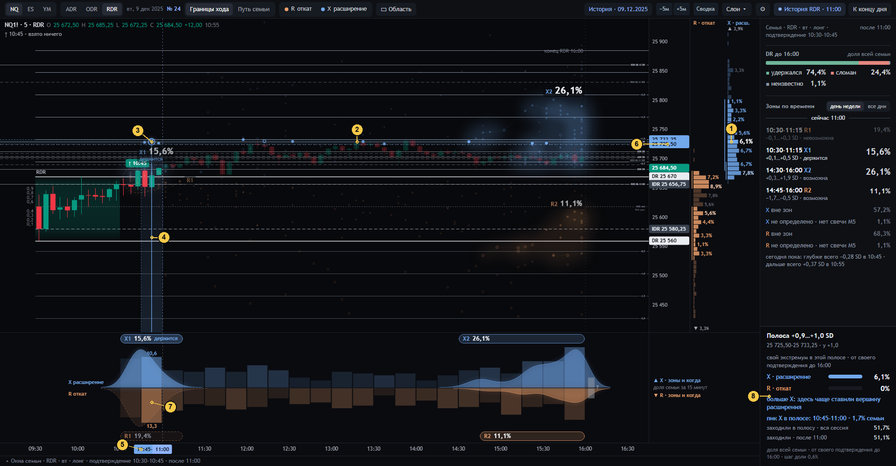

# 04 · Полоса цены → её пиковое время

[← к оглавлению](README.md) · состояние `…&at=11:00&hov=pcell:X:9` — курсор на строке +0,9…+1,0 SD колонки X

Наведение на строку колонки цены (или на зону, [06](06-zona-i-okna.md)) одним движением ведёт от самого плотного места
кластера вниз, к его пиковым 15 минутам. Так полоса цены сразу связана со временем: просьба оператора от 01.10.

| № | Что видно | Смысл и как считается | Код | Как нельзя читать |
|---|---|---|---|---|
| 1 | Строка X «6,1 %» (белым) | `P_X(9)`: доля семьи, чей X на всём горизонте лёг в полосу [0,9; 1,0) SD | `hit` → `{k:'pcell', ev:'X', k0:9, k1:10}`, `drawProjRX` | Это где X **закончился**, а не «цена дойдёт до полосы» (это № 8, «заходили») |
| 2 | Полоса через весь график | Та же полоса в сегодняшних ценах (пунктирные края, заливка цветом события). Звёзды X в полосе ярче, остальные тусклее | `drawHighlight`, `emphOf` | — |
| 3 | Кольцо | Самое плотное место полосы. Окно 15 минут, где больше всего звёзд X этой полосы (при равенстве — раньше), и среднее время этих звёзд на высоте середины полосы | `linkOf` (`V.lk`), `drawLink` | — |
| 4 | Линия вниз | От кольца до ленты времени через пиковое окно: градиент, пунктирные края окна, сплошная середина | `drawLink` | — |
| 5 | Плашки «10:45–11:00» на оси | Пиковое окно полосы | `linkOf` → `V.win`, `drawTimeAxis` | — |
| 6 | Плашки цен на шкале | Края полосы в сегодняшних ценах: 25 725,50–25 733,25 | `drawPriceAxis` (`V.win.pA/pB`) | — |
| 7 | Подсвеченная колонка ленты с числами «10,6» и «13,3» | То же окно 10:45–11:00 в ленте: доли семьи, чей X (вверх) и R (вниз) пришёлся на это окно **при любой цене** | `drawBand` (`lk.b`) | 10,6 % — НЕ доля полосы в этом окне. Доля полосы × окна — 1,7 % в инспекторе (№ 8) |
| 8 | Инспектор полосы | Шапка: полоса в SD, цены и где она относительно уровней (`where`: «у +1,0»). Дальше по строкам — см. ниже | `tipHtml` (`pcell`) | см. ниже |

Строки инспектора полосы:

| Строка | Что это | Сотня | Как считается |
|---|---|---|---|
| «свой экстремум в этой полосе · от своего подтверждения до 16:00» + две полосы X / R | Доля семьи, чей X лёг в полосу; доля семьи, чей R лёг в полосу. Два бара на одной шкале | своя у R и своя у X, одно N | `areaCount(F, ev, {k0,k1})`, паспорт `evPass(…, 'price_cell')` |
| «больше X: здесь чаще ставили вершину расширения» | Сравнение двух долей одного N: одна больше другой более чем на 15 % — «больше X» или «больше R», иначе «примерно поровну» | — | `twoBars` |
| «пик X в полосе: 10:45–11:00 · 1,7 % семьи» | Пиковое окно полосы (№ 3–5) и доля семьи, чей X лёг **и** в полосу, **и** в это окно | одно N | `linkOf` (`V.lk.n / N`) |
| «заходили в полосу · вся сессия 51,7 %» | **Другое событие**: хотя бы одна M5 после своего подтверждения задела полосу диапазоном: low < 1,0 SD и high ≥ 0,9 SD. Бинарный вопрос. Если у части семьи нет свечей, показывается диапазон «a–b %» | одно N, да / нет / неизвестно | `visitCount(F, k0, k1, null)` → `visitOne` по `path` |
| «заходили · после 11:00 51,1 %» | То же на общих часах после среза: M5, закрывшиеся после 11:00 до 16:00 | одно N | `visitCount(F, k0, k1, slice)` |
| подвал | «доля всей семьи · от своего подтверждения до 16:00 · шаг доли 0,6 %» | — | `ifoot` |

Вложенность, которая обязана выполняться:
- «после среза» ≤ «вся сессия»;
- доля полосы × окна ≤ доли полосы.

Доля экстремума в полосе меньше доли заходов в неё. Это не ошибка: в полосу заходят многие, а заканчивают там
немногие.

Проверки:
- `tests/sem24.py`: определения `visits` и вложенность;
- `tests/ui_check24.js` §3: колонка — та же таблица, что клетки и лента;
- `tests/ui_check24.js` §7: окно ≤ полосы.
