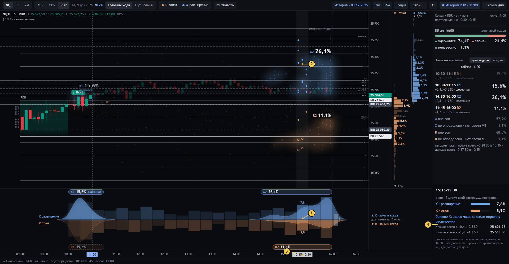

# 05 · Окно 15 минут: что в нём перевешивает, R или X

[← к оглавлению](README.md) · состояние `…&at=11:00&hov=tcell:19` — курсор на колонке ленты 15:15–15:30

| № | Что видно | Смысл и как считается | Код | Как нельзя читать |
|---|---|---|---|---|
| 1 | Подсвеченная колонка ленты «7,8 / 3,9» | `T_X(b)` и `T_R(b)` для окна `b = 19` (15:15–15:30): доля семьи, чей X (R) поставлен в этом окне, при любой цене. Время события — минута открытия первой M5, достигшей экстремума | `hit` → `{k:'tcell', b0:19}`, `F.ev[ev].T`, `drawBand` | Не «вероятность максимума в 15:15 сегодня». Одна сессия может дать и X, и R в одном окне, поэтому две доли не складываются и не исключают друг друга |
| 2 | Столбец через график | То же окно на графике. Звёзды R и X этого окна ярче, остальные тусклее | `drawHighlight`, `emphOf` | — |
| 3 | Плашка «15:15–15:30» | Наведённое окно на оси времени | `drawTimeAxis` | — |
| 4 | Инспектор окна | См. ниже | `tipHtml` (`tcell`) | — |

Строки инспектора окна:

| Строка | Что это | Как считается |
|---|---|---|
| «в эти 15 минут свой экстремум поставили» + X 7,8 % / R 3,9 % | Две доли одного N, два бара одной шкалы | `F.ev.X.T.get(b) / N`, `F.ev.R.T.get(b) / N`; паспорта `evPass(…, 'time_cell')` |
| «больше X: здесь чаще ставили вершину расширения» | Разница больше 15 % в пользу одного события; иначе «примерно поровну» | `twoBars` |
| «X чаще всего в +0,4…+0,5 SD · 25 691,25» | Клетка цены с наибольшим числом X в этом окне (при равенстве — ниже), середина клетки в сегодняшней цене | `peakK` в `tipHtml` |
| «R чаще всего в −1,4…−1,3 SD · 25 553,50» | То же для R | то же |
| подвал | «… время — открытие первой M5, где достигнута цена» | `ifoot` |

Щелчок по колонке выбирает окно как область (вместе с уже выбранной полосой, если она есть, [08](08-oblast-i-uroven.md)).

Проверки:
- `tests/ui_check24.js` §6: инспектор окна показывает и R, и X;
- `tests/ui_check24.js` §3: сумма `T` = известные события.
