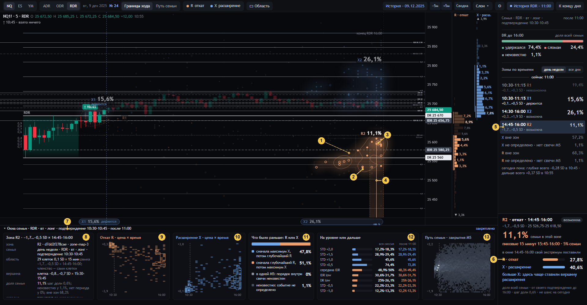

# 06 · Зона и шесть окон семьи

[← к оглавлению](README.md) · состояние `…&at=11:00&ev=R&zone=2&det=1` — закреплена зона R2, окна снизу закреплены

## Что такое зона (`zone-map-3`, [`meaning/12`](../../meaning/12-karta-zon.md), `lab/zonemap24.py`)

Зона строится так.
1. Берутся известные события одного вида (R или X) всех сессий семьи. Каждое лежит в клетке «0,1 ширины IDR × 15
   минут».
2. В каждой клетке сетки, включая пустые, считается **D** — число событий в квадрате 3 × 3 вокруг неё
   (`regions`: `ndimage.correlate`).
3. **Зона** — связная (по 8 соседям) область клеток. В ней D не ниже половины её собственной вершины, и в ней нет
   клетки выше этой вершины. Это область половинной высоты своей вершины.
   - Две концентрации — две зоны, если долина между ними ниже половины каждой.
   - Области не пересекаются, правила выбора при равенстве не нужны.
4. Область становится зоной, если в ней не меньше `max(4, ceil(0,05·N))` сессий (`zone_map`). Все остальные известные
   события — **остаток**.
5. Порядок и имена:
   - сортировка по началу во времени, затем по доле, затем по близости к u = 0;
   - имена R1, R2…, X1, X2…;
   - окна времени — от окна подтверждения до последнего открытия M5 блока (`map_of`).
6. **Членство — клетки** (`cell_mask`). Доля зоны = `n_zone / N` (`p_snapshot`). Неизвестные и «нет периода» остаются
   в N и места не получают.

**Статус сегодня** (`zonemap24.status`, страница `zoneStatus`, сверка с `today.zones`) строится от предварительного
сегодняшнего экстремума. Это R или X по закрытым M5 после сегодняшней активации до среза.

| Статус | Когда |
|---|---|
| **держится** (`HOLDS`) | Клетка сегодняшнего экстремума в зоне |
| **возможна** (`POSSIBLE`) | В зоне есть клетка, куда окончательный экстремум ещё может лечь. По цене: для R клетка глубже нынешнего R (`k/10 < v`), для X — дальше (`(k+1)/10 > v`). По времени: последнее открытие M5 в клетке не раньше среза |
| **невозможна** (`IMPOSSIBLE`) | Ни одной такой клетки, или блок кончился |
| **неизвестно** (`STATUS_UNKNOWN`) | Сегодня на горизонте нет целой M5 |

Статус — не вероятность.

## Номера на снимке

| № | Что видно | Смысл и как считается | Код | Как нельзя читать |
|---|---|---|---|---|
| 1 | Созвездие R2 с изолинией | Дымка и нити (см. [02](02-obzor-grafik.md) № 12). При наведении или закреплении — изолиния 0,35 пика плотности; островов может быть несколько | `drawZones` (`g.ln`) | Изолиния — рисунок, не граница |
| 2 | Пунктир точных клеток | Внешняя граница `cell_mask` зоны: каждая клетка 0,1 SD × 15 мин в сегодняшних ценах | `drawZones` (`on`) | Звезда внутри изолинии, но вне клеток, в зону не входит |
| 3 | Кольцо в самом плотном месте | Пик плотности звёзд зоны в экранных пикселях | `cloudsOf` → `kd.spot`, `linkOf` | — |
| 4 | Линия к пиковым 15 минутам | Окно времени, где больше всего сессий зоны (при равенстве — раньше). Линия идёт до ленты, окно подсвечено на оси | `cloudsOf` → `peak`, `drawLink` | — |
| 5 | Строка R2 в панели (закреплена) | Как [03](03-obzor-panel.md) № 17. Подсвечена только R2: событие входит в `pinKey` | `zonesHtml`, `panelMarks` | — |
| 6 | Инспектор зоны | См. ниже | `zoneTip` | — |
| 7 | Ручка «▾ Окна семьи · … · после 11:00 · закреплено» | Шесть окон описывают тот же слепок и тот же срез | `details` | — |

Строки инспектора зоны:

| Строка | Что это | Как считается |
|---|---|---|
| «R2 · откат · 14:45–16:00 · возможна» | Имя, событие, окно времени зоны, статус сегодня | `zoneStatus` |
| «−1,7…−0,5 SD · 25 526,75–25 618,50» | Ценовой охват клеток в SD и в сегодняшних ценах | `price_low/high`, `F.u2p` |
| «11,1 % семьи в этой зоне» | `n_zone / N` | `zonePass` |
| «пиковые 15 минут 15:45–16:00 · 5 % семьи» | Окно № 4 и доля семьи, чей R лёг в клетки зоны **в этом окне** | `cloudsOf` → `peakN / N` |
| «в окне 14:45–16:00 свой экстремум поставили» + R 27,8 % / X 40,6 % | Всё окно зоны по времени, **при любой цене**: какое событие семьи чаще ставили в эти часы. Две доли одного N, «больше X / R» при разнице больше 15 % | `F.ev[ev].T` за окна зоны, `twoBars` |
| подвал «… не шанс на сегодня» | — | `ifoot` |

## Шесть окон (8–13)

Окна выдвигаются, когда мышь у нижнего края экрана. Щелчок по ручке закрепляет их. У каждого окна свой объект и своя
сотня (или свой вложенный вопрос). Это не повтор графика. Код: `panel.js` → `details`.

| № | Окно | Что в нём и как считается | Своя сотня | Код | Как нельзя читать |
|---|---|---|---|---|---|
| 8 | **1 · Паспорт** объекта под курсором или закреплённого. Без объекта — «Слепок семьи» | **Зона:** - имя, `zone_id`, версия алгоритма; - семья (день недели / все дни); - область: число клеток, рамка, «членство — сами клетки»; - вершина (`peak_anchor`); - доля, шаг, неизвестно, нет периода, вне зон; - статус сегодня («не вероятность»); - `snapshot_id` и `family_id`. **Диагностика зоны** (свойства, а не разрешение на существование): - сдвиг сетки — Жаккар множеств сессий на сетках, сдвинутых на 0,05 SD, на 5 и на 10 минут; - пересэмплирование — 50 повторов: средний Жаккар и доля повторов с Жаккаром ≥ 0,5; - путь без направления — старшая половина находит область, младшая сравнивается с копиями своих путей с перевёрнутыми знаками: реальная доля, доля без направления, избыток в п.п. и порог различимости; - исследование 2018–2025 — разведка, не шанс на сегодня. **Другие объекты:** - сессия: R, X, повторы цены, порядок, DR, активация, дырки; - уровень: паспорт, после среза, «пересекали свечой» — другое событие; - область, полоса, окно, клетка пути, исход DR, строка события. **Слепок:** ключ, история, шкала, начало, конец, время события, атом, id, шаг | по объекту | `detailObj`, `detBody`, `passportRows`, `zoneRows`, `zoneDiag`; сервер `zonemap24.evaluate` (`grid_member_jaccard`, `bootstrap_recovery`, `_null`, `study_refs`) | Диагностика не отбирает зоны и не превращает их в «надёжные / ненадёжные» |
| 9 | **2 · Откат R · цена × время** | Таблица клеток R семьи: строки — 0,1 SD, столбцы — 15 минут от `f` до `E`. - Яркость — число сессий в клетке, степень 0,7 от максимума. - Показаны цены с 3 % по 97 % событий. - Клетки зон обведены и подписаны. - Пунктир — срез. | счёт клеток; сумма всех клеток = известные R | `drawHeat('dcR', …, 'R')` | Обрезка 3–97 % только для вида; клетки за краем есть в счёте |
| 10 | **3 · Расширение X · цена × время** | То же для X | то же | `drawHeat('dcX', …, 'X')` | то же |
| 11 | **4 · Что было раньше: R или X** | Порядок первых времён у каждой сессии: - «сначала максимум X, потом глубочайший R»; - «сначала глубочайший R, потом максимум X»; - «в одной M5: порядок внутри свечи неизвестен»; - «неизвестно: событие не определено». Повторы цены сохранены в `orderDetail` (окно 1 сессии) | **одна сотня**: четыре строки = N | `orderHtml`; сервер `measure` → `order` | Это порядок первых касаний окончательных экстремумов, а не «сначала откат, потом рост» как сценарий |
| 12 | **5 · На уровне или дальше** | Сегодняшние уровни: по направлению игры STD +2,0…+0,5, против — середина IDR, край IDR, DR, STD −0,5, −1,0. - На каждом: доля семьи, у которой хоть одна M5 после своей активации дошла до уровня или дальше (хвостом). - Левое число и бледная полоса — весь горизонт, правое и яркая — после среза. - «a–b %» — при неизвестных; «✓ ЧЧ:ММ» — сегодня уровень уже взят. - Сторона вопроса — по знаку `u` уровня: за краем игры — «по направлению» (high), иначе «против» (low). | **не сотня**: каждая строка — свой бинарный вопрос; доли вложены (дальше ≤ ближе, после среза ≤ весь горизонт) | `ladderHtml`, `levelQuery` → `reachCount` → `reachOne` | Не «вероятность дойти сегодня». Строки не складываются. На сессиях с известным X доля на +1,0 по всему горизонту = доля X ≥ +1,0 (хвост распределения X) |
| 13 | **6 · Путь семьи · закрытия M5** | Плёнка: столбец — общая M5 блока, строка — 0,1 SD, яркость — доля N, закрывшихся в клетке, на одной линейной шкале 0…100 % для всех столбцов. Белые точки — закрытия сегодняшних M5. Пунктир — срез | **каждый столбец — своя сотня** (клетки + нет свечи = N) | `drawFilmMini`, `filmOf` | Не прогноз пути. Сессии, ещё не подтвердившиеся к этой M5, тоже в столбце ([09](09-put-semi.md)) |

## Проверки

- `tests/sem24.py` часть 3 — карта зон:
  - синтетические сгустки, долины и плечи;
  - минимальная поддержка;
  - статусы по достижимому множеству;
  - на базе: счёт зон, неподвижность при срезе, «все дни».
- `tests/ui_check24.js` §10:
  - доля каждой зоны = её сессии в её клетках (страница пересчитывает);
  - зоны не делят клеток;
  - зоны + остаток + неизвестное + нет периода = N;
  - статус страницы = статус сервера на срезе запроса.
- `tests/ui_check24.js` §6:
  - каждая зона нарисована, у каждой капсула и холм;
  - инспектор читает зону;
  - у зоны есть связь с пиковыми 15 минутами;
  - окон снизу шесть.
