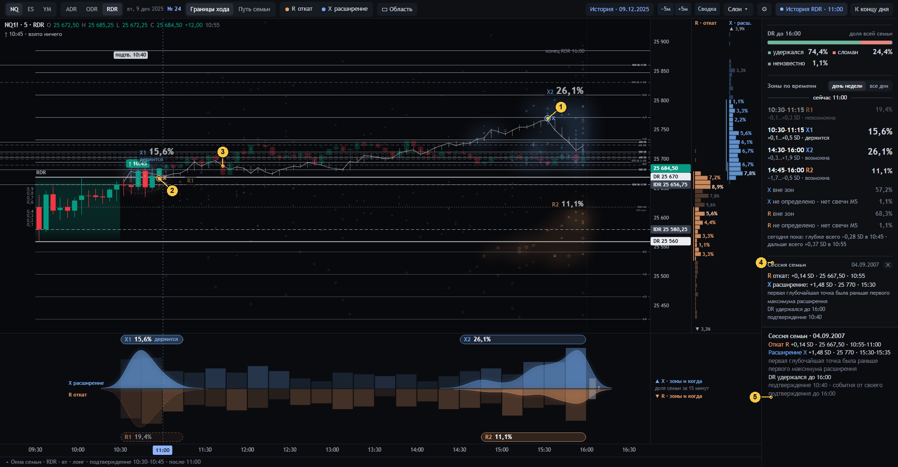

# 07 · Одна сессия семьи

[← к оглавлению](README.md) · состояние `…&at=11:00&pt=8` — закреплена девятая сессия семьи (04.09.2007)

Щелчок по звезде (R или X) закрепляет её сессию. Звезда выбирается ближайшая в радиусе 5 px. Если в точке несколько
сессий, инспектор говорит «и ещё n в этой точке».

| № | Что видно | Смысл и как считается | Код | Как нельзя читать |
|---|---|---|---|---|
| 1 | Кольцо «X» | X этой сессии: самая дальняя точка по подтверждению от её активации до 16:00. Время — открытие первой M5, где она достигнута. Цена — её `u` в сегодняшних ценах | `drawPair` | Это цена в ЕЁ единицах IDR на сегодняшней шкале, не цена того дня |
| 2 | Кольцо «R» | R этой сессии: самая глубокая точка против подтверждения | `drawPair` | R может быть выше нуля (+0,14 SD): сессия ни разу не вернулась к краю |
| 3 | Путь сессии | Её закрытия на каждой общей M5 блока (линия) и диапазоны M5 (вертикальные штрихи; до активации бледнее), на настоящих часах. Метки: «подтв. 10:40» — её активация, «слом DR ЧЧ:ММ» — если был. Между R и X нет стрелки (spec §8) | `drawMemberPath`; `members[i].path` | — |
| 4 | Блок панели «Сессия семьи · 04.09.2007» | R и X этой сессии в SD, сегодняшней цене и времени. Порядок первых R и X. Исход DR. Активация. «✕» снимает | `memberHtml`, `orderText` | — |
| 5 | Инспектор сессии | То же с интервалами M5 (10:55–11:00), с повторами той же цены («та же цена ещё n раз»), исходом DR и горизонтом. Окно 1 снизу добавляет повторы по времени и число дырок на горизонте | `tipHtml` (`pt`), `detBody` (`pt`) | — |

## Тексты порядка (`orderText`, spec §8)

| `order` | `orderDetail` | Текст |
|---|---|---|
| `R_before_X` | `all_r_before_all_x` | первая глубочайшая точка была раньше первого максимума расширения |
| `R_before_X` | иначе | … глубочайшая цена повторялась и позже |
| `X_before_R` | `all_x_before_all_r` | максимум расширения был раньше глубочайшей точки и после неё не повторялся |
| `X_before_R` | иначе | первый максимум расширения был раньше глубочайшей точки; он повторялся и позже |
| `same_M5` | — | R и X в одной M5: порядок внутри свечи неизвестен |
| `unknown` | — | порядок неизвестен: событие не определено |

Порядок — по первым временам (`ties[0]`), повторы цены сохраняются: сервер `measure` → `order`, `order_detail`.
