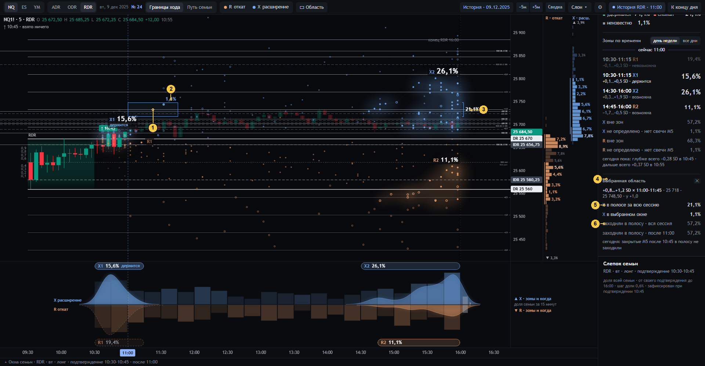
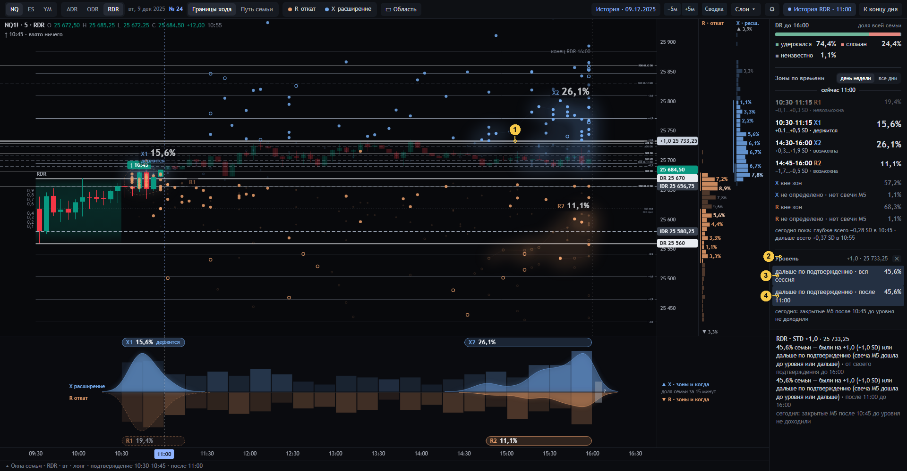

# 08 · Выбранная область и уровень

[← к оглавлению](README.md)

## Область

Состояние `…&at=11:00&ev=X&area=8:12:2:5` — полоса X [0,8; 1,2) SD × окна 2…4 (11:00–11:45).

Область задаётся тремя способами:
- рамкой «▭ Область» на графике;
- протяжкой по колонке цены — полоса;
- щелчком по колонке ленты — окно, вместе с уже выбранной полосой.

Область принадлежит **одному** событию. Его цвет у рамки и в панели. Полоса из колонки цены берёт событие своей
колонки. Рамка на графике берёт событие, бывшее последним в фокусе (`st.ev`: последнее наведённое R или X,
по умолчанию R).

| № | Что видно | Смысл и как считается | Своя сотня | Код | Как нельзя читать |
|---|---|---|---|---|---|
| 1 | Рамка | Полоса × окно в сегодняшних ценах и времени | — | `drawArea` | — |
| 2 | «1,1 %» над рамкой | Совместная доля: X семьи лёг **и** в полосу, **и** в окно | N | `areaCount(F, ev, a)`, паспорт `evPass(…, 'price_time')` | — |
| 3 | Скобка у конца блока «21,1 %» | Вся полоса за весь горизонт: X семьи лёг в полосу в любое время | N | `areaCount(F, ev, {k0,k1})`, `evPass(…, 'price_band')` | Всегда ≥ № 2 |
| 4 | «Выбранная область» | Имя (полоса × окно), цены, где относительно уровней, «✕» | — | `areaHtml`, `areaInfo` | — |
| 5 | «X в полосе за всю сессию 21,1 %» | = № 3. Ниже «X в выбранном окне» = № 2 | N | `areaInfo` | — |
| 6 | «заходили в полосу · вся сессия 57,2 %», «· после 11:00 57,2 %» | **Другое событие**: хотя бы одна M5 задела полосу диапазоном — на своём горизонте и на общих часах после среза. Бинарно, «a–b %» при неизвестных. Ниже — что сделали сегодняшние закрытые M5: «в полосу не заходили» | N, да / нет / неизвестно | `visitCount`, `todayVisit` | Заход ≠ экстремум в полосе |

## Уровень

Состояние `…&at=11:00&lvl=u2` — закреплён STD +1,0.

| № | Что видно | Смысл и как считается | Своя сотня | Код | Как нельзя читать |
|---|---|---|---|---|---|
| 1 | Яркая линия уровня, плашка «+1,0 · 25 733,25» | Уровень сегодняшнего дня, переведённый в точную дробь `u = a/b` шкалы семьи (половинные тики). Звёзды сессий, дошедших до уровня, ярче | — | `levelRat`, `drawReference`, `emphOf` (`lvl`) | — |
| 2 | «Уровень +1,0 · 25 733,25» | Шапка блока, «✕» снимает | — | `levelHtml` | — |
| 3 | «дальше по подтверждению · вся сессия 45,6 %» | **«На уровне или дальше»** (spec §5.4): у сессии хоть одна M5 после своей активации дошла хвостом до уровня или дальше. Сторона — по знаку `u`: `u > 0` → по направлению (high ≥ уровня), `u ≤ 0` → против (low ≤ уровня). Бинарно, «a–b %» при неизвестных | N | `levelQuery` → `reachCount(…, null)` → `reachOne`; эталон `scene24.reach` | Не «дойдёт сегодня». На сессиях с известным X: вся сессия = доля X ≥ уровня |
| 4 | «… · после 11:00 45,6 %» | То же на общих часах: M5, закрывшиеся после среза до 16:00. Ниже — сегодняшний факт: «закрытые M5 после 10:45 до уровня не доходили» (или время, когда дошли) | N | `reachCount(…, slice)`, `todayReach` | ≤ № 3 всегда |

В инспекторе обе доли — фразами с горизонтом (`sentence`). В окне 1 снизу добавлено **«пересекали свечой»** —
другое событие: минимум ≤ уровня ≤ максимум одной M5 (`crossOne`). Гэп через уровень — «дальше» без пересечения.

## Проверки

- `tests/ui_check24.js` §7: доля окна ≤ доли полосы.
- `tests/ui_check24.js` §4: хвост X = «на уровне или дальше» на каждом уровне 0,1 от −1 до +3.
- `tests/sem24.py`: определения `reach`, `visits`, `crosses`, вложенность по уровню и по горизонту.
