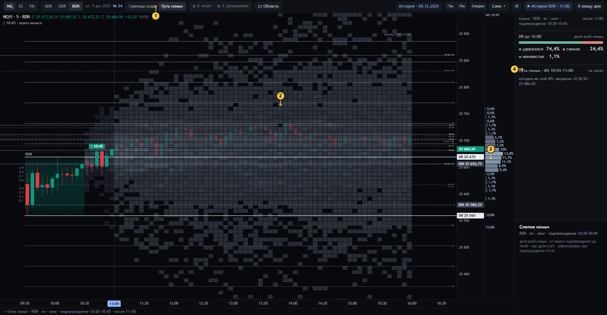

# 09 · Путь семьи (закрытия M5)

[← к оглавлению](README.md) · состояние `…&at=11:00&mode=path`

Второй режим экрана. Вместо экстремумов — где семья **закрывалась** на каждой общей пятиминутке блока (spec §5.3,
§10.2). Лента времени и созвездия в этом режиме скрыты, чипы R / X серые.

| № | Что видно | Смысл и как считается | Своя сотня | Код | Как нельзя читать |
|---|---|---|---|---|---|
| 1 | «Путь семьи» | Переключатель режима | — | `st.mode = 'path'` | — |
| 2 | Клетка плёнки | Столбец — общая M5 блока (по часам), строка — 0,1 SD. Цвет — доля N, чьё закрытие этой M5 легло в клетку, на **одной** линейной шкале 0…100 % для всех столбцов (без нормировки на столбец или строку, spec §9.2). Прошедшие часы тусклее | **каждый столбец**: клетки + «нет свечи» = N | `filmOf`, `drawFilm` | Не прогноз пути и не «где будет цена». В столбце есть и сессии, ещё не подтвердившиеся к этой минуте (их доля названа в панели) |
| 3 | Колонка справа от шкалы | Распределение закрытий семьи на выбранной M5: наведённой, закреплённой или M5 среза. С процентами. «? x %» — нет свечи. «▲ / ▼» — за краем видимых цен | тот же столбец | `projData`, `colFor`, `drawProj` | — |
| 4 | «Путь семьи · M5 10:55–11:00 · на срезе» | Какая M5. Наведённая клетка — «закрылись в … SD x %». «нет свечи · неизвестно». «из них ещё до своего подтверждения: …». «сегодня на этой M5: закрытие +0,36 SD · 25 684,50» | тот же столбец | `columnHtml` | — |

В инспекторе клетки, кроме доли закрытий, есть **поле диапазонов**. Это доля семьи, чья свеча M5 задела эту полосу
диапазоном, не закрытием (`rangeField`, spec §5.3). Другое событие, не нормируется.

Щелчок по столбцу закрепляет его (`st.col`).

Проверка: `tests/ui_check24.js` §5 — каждый столбец своя сотня.
