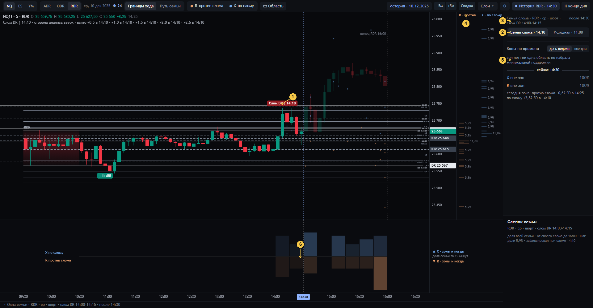

# 10 · Семья слома

[← к оглавлению](README.md) · состояние `#date=2025-12-10&session=RDR&at=14:30` — шорт подтвердился в 11:00, DR сломан
вверх в 14:10

После сегодняшнего слома DR экран по умолчанию показывает **семью слома** (spec §9.3). Исходный слепок подтверждения
сохраняется как был, его открывает переключатель.

| № | Что видно | Смысл и как считается | Код | Как нельзя читать |
|---|---|---|---|---|
| 1 | Плашка «Слом DR ↑ 14:10» | Первое закрытие M5 строго за противоположным DR после подтверждения (правила `live.py`) | `sess` → `s.failed`, `drawPills` | — |
| 2 | «Семья слома · 14:10 / Исходная · 11:00» | `view=auto`: семья слома. `view=conf`: исходный слепок подтверждения, неизменный | `viewSwitch`, `st.view`, сервер `family(view)` | «Исходная» после слома — тот же слепок, что был утром, без учёта слома |
| 3 | «Семья слома · RDR · ср · шорт · слом DR 14:00–14:15» | Ключ: инструмент × сессия × день недели × **исходное** направление × 15-минутное окно M5, сломавшей DR. Здесь N = 17, шаг 5,9 % | `_snapshot(view='brk')` | Другая семья, другое N. Её проценты не сравниваются с процентами семьи подтверждения как «до и после» |
| 4 | Колонки «R · против / X · по слому» | Ориентация перевёрнута: `d = −side`, ноль — противоположный край IDR (здесь IDR high), плюс — по направлению слома. События измеряются от **своего** слома каждой сессии до 16:00 | `buildSnap` (`d0`, `e0`, `names`), сервер `_snapshot` (`act = fail`, `d = −side`) | — |
| 5 | «зон нет: ни одна область не набрала минимальной поддержки» | При N = 17 минимальная поддержка — `max(4, ceil(0,85)) = 4` сессии. Ни одна область половинной высоты её не набрала. Поэтому «X вне зон 100 %», «R вне зон 100 %» | `zone_map` (`need`), `zonesHtml` | «Зон нет» — свойство этой маленькой семьи, а не «рынок без структуры» |
| 6 | Лента | Только колонки по 15 минут: без зон нет капсул и холмов | `drawBand` | — |

В семье слома нет полосы исхода DR. Исход DR — свойство семьи подтверждения (`counts.outcome` только при `view=conf`).

Строка статуса: «Слом DR ↑ 14:10 · сторона анализа вверх · взято +0,5 в 14:10 …». Это шаги STD, взятые сегодня от
нового края. Они считаются **начиная со свечи слома** (`takenN` от `failed − 5`), а шаги подтверждения — после свечи
подтверждения. Несоответствие унаследовано от дизайна 22 и вынесено в открытые вопросы ([11](11-invarianty.md)).
