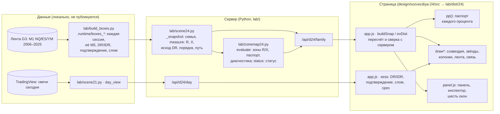

# Спецификация экрана 24 «Окна времени» — смысл, расчёт и код каждого элемента

**Для кого.** Для агента или человека, который будет править, проверять или переносить экран 24 и должен знать про
каждую точку, линию и процент три вещи:
1. какой это смысловой объект;
2. откуда он берётся и как агрегируется;
3. в каком коде живёт.

Цель — чтобы ни один процент или кластер не был случайно взят не из того смысла, посчитан или сложен не так. Это
основная опасность этой линии: в дизайне 22 под одной картинкой жили четыре разных объекта ([`meaning/10`](../../meaning/10-dizajn-24.md) §1).

**Статус.**
- Экран 24 — рабочий экран DR Lab с 01.10.2026, ночь: решение оператора. Ветка `design-24`, PR #1, в `main` не слит.
- `http://127.0.0.1:8767/` открывает его, ярлык «DR Lab».
- Дизайн 22 доступен рядом: `/22/`, кнопка «№22 ↗».
- Источник смысла — спецификация аудитора DR-LAB-SEM-1.0 ([`meaning/lens/2026-10-01-spec-v1/`](../../meaning/lens/2026-10-01-spec-v1/README.md)).
- Карта зон — `zone-map-3` ([`meaning/12`](../../meaning/12-karta-zon.md)).
- Вид экрана выбрал оператор ([`meaning/10`](../../meaning/10-dizajn-24.md) §3а).
- Этот документ описывает реализацию и не заменяет первоисточники. При расхождении правят код или этот документ, но
  не смысл — смысл меняется только решением оператора.

## Как читать

Каждая страница — один снимок экрана с жёлтыми номерами. Под снимком таблица: номер → что видно → объект и смысл →
как считается → своя сотня (знаменатель) → код (сервер → страница) → как нельзя читать. Снимки — исторические дни NQ.
Это снимки инструмента, не ленты (правило 1 AGENTS.md). Номера ставит скрипт по геометрии самой страницы (`&geo=1`),
поэтому после правки экрана их можно переснять, не двигая вручную ([«Как обновить»](#как-обновить)).

| Страница | Что разобрано |
|---|---|
| [01 · Стек](01-stek.md) | Путь данных от ленты до пикселя: файлы, функции, запросы API, поля ответа, где что считается и сверяется |
| [02 · Обзор: график](02-obzor-grafik.md) | Все слои графика: свечи и уровни, созвездия, звёзды, колонки цены, лента времени |
| [03 · Обзор: рамка и панель](03-obzor-panel.md) | Панель инструментов, правая панель (слепок, исход DR, список зон), инспектор, ручка окон |
| [04 · Полоса цены → время](04-polosa.md) | Наведение на полосу: связь с пиковыми 15 минутами, инспектор полосы |
| [05 · Окно 15 минут](05-okno.md) | Наведение на окно времени: какое событие перевешивает |
| [06 · Зона и шесть окон](06-zona-i-okna.md) | Закреплённая зона (изолиния, точные клетки, пик) и шесть окон семьи |
| [07 · Сессия семьи](07-sessiya.md) | Одна сессия: её R, X, путь, порядок |
| [08 · Область и уровень](08-oblast-i-uroven.md) | Выбранная область (полоса × окно) и закреплённый уровень |
| [09 · Путь семьи](09-put-semi.md) | Режим закрытий M5 |
| [10 · Семья слома](10-semya-sloma.md) | После слома DR: другая семья, перевёрнутая ориентация |
| [11 · Инварианты и аудит](11-invarianty.md) | Что обязано выполняться всегда, какой тест это проверяет, как проверять перенос смысла |

## Три слоя одним взглядом



| Слой | За что отвечает | Где |
|---|---|---|
| **Смысл** | Что такое семья, R, X, исход DR, зона, «на уровне или дальше», путь семьи; какая сотня у каждого числа | DR-LAB-SEM-1.0, [`meaning/10`](../../meaning/10-dizajn-24.md) §2, [`meaning/12`](../../meaning/12-karta-zon.md), [`docs/SEMANTICS.md`](../../docs/SEMANTICS.md) «Дизайн 24» |
| **Бэкенд** | Отбор семьи, измерение каждой сессии в целых тиках, зоны и их диагностика, статус зон на срезе | `lab/scene24.py`, `lab/zonemap24.py`, `lab/server.py` |
| **Фронтенд** | Пересчёт распределений из членов семьи и сверка с сервером, паспорта, перенос на сегодняшние цены, рисунок, наведение | `design/sozvezdiya-24/src/app.js`, `panel.js`, `page.html`, `panel.css` |

## Главные правила, которые нельзя нарушить при правке

1. **Каждый процент — счётчик / N одной семьи.**
   - У каждой сущности своя сотня: распределение R, распределение X, исход DR, порядок R/X, каждая колонка «Пути
     семьи».
   - R и X не складываются. Доли зон одного события не складываются в сотню: есть остаток и «?».
2. **Слепок неподвижен.**
   - Семья фиксируется при сегодняшнем подтверждении (или сломе) и до конца дня не меняется.
   - Срез двигает только сегодняшние факты, вопросы «после ЧЧ:ММ» и статусы зон.
3. **Рисунок не несёт чисел.**
   - Не несут: дымка и нити созвездия, высота холма в ленте, ширина свечения.
   - Числа несут только подписи, колонки, капсулы, панель и инспектор, и у каждого есть паспорт.
4. **Членство в зоне — это её клетки** (`cell_mask`), а не контур рисунка.
5. **Неизвестное не ноль.** Сессия без нужной M5 остаётся в N. Её событие «?» нигде не рисуется. У бинарных вопросов —
   диапазон.
6. **Никаких чисел без определения** в [`docs/SEMANTICS.md`](../../docs/SEMANTICS.md) (правило 7 AGENTS.md).

## Как обновить

```bash
python design/sozvezdiya-24/src/build.py      # страница -> lab/dist/24/
python spec/ekran-24/tools/shots.py           # снимки и геометрия девяти состояний (сервер должен работать)
python spec/ekran-24/tools/annotate.py        # номера на снимках -> spec/ekran-24/img/
```

Если элемент экрана добавлен или переименован, нужно добавить его номер в `tools/annotate.py` (словарь `MARKS`) и
строку в таблицу нужной страницы. Если элемент изменил смысл, это решение оператора: узел в
[`meaning/07`](../../meaning/07-cepochka-reshenij.md), затем этот документ.
